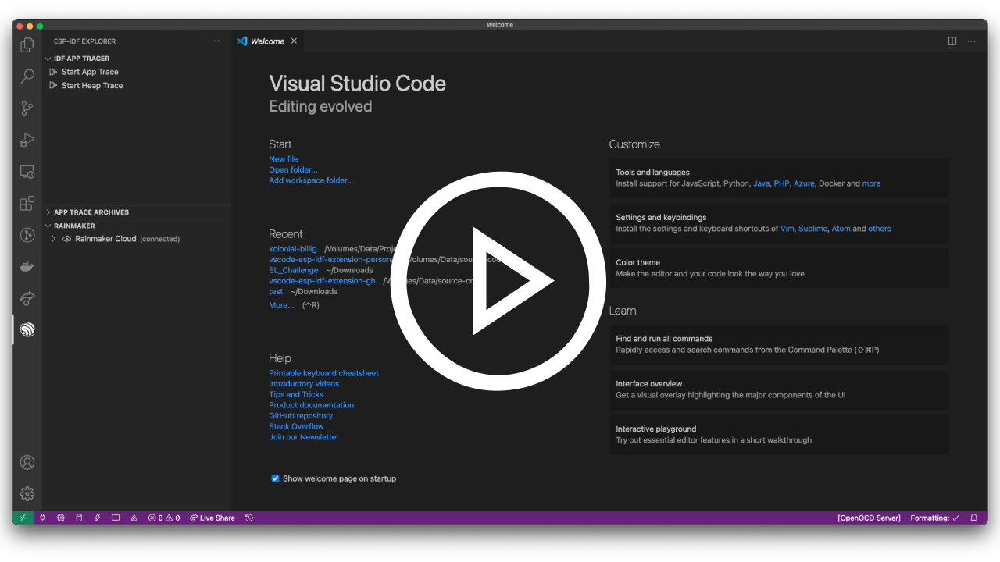

# [ESP-IDF VS Code Extension's](http://github.com/espressif/vscode-esp-idf-extension) Changelog

> We have opened a [survey link](https://bit.ly/3iNCFyY), please submit your valuable feedbacks. Thanks 👏

<a href="https://youtu.be/Lc6ausiKvQM">

  

    
  

</a>

---

All notable changes to the "Espressif IDF" extension will be documented in this file.

## [1.0.0](https://github.com/espressif/vscode-esp-idf-extension/releases/tag/v1.0.0)

### Features and enhancements

- [Add report button](https://github.com/espressif/vscode-esp-idf-extension/pull/302) to send error to telemetry backend.
- [Launch ESP-IDF Monitor on debug session launch](https://github.com/espressif/vscode-esp-idf-extension/pull/303).
- [CI Enhancements](https://github.com/espressif/vscode-esp-idf-extension/pull/308)
- [New IDF Component command](https://github.com/espressif/vscode-esp-idf-extension/pull/310) to add a component in current project.
- [Add post build ninja summary from Chromium tools script](https://github.com/espressif/vscode-esp-idf-extension/pull/315)
- [Add command to dispose cached SDK Configuration Editor confserver process](https://github.com/espressif/vscode-esp-idf-extension/pull/325)

### Bug Fixes

- [Fix JTAG Flashing issue](https://github.com/espressif/vscode-esp-idf-extension/pull/301)
- [Fix select UI on SDK Configuration Editor](https://github.com/espressif/vscode-esp-idf-extension/pull/304)
- [Use only major_minor for python_env directories](https://github.com/espressif/vscode-esp-idf-extension/pull/311)
- [Update Arduino esp32 branches and fallback on master](https://github.com/espressif/vscode-esp-idf-extension/pull/312)
- [Kill ESP-IDF Monitor terminal on Flash task execution](https://github.com/espressif/vscode-esp-idf-extension/pull/314)
- [Fix CMakeLists.txt Editor schema error](https://github.com/espressif/vscode-esp-idf-extension/pull/319)
- [Fix missing ESP-ADF ESP-MDF env variables on Windows](https://github.com/espressif/vscode-esp-idf-extension/pull/320)
- [Fix default compiler path on Show ESP-IDF examples created projects](https://github.com/espressif/vscode-esp-idf-extension/pull/324)

## [0.6.1](https://github.com/espressif/vscode-esp-idf-extension/releases/tag/v0.6.1)

### Features and enhancements

- [ESP-IDF: Doctor command](https://github.com/espressif/vscode-esp-idf-extension/pull/255) to generate an extension configuration report.
- [Enhance readme and documentation](https://github.com/espressif/vscode-esp-idf-extension/pull/284)
- [Select openOCD board command](https://github.com/espressif/vscode-esp-idf-extension/pull/286) based on esp-config.json from OpenOCD repository.
- [Russian localization for commands](https://github.com/espressif/vscode-esp-idf-extension/pull/216) Thanks @Vasilius-001 !

### Bug Fixes

- [WSL 1 serial port fix](https://github.com/espressif/vscode-esp-idf-extension/pull/298)
- [Fix OpenOCD Config Files](https://github.com/espressif/vscode-esp-idf-extension/pull/296) Thanks @meltdown03 !
- [Fix custom terminal output formatting](https://github.com/espressif/vscode-esp-idf-extension/pull/291)
- [Remove check IDF tools before build or flash, update tasks.json template](https://github.com/espressif/vscode-esp-idf-extension/pull/281)
- [Fix env variables settings in IDF Monitor command](https://github.com/espressif/vscode-esp-idf-extension/pull/274)
- [Fix eFuse explorer icons](https://github.com/espressif/vscode-esp-idf-extension/pull/268)

## [0.6.0](https://github.com/espressif/vscode-esp-idf-extension/releases/tag/v0.6.0)

### Features & Enhancements

- [Changelog Viewer](https://github.com/espressif/vscode-esp-idf-extension/pull/180)
- [Core Dump & GDB Stub Postmortem Debug Support](https://github.com/espressif/vscode-esp-idf-extension/pull/176)
- [Add Support for Powershell Core](https://github.com/espressif/vscode-esp-idf-extension/pull/212)
- [ESP-IDF custom CMake Editor](https://github.com/espressif/vscode-esp-idf-extension/pull/203)
- [Add Option to silent the notifications](https://github.com/espressif/vscode-esp-idf-extension/pull/220)
- [Enhance doc search from vscode, also show results inside vscode itself](https://github.com/espressif/vscode-esp-idf-extension/pull/215)
- [Show Rainmaker LoggedIn User's Info](https://github.com/espressif/vscode-esp-idf-extension/pull/235)
- [Add WSL Serial Support](https://github.com/espressif/vscode-esp-idf-extension/pull/224)
- [JTAG Flashing Support](https://github.com/espressif/vscode-esp-idf-extension/pull/183)
- [Add e-fuse bit viewer](https://github.com/espressif/vscode-esp-idf-extension/pull/151)
- [Add Full Clean Command](https://github.com/espressif/vscode-esp-idf-extension/pull/250)
- [Full Partition Table Editor UI](https://github.com/espressif/vscode-esp-idf-extension/pull/170)
- [NVS Partition Editor UI](https://github.com/espressif/vscode-esp-idf-extension/pull/246)
- [Enhanced Onboarding & Simplification](https://github.com/espressif/vscode-esp-idf-extension/pull/159)
- [Use variable app_image_offset for debugAdapter](https://github.com/espressif/vscode-esp-idf-extension/issues/225)
- [Win configuration parameters](https://github.com/espressif/vscode-esp-idf-extension/issues/234)

### Bug Fixes

- [Fix Rainmaker UI Crash](https://github.com/espressif/vscode-esp-idf-extension/issues/245)
- [Fix Create project using example error](https://github.com/espressif/vscode-esp-idf-extension/issues/239)
- [Fix Conflict with PlatformIO and ESP-IDF Extension](https://github.com/espressif/vscode-esp-idf-extension/issues/190)
- [Fix Menuconfig Related Error](https://github.com/espressif/vscode-esp-idf-extension/issues/199)
- [Fix issues with IntelliSense](https://github.com/espressif/vscode-esp-idf-extension/issues/191)

## [0.5.1](https://github.com/espressif/vscode-esp-idf-extension/releases/tag/v0.5.1)

### Release Bug Fix

- Fix the CI release to marketplace bug not packaging the `esp_debug_adapter`
- Fix the System Tracing UI theme, and added webview panel icons

## [0.5.0](https://github.com/espressif/vscode-esp-idf-extension/releases/tag/v0.5.0)

### ESP-ADF & ESP-MDF

- Added support for ESP-ADF and ESP-MDF
- Fixed some bugs related to [Device Baud Rate](https://github.com/espressif/vscode-esp-idf-extension/pull/166), [Webview Background Color](https://github.com/espressif/vscode-esp-idf-extension/pull/166), [Menuconfig](https://github.com/espressif/vscode-esp-idf-extension/pull/166)

## [0.4.0](https://github.com/espressif/vscode-esp-idf-extension/releases/tag/v0.4.0)

### System View Tracing Viewer, Search IDF Documentation, etc.

- Add System View Tracing [support]() inside vscode, which will enable you to easily view the timeline, events stream, etc., of of existing heap tracing (.svdat) file
- Add support for Arduino as ESP32 Component
- Add [support](https://github.com/espressif/vscode-esp-idf-extension#available-commands) for searching ESP-IDF documentation from vscode itself.
- Fixed some bugs related to [debug adapter](https://github.com/espressif/vscode-esp-idf-extension/pull/134), [gui menuconfig](https://github.com/espressif/vscode-esp-idf-extension/pull/145), [task based commands](https://github.com/espressif/vscode-esp-idf-extension/pull/143), [UI and style enhancements](https://github.com/espressif/vscode-esp-idf-extension/pull/137), etc.

## [0.3.0](https://github.com/espressif/vscode-esp-idf-extension/releases/tag/v0.3.0)

### Heap Tracing, Code Coverage Support, Rainmaker Support and bug fixes

- Add Heap Tracing [support](https://github.com/espressif/vscode-esp-idf-extension#log--heap-tracing) inside vscode for ESP32 and ESP32-S2 chips
- Show [code-coverage](https://github.com/espressif/vscode-esp-idf-extension#code-coverage) inside the vscode editor for your ESP-IDF projects
- Add ESP Rainmaker IoT cloud [support](https://github.com/espressif/vscode-esp-idf-extension#esp-rainmaker-support) inside vscode, this will enable you to control your ESP32 and ESP32-S2 devices from vscode
- Use `webview.asWebviewUri(...)` API for making extension web browser compatible
- Add [support](https://github.com/espressif/vscode-esp-idf-extension/blob/master/docs/TELEMETRY.md) for telemetry
- Fix some typos in template project
- Fix Poweshell export env support
- Improve onboarding docs
- Fix some typos in Documentation
- Fix workspace folder error for no opened workspaces

## [0.2.2](https://github.com/espressif/vscode-esp-idf-extension/releases/tag/v0.2.2)

### Add problem matcher support for build and Minor Bug Fixes

- Add support for Problem Matcher in vscode to show line number errors for build which will make navigation to the error easier
- Update some CI issues
- Fixed build related errors

## [0.2.1](https://github.com/espressif/vscode-esp-idf-extension/releases/tag/v0.2.1)

### Minor bug fixes and performance enhancements

- SEO for vscode marketplace, add keywords and update description
- Enhance and Fix some bugs with IDF Monitor terminal
- Update Stale CI configs
- Project structore enhancement, remove unused files in project
- Fix xtensa toolchain issue and getProjectName
- Update OpenOCD script checks

## [0.2.0](https://github.com/espressif/vscode-esp-idf-extension/releases/tag/v0.2.0)

### Release Debug Adapter for ESP-IDF withing VSCode

- Release Debug Adapter, this would enable debugging for an IDF project from within the VSCode IDE, please refer the guide for how to use the same
- Add support for save before IDF build, this would save all your edited files and then trigger a build.
- Add Prettier for code linting and formatting (improving extension developer experience)
- Update Issue Template for GH
- Minor bug fixes and enhancements

## [0.1.4](https://github.com/espressif/vscode-esp-idf-extension/releases/tag/v0.1.4)

### i18n Validation and CMake based reading of project name

- Auto validate missing `i18n` keys and trigger build failure if not found.
- Read & Sync project name using `CMakeList`

## [0.1.3](https://github.com/espressif/vscode-esp-idf-extension/releases/tag/v0.1.3)

### Automate Github and VSCode Marketplace release

- Release to Github and VSCode Marketplace using Github Actions
- Minor bug fixes

## [0.1.2](https://github.com/espressif/vscode-esp-idf-extension/releases/tag/v0.1.2)

### Breaking Project Structural changes

- Use `yarn` instead of `npm`
- Use `webpack` to bundle all of the extension
- Reduce overall size of the `.vsix` significantly

## [0.1.1](https://github.com/espressif/vscode-esp-idf-extension/releases/tag/v0.1.1)

### Release to the VSCode Marketplace

- Preview release to the VSCode Marketplace
- Update docs
- CI improvements

## [0.1.0](https://github.com/espressif/vscode-esp-idf-extension/releases/tag/v0.1.0)

### Initial Public Release

- Initial ESP-IDF commands
- Build, flash and monitor with CMake functionality
- GUIConfig to setup your project ESP-IDF settings.
- IDF Size Analysis GUI
- App Trace Logging
- ...and much more
