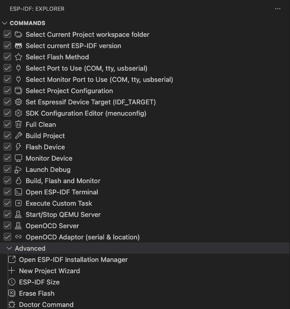
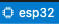

<a href="https://marketplace.visualstudio.com/items?itemName=espressif.esp-idf-extension">
  
</a>

# ESP-IDF Extension for VS Code

[中文](./README_CN.md)

[](https://docs.espressif.com/projects/vscode-esp-idf-extension/en/latest/)
[](./README.md#Troubleshooting)

[](https://github.com/espressif/vscode-esp-idf-extension/releases)
[](https://esp32.com/viewforum.php?f=40)

Develop, build, flash, monitor, debug and [more](https://docs.espressif.com/projects/vscode-esp-idf-extension/en/latest/index.html) with Espressif chips using Espressif IoT Development Framework [(ESP-IDF)](https://github.com/espressif/esp-idf).

<a href="https://nightly.link/espressif/vscode-esp-idf-extension/workflows/ci/master/esp-idf-extension.vsix.zip">**Latest master installer**</a> for Visual Studio Code. You can use this VSIX to test the current github master of the extension by pressing <kbd>F1</kbd> or click menu `View` -> `Command Palette...`, type `Install from VSIX` and then select the previously downloaded `.vsix` file to install the extension.

Make sure to review our [Espressif documentation](https://docs.espressif.com/projects/vscode-esp-idf-extension/en/latest/index.html) first to properly use the extension.

# How to use

## Install

1. Download and install [Visual Studio Code](https://code.visualstudio.com/).

2. Install ESP-IDF system prerequisites for your operating system:

- Prerequisites for [MacOS and Linux](https://docs.espressif.com/projects/esp-idf/en/latest/esp32/get-started/linux-macos-setup.html).
- For Windows there is no additional prerequisites.

3. In Visual Studio Code, Open the **Extensions** view by clicking on the Extension icon in the Activity Bar on the side of Visual Studio Code or the **View: Show Extensions** command (shortcut: <kbd>⇧</kbd> <kbd>⌘</kbd> <kbd>X</kbd> or <kbd>Ctrl+Shift+X</kbd>).

4. Search for [ESP-IDF Extension](https://marketplace.visualstudio.com/items?itemName=espressif.esp-idf-extension).

5. Install the extension. After you install the extension, the  should appear in the VS Code Activity bar (left side set of icons). When you click the Espressif icon, you can see a list of basic commands provided by this extension.

<p>
  
</p>

6. From the command list, select **Configure ESP-IDF Extension** or press <kbd>F1</kbd> and type `Configure ESP-IDF Extension`. After, choose the **ESP-IDF: Configure ESP-IDF Extension** option.
   > **NOTE:** For versions of ESP-IDF < 5.0, spaces are not supported inside configured paths.

<p>
  
</p>

7. Choose **Express** and select the download server:

- Espressif: Faster speed in China using Espressif download servers links.
- Github: Using github releases links.

8. Pick an ESP-IDF version to download or the `Find ESP-IDF in your system` option to search for existing ESP-IDF directory.

9. Choose the location for ESP-IDF Tools (also known as `IDF_TOOLS_PATH`) which is `$HOME\.espressif` on MacOS/Linux and `%USERPROFILE%\.espressif` on Windows by default.

10. If your operating system is MacOS/Linux, choose the system Python executable to create ESP-IDF virtual environment inside ESP-IDF Tools and install ESP-IDF Python package there.

    > **NOTE:** Windows users don't need to select a Python executable since it is going to be installed by this setup.

11. Make sure that `IDF_TOOLS_PATH` doesn't have any spaces to avoid any build issues. Also make sure that `IDF_TOOLS_PATH` is not the same directory as `IDF_PATH`.

12. You will see a page showing the setup progress status, including ESP-IDF download progress, ESP-IDF Tools download and install progress as well as the creation of a Python virtual environment.

13. If everything is installed correctly, you will see a message that all settings have been configured. You can start using the extension.

Check the [Troubleshooting](#Troubleshooting) section if you have any issues.

## Using the ESP-IDF Extension for VS Code

This extension provides a list of icons in the status bar (blue bar in the bottom of VS Code window) for ESP-IDF commands. You can see the command to be executed when you hover the icon.

<p>
  
</p>

These icons will be used in the steps below showing common ESP-IDF use cases:

1. Press <kbd>F1</kbd> and type **ESP-IDF: Show Example Projects** to create a new project from ESP-IDF examples. Select ESP-IDF and choose an example to create a new project from.

2. Once the project is created and opened in VS Code, set the serial port of your device by clicking status bar icon . Alternatively, press <kbd>F1</kbd>, type **ESP-IDF: Select Port to Use**, and choose the serial port to which your device is connected.

3. Select an Espressif target (esp32, esp32s2, etc.) by clicking status bar icon . Alternatively, press <kbd>F1</kbd> and type **ESP-IDF: Set Espressif Device Target** command.

4. Next, configure your ESP-IDF project by clicking status bar icon  or press <kbd>F1</kbd> and typing **ESP-IDF: SDK Configuration Editor** command (<kbd>CTRL</kbd> <kbd>E</kbd> <kbd>G</kbd> keyboard shortcut) where you can modify the ESP-IDF project settings. After all changes are made, click `Save` and close this window. You can see the output in the menu `View` -> `Output` and choose `ESP-IDF` from the dropdown list.

5. (OPTIONAL) Run **ESP-IDF: Run idf.py reconfigure Task** to generate the ``compile_commands.json`` file so language support works. Additionally you can configure the `.vscode/c_cpp_properties.json` as explained in [C/C++ Configuration](https://docs.espressif.com/projects/vscode-esp-idf-extension/en/latest/configureproject.html#c-and-c-code-navigation-and-syntax-highlight) documentation.

6. At this point, you can modify the code. When the project is completed, build your project by clicking status bar icon  or pressing <kbd>F1</kbd> and typing **ESP-IDF: Build your Project**.

7. Flash to your device by clicking status bar icon , or pressing <kbd>F1</kbd> and typing **ESP-IDF: Flash Your Project**. From there, select `UART`, `DFU` or `JTAG` depending on your serial connection, and start flashing the application to your device.

8. Change the flash method by clicking status bar icon , or pressing <kbd>F1</kbd> and typing **ESP-IDF: Select Flash Method** to select from `UART`, `DFU` or `JTAG`. You can alternatively use one of the commands **ESP-IDF: Flash (UART) Your Project**, **ESP-IDF: Flash (with JTAG)** or **ESP-IDF: Flash (DFU) Your Project**.

9. Start a monitor by clicking status bar icon , or pressing <kbd>F1</kbd> and typing **ESP-IDF: Monitor Device**, which will log the device activity in a Visual Studio Code terminal.

10. Make sure to configure your drivers as mentioned in ESP-IDF [Configure JTAG Interface](https://docs.espressif.com/projects/esp-idf/en/latest/esp32/api-guides/jtag-debugging/configure-ft2232h-jtag.html) documentation.

11. Before debugging your device, if you are using a connected ESP-IDF development board, the OpenOCD configuration will be automatically selected based on your connected board, including the USB location if available (requires OpenOCD version v0.12.0-esp32-20240821 or higher). Otherwise, you can manually select the device OpenOCD board configuration files by pressing <kbd>F1</kbd> and typing **ESP-IDF: Select OpenOCD Board Configuration**. You can test the connection by clicking status bar icon  or pressing <kbd>F1</kbd> and typing **ESP-IDF: OpenOCD Manager**. The output is shown in the menu `View` -> `Output` and choose `ESP-IDF` from the dropdown list.

    > **NOTE:** You can start or stop the OpenOCD in Visual Studio Code using the **ESP-IDF: OpenOCD Manager** command or by clicking the `OpenOCD Server (Running | Stopped)` button in the status bar.

12. If you want to start a debug session, just press <kbd>F5</kbd> (ensure the project is built, flashed, and OpenOCD is properly connected for the debugger to function correctly). The debug session output can be seen in the menu `View` -> `Debug Console`.

Check the [Troubleshooting](#Troubleshooting) section if you have any issues.

# Further reading

Check the [ESP-IDF Extension for VS Code Documentation](https://docs.espressif.com/projects/vscode-esp-idf-extension/en/latest/) for tutorials, commands and features provided.

## All Available Commands

Press <kbd>F1</kbd> or click menu `View` -> `Command Palette...` to show Visual Studio code commands, then type **ESP-IDF** to see all available extension commands.

<table>
    <thead>
        <tr>
            <th>Category</th>
            <th>Command</th>
            <th>Description</th>
            <th>Keyboard Shortcuts (Mac)</th>
            <th>Keyboard Shortcuts (Windows/Linux)</th>
        </tr>
    </thead>
    <tbody>
        <tr>
            <td rowspan=6 align="center">Settings</td>
            <td>Add Docker Container Configuration</td>
            <td>Add the <strong>.devcontainer</strong> files to the currently opened project directory, necessary to use a ESP-IDF project in a Docker container with Visual Studio Code
            <a href="https://marketplace.visualstudio.com/items?itemName=ms-vscode-remote.remote-containers">Dev Containers</a> extension.</td>
            <td></td>
            <td></td>
        </tr>
        <tr>
            <td>Add VS Code Configuration Folder</td>
            <td>Add <strong>.vscode</strong> files to the currently opened project directory. This includes launch.json (for debugging), settings.json and c_cpp_properties.json (for syntax highlight).</td>
            <td></td>
            <td></td>
        </tr>
        <tr>
            <td>Configure ESP-IDF Extension</td>
            <td>Open a window with a setup wizard to install ESP-IDF, IDF Tools and Python virtual environment.</td>
            <td></td>
            <td></td>
        </tr>
        <tr>
            <td>Select Output and Notification Mode</td>
            <td>This extension shows many notifications and output in the Output window <strong>ESP-IDF</strong>. This command allows you to set if to show notifications only, output only, both notifications and output, or neither.</td>
            <td></td>
            <td></td>
        </tr>
        <tr>
            <td>Select Where to Save Configuration Settings</td>
            <td>In Visual Studio Code, settings can be saved in 3 places: User Settings (global settings), workspace ( .code-workspace file) or workspace folder (.vscode/settings.json).
            More information in <a href="https://docs.espressif.com/projects/vscode-esp-idf-extension/en/latest/additionalfeatures/multiple-projects.html">working with multiple projects</a>.</td>
            <td></td>
            <td></td>
        </tr>
        <tr>
            <td>Pick a Workspace Folder</td>
            <td>When using a Visual Studio Code workspace with multiple folders, this command allows you to choose which workspace folder to apply this extension's commands to.
            More information in <a href="https://docs.espressif.com/projects/vscode-esp-idf-extension/en/latest/additionalfeatures/multiple-projects.html">working with multiple projects</a>.</td>
            <td></td>
            <td></td>
        </tr>
        <tr>
            <td rowspan=11 align="center">Basic</td>
            <td>Show Example Projects</td>
            <td>Launch UI to show examples from selected framework and allow you to create a project from them. This command will show frameworks already configured in the extension, so to view ESP-Rainmaker examples, you need to run the <strong>Install ESP-Rainmaker</strong> first (or set the equivalent setting idf.espRainmakerPath), and then execute this command to see the examples.</td>
            <td></td>
            <td></td>
        </tr>
        <tr>
            <td>Set Espressif Device Target</td>
            <td>This will set the target for the current project (IDF_TARGET). Similar to <strong>idf.py set-target</strong>. For example, if you want to use ESP32 or ESP32-C3, you need to execute this command.</td>
            <td></td>
            <td></td>
        </tr>
        <tr>
            <td>SDK Configuration Editor</td>
            <td>Launch a UI to configure your ESP-IDF project settings. This is equivalent to <strong>idf.py menuconfig</strong>.</td>
            <td><kbd>⌘</kbd> <kbd>I</kbd> <kbd>G</kbd></td>
            <td><kbd>Ctrl</kbd> <kbd>E</kbd> <kbd>G</kbd></td>
        </tr>
        <tr>
            <td>Build Your Project</td>
            <td>Build your project using `CMake` and `Ninja-build` as explained in <a href="https://docs.espressif.com/projects/esp-idf/en/latest/esp32/api-guides/build-system.html#using-cmake-directly">ESP-IDF Build System Using Cmake Directly</a>. You could modify the behavior of the build task with <strong>idf.cmakeCompilerArgs</strong> for Cmake configure step and <strong>idf.ninjaArgs</strong> for Ninja step. For example, using <strong>[-j N]</strong> where N is the number of jobs run in parallel.</td>
            <td><kbd>⌘</kbd> <kbd>I</kbd> <kbd>B</kbd></td>
            <td><kbd>Ctrl</kbd> <kbd>E</kbd> <kbd>B</kbd></td>
        </tr>
        <tr>
            <td>Size Analysis of the Binaries</td>
            <td>Launch UI with the ESP-IDF project binaries size information.</td>
            <td><kbd>⌘</kbd> <kbd>I</kbd> <kbd>S</kbd></td>
            <td><kbd>Ctrl</kbd> <kbd>E</kbd> <kbd>S</kbd></td>
        </tr>
        <tr>
            <td>Select Port to Use</td>
            <td>Select which serial port to use for ESP-IDF tasks, such as flashing or monitoring your device.</td>
            <td><kbd>⌘</kbd> <kbd>I</kbd> <kbd>P</kbd></td>
            <td><kbd>Ctrl</kbd> <kbd>E</kbd> <kbd>P</kbd></td>
        </tr>
        <tr>
            <td>Flash Your Project</td>
            <td>Write binary data to the ESP's flash chip from your current ESP-IDF project. This command will use either UART, DFU or JTAG based on <strong>idf.flashType</strong>.</td>
            <td><kbd>⌘</kbd> <kbd>I</kbd> <kbd>F</kbd></td>
            <td><kbd>Ctrl</kbd> <kbd>E</kbd> <kbd>F</kbd></td>
        </tr>
        <tr>
            <td>Monitor Device</td>
            <td>This command will execute <strong>idf.py monitor</strong> to start serial communication with Espressif device.
            Please take a look at the <a href="https://docs.espressif.com/projects/esp-idf/en/latest/esp32/api-guides/tools/idf-monitor.html?highlight=monitor">IDF Monitor</a>.</td>
            <td><kbd>⌘</kbd> <kbd>I</kbd> <kbd>M</kbd></td>
            <td><kbd>Ctrl</kbd> <kbd>E</kbd> <kbd>M</kbd></td>
        </tr>
        <tr>
            <td>Open ESP-IDF Terminal</td>
            <td>Launch a terminal window configured with extension ESP-IDF settings. Similar to export.sh script from ESP-IDF CLI.</td>
            <td><kbd>⌘</kbd> <kbd>I</kbd> <kbd>T</kbd></td>
            <td><kbd>Ctrl</kbd> <kbd>E</kbd> <kbd>T</kbd></td>
        </tr>
        <tr>
            <td>Select OpenOCD Board Configuration</td>
            <td>Select the OpenOCD configuration files that match your Espressif device target, such as DevKitC or ESP-Wrover-Kit. This is necessary for flashing with JTAG or debugging your device.</td>
            <td></td>
            <td></td>
        </tr>
        <tr>
            <td>Build, Flash and Start a Monitor on Your Device</td>
            <td>Build the project, write binaries program to device and start a monitor terminal with a single command. Similar to <strong>idf.py build flash monitor</strong>.</td>
            <td><kbd>⌘</kbd> <kbd>I</kbd> <kbd>D</kbd></td>
            <td><kbd>Ctrl</kbd> <kbd>E</kbd> <kbd>D</kbd></td>
        </tr>
        <tr>
            <td rowspan=5 align="center">Project creation</td>
            <td>Show Example Projects</td>
            <td>Launch UI to show examples from selected framework and allow you to create a project from them. This command will show frameworks already configured in the extension, so to view ESP-Rainmaker examples, you need to run the <strong>Install ESP-Rainmaker</strong> first (or set the equivalent setting idf.espRainmakerPath), and then execute this command to see the examples.</td>
            <td></td>
            <td></td>
        </tr>
        <tr>
            <td>Create Project from Extension Template</td>
            <td>Create an ESP-IDF project using one of the extension template projects.</td>
            <td><kbd>⌘</kbd> <kbd>I</kbd> <kbd>C</kbd></td>
            <td><kbd>Ctrl</kbd> <kbd>E</kbd> <kbd>C</kbd></td>
        </tr>
        <tr>
            <td>Create New ESP-IDF Component</td>
            <td>Create a new component in the current directory based on ESP-IDF component template.</td>
            <td></td>
            <td></td>
        </tr>
        <tr>
            <td>Import ESP-IDF Project</td>
            <td>Import an existing ESP-IDF project, add .vscode and .devcontainer files to a new location, and optionally rename the project.</td>
            <td></td>
            <td></td>
        </tr>
        <tr>
            <td>New Project</td>
            <td>Launch UI with a ESP-IDF project creation wizard using example templates from ESP-IDF and additional frameworks configured in the extension.</td>
            <td><kbd>⌘</kbd> <kbd>I</kbd> <kbd>N</kbd></td>
            <td><kbd>Ctrl</kbd> <kbd>E</kbd> <kbd>N</kbd></td>
        </tr>
        <tr>
            <td rowspan=7 align="center">Flashing</td>
            <td>Select Flash Method</td>
            <td>Select which flash method to use for <strong>Flash Your Project</strong> command. It can be DFU, JTAG or UART.</td>
            <td></td>
            <td></td>
        </tr>
        <tr>
            <td>Flash Your Project</td>
            <td>Write binary data to the ESP's flash chip from your current ESP-IDF project. This command will use either UART, DFU or JTAG based on <strong>idf.flashType</strong></td>
            <td><kbd>⌘</kbd> <kbd>I</kbd> <kbd>F</kbd></td>
            <td><kbd>Ctrl</kbd> <kbd>E</kbd> <kbd>F</kbd></td>
        </tr>
        <tr>
            <td>Flash (DFU) Your Project</td>
            <td>Write binary data to the ESP's flash chip from your current ESP-IDF project using DFU. Only for ESP32-S2 and ESP32-S3. </td>
            <td></td>
            <td></td>
        </tr>
        <tr>
            <td>Flash (UART) Your Project</td>
            <td>Write binary data to the ESP's flash chip from your current ESP-IDF project using esptool.py.</td>
            <td></td>
            <td></td>
        </tr>
        <tr>
            <td>Flash (with JTAG)</td>
            <td>Write binary data to the ESP's flash chip from your current ESP-IDF project using OpenOCD JTAG.</td>
            <td></td>
            <td></td>
        </tr>
        <tr>
            <td>Encrypt and Flash Your Project</td>
            <td>Execute flashing the project program to device while adding <strong>--encrypt</strong> for partitions to be encrypted.</td>
            <td></td>
            <td></td>
        </tr>
        <tr>
            <td>Erase Flash Memory from Device</td>
            <td>Execute <strong>esptool.py erase_flash</strong> command to erase flash chip (set to 0xFF bytes).</td>
            <td><kbd>⌘</kbd> <kbd>I</kbd> <kbd>R</kbd></td>
            <td><kbd>Ctrl</kbd> <kbd>E</kbd> <kbd>R</kbd></td>
        </tr>
        <tr>
            <td rowspan=4 align="center">Code coverage</td>
            <td>Add Editor Coverage</td>
            <td>Parse your project <a href="https://docs.espressif.com/projects/esp-idf/en/latest/esp32/api-guides/app_trace.html#gcov-source-code-coverage)">GCOV code coverage</a> files to add color lines
            representing code coverage on currently opened source code file.</td>
            <td></td>
            <td></td>
        </tr>
        <tr>
            <td>Configure Project SDKConfig for Coverage</td>
            <td>Set required values in your project SDKConfig to enable code coverage analysis.</td>
            <td></td>
            <td></td>
        </tr>
        <tr>
            <td>Get HTML Coverage Report for Project</td>
            <td>Parse your project <a href="https://docs.espressif.com/projects/esp-idf/en/latest/esp32/api-guides/app_trace.html#gcov-source-code-coverage)">GCOV code coverage</a> files to generate a HTML coverage report.</td>
            <td></td>
            <td></td>
        </tr>
        <tr>
            <td>Remove Editor Coverage</td>
            <td>Remove editor colored lines from <strong>Add Editor Coverage</strong> command </td>
            <td></td>
            <td></td>
        </tr>
        <tr>
            <td rowspan=8 align="center">Additional frameworks</td>
            <td>Install ESP-ADF</td>
            <td>Clone ESP-ADF inside the selected directory and set <strong>idf.espAdfPath</strong> (<strong>idf.espAdfPathWin</strong> in Windows) configuration setting.</td>
            <td></td>
            <td></td>
        </tr>
        <tr>
            <td>Add Arduino ESP32 as ESP-IDF Component</td>
            <td>Add <a href="https://github.com/espressif/arduino-esp32">Arduino-ESP32</a> as a ESP-IDF component
            in your current directory (<strong>${CURRENT_DIRECTORY}/components/arduino</strong>).</a></td>
            <td></td>
            <td></td>
        </tr>
        <tr>
            <td>Install ESP-IDF Python Packages (DEPRECATION NOTICE)</td>
            <td>Install extension Python packages. This command is deprecated and will be removed soon. </td>
            <td></td>
            <td></td>
        </tr>
        <tr>
            <td>Install ESP-MDF</td>
            <td>Clone ESP-MDF inside the selected directory and set <strong>idf.espMdfPath</strong> (<strong>idf.espMdfPathWin</strong> in Windows) configuration setting.</td>
            <td></td>
            <td></td>
        </tr>
        <tr>
            <td>Install ESP-Matter</td>
            <td>Clone ESP-Matter and set <strong>idf.espMatterPath</strong>. ESP-Matter is not supported in Windows. Make sure to install <a href="https://github.com/espressif/connectedhomeip/blob/v1.1-branch/docs/guides/BUILDING.md#prerequisites">Matter system prerequisites</a> first.</td>
            <td></td>
            <td></td>
        </tr>
        <tr>
            <td>Set ESP-MATTER Device Path (ESP_MATTER_DEVICE_PATH)</td>
            <td>The <strong>ESP-IDF: Set ESP-MATTER Device Path (ESP_MATTER_DEVICE_PATH)</strong> is used to define the device path for ESP-Matter. ESP-Matter is not supported in Windows.</td>
            <td></td>
            <td></td>
        </tr>
        <tr>
            <td>Install ESP-Rainmaker</td>
            <td>Clone ESP-Rainmaker and set <strong>idf.espRainmakerPath</strong> (<strong>idf.espRainmakerPathWin</strong> in Windows) configuration setting.</td>
            <td></td>
            <td></td>
        </tr>
        <tr>
            <td>Install ESP-HomeKit-SDK</td>
            <td>Clone ESP-HomeKit-SDK inside the selected directory and set <strong>idf.espHomeKitSdkPath</strong> (<strong>idf.espHomeKitSdkPathWin</strong> in Windows) configuration setting.</td>
            <td></td>
            <td></td>
        </tr>
        <tr>
            <td rowspan=2 align="center">eFuse</td>
            <td>Get eFuse Summary</td>
            <td>Retrieve a list of eFuses and their corresponding values from the chip currently connected to the serial port and display in the <a href="https://docs.espressif.com/projects/vscode-esp-idf-extension/en/latest/additionalfeatures/efuse.html">ESP Explorer EFUSEEXPLORER</a>.</td>
            <td></td>
            <td></td>
        </tr>
        <tr>
            <td>Clear eFuse Summary</td>
            <td>Clear the eFuse Summary tree from <a href="https://docs.espressif.com/projects/vscode-esp-idf-extension/en/latest/additionalfeatures/efuse.html">ESP Explorer EFUSEEXPLORER</a>.</td>
            <td></td>
            <td></td>
        </tr>
        <tr>
            <td rowspan=3 align="center">QEMU</td>
            <td>Launch QEMU Server</td>
            <td>As described in <a href="https://docs.espressif.com/projects/vscode-esp-idf-extension/en/latest/additionalfeatures/qemu.html">QEMU documentation</a>, this command will execute ESP32 QEMU from the project Dockerfile with the current project binaries.</td>
            <td></td>
            <td></td>
        </tr>
        <tr>
            <td>Launch QEMU Debug Session</td>
            <td>As described in <a href="https://docs.espressif.com/projects/vscode-esp-idf-extension/en/latest/additionalfeatures/qemu.html">QEMU documentation</a>, this command will start a debug session to ESP32 QEMU from the project Dockerfile with the current project binaries.</td>
            <td></td>
            <td></td>
        </tr>
        <tr>
            <td>Monitor QEMU Device</td>
            <td>As described in <a href="https://docs.espressif.com/projects/vscode-esp-idf-extension/en/latest/additionalfeatures/qemu.html">QEMU documentation</a>, this command will start a terminal to monitor the ESP32 QEMU from the project Dockerfile with the current project binaries.</td>
            <td></td>
            <td></td>
        </tr>
        <tr>
            <td rowspan=3 align="center">Monitoring</td>
            <td>Monitor Device</td>
            <td>This command will execute <strong>idf.py monitor</strong> to start serial communication with Espressif device.
            Please take a look at the <a href="https://docs.espressif.com/projects/esp-idf/en/latest/esp32/api-guides/tools/idf-monitor.html?highlight=monitor">IDF Monitor Documentation</a>.</td>
            <td><kbd>⌘</kbd> <kbd>I</kbd> <kbd>M</kbd></td>
            <td><kbd>Ctrl</kbd> <kbd>E</kbd> <kbd>M</kbd></td>
        </tr>
        <tr>
            <td>Launch IDF Monitor for Core Dump Mode/GDB Stub Mode</td>
            <td>Launch ESP-IDF Monitor with WebSocket capabilities. If you has configured the panic handler to gdbstub or core dump, the monitor will launch a post-mortem debug session of the chip.</td>
            <td></td>
            <td></td>
        </tr>
        <tr>
            <td>Monitor QEMU Device</td>
            <td>As described in <a href="https://docs.espressif.com/projects/vscode-esp-idf-extension/en/latest/additionalfeatures/qemu.html">QEMU documentation</a>, this command will start a terminal to monitor the ESP32 QEMU from the project Dockerfile with the current project binaries.</td>
            <td></td>
            <td></td>
        </tr>
        <tr>
            <td rowspan=3 align="center">Editors</td>
            <td>NVS Partition Editor</td>
            <td>Launch UI to create a CSV file for <a href="https://docs.espressif.com/projects/esp-idf/en/latest/esp32/api-reference/storage/nvs_flash.html">ESP-IDF Non-Volatile Storage Library</a>.</td>
            <td></td>
            <td></td>
        </tr>
        <tr>
            <td>Partition Table Editor</td>
            <td>Launch UI to manage custom partition table as described in <a href="https://docs.espressif.com/projects/esp-idf/en/latest/esp32/api-guides/partition-tables.html">ESP-IDF Partition Tables</a>.</td>
            <td></td>
            <td></td>
        </tr>
        <tr>
            <td>SDK Configuration Editor</td>
            <td>Launch a UI to configure your ESP-IDF project settings. This is equivalent to <strong>idf.py menuconfig</strong>.</td>
            <td><kbd>⌘</kbd> <kbd>I</kbd> <kbd>G</kbd></td>
            <td><kbd>Ctrl</kbd> <kbd>E</kbd> <kbd>G</kbd></td>
        </tr>
        <tr>
            <td rowspan=2 align="center">Unit Testing</td>
            <td>Unit Test: Build and Flash Unit Test App for Testing</td>
            <td>Copy the unit test app in the current project, build the current project and flash the unit test application to the connected device. More information in <a href="https://docs.espressif.com/projects/vscode-esp-idf-extension/en/latest/additionalfeatures/unit-testing.html">Unit testing documentation</a>.</td>
            <td></td>
            <td></td>
        </tr>
        <tr>
            <td>Unit Test: Install ESP-IDF PyTest Requirements</td>
            <td>Install the ESP-IDF Pytest requirement packages to be able to execute ESP-IDF unit tests. More information in <a href="https://docs.espressif.com/projects/vscode-esp-idf-extension/en/latest/additionalfeatures/unit-testing.html">Unit Testing documentation</a>.</td>
            <td></td>
            <td></td>
        </tr>
        <tr>
            <td rowspan=10 align="center">Scripts and Tools</td>
            <td>Run idf.py reconfigure Task</td>
            <td>This command will execute <strong>idf.py reconfigure</strong> (CMake configure task), which is useful for generating compile_commands.json for the C/C++ language support.</td>
            <td></td>
            <td></td>
        </tr>
        <tr>
            <td>Erase Flash Memory from Device</td>
            <td>Execute <strong>esptool.py erase_flash</strong> command to erase flash chip (set to 0xFF bytes).</td>
            <td><kbd>⌘</kbd> <kbd>I</kbd> <kbd>R</kbd></td>
            <td><kbd>Ctrl</kbd> <kbd>E</kbd> <kbd>R</kbd></td>
        </tr>
        <tr>
            <td>Dispose of Current SDK Configuration Editor Server Process</td>
            <td>If you already executed the SDK Configuration Editor, a cache process will remain in the background for faster reopening. This command will dispose of such cache process.</td>
            <td></td>
            <td></td>
        </tr>
        <tr>
            <td>Doctor Command</td>
            <td>Run a diagnostic of the extension setup settings and extension logs to provide a troubleshooting report.</td>
            <td></td>
            <td></td>
        </tr>
        <tr>
            <td>Troubleshoot Form</td>
            <td>Launch UI for user to send a troubleshoot report with steps to reproduce. Run a diagnostic of the extension setup settings and extension logs to send to telemetry backend.</td>
            <td></td>
            <td></td>
        </tr>
        <tr>
            <td>Run ESP-IDF-SBOM Vulnerability Check</td>
            <td>Creates Software bill of materials (SBOM) files in the Software Package Data Exchange (SPDX) format for applications generated by the Espressif IoT Development Framework (ESP-IDF).</td>
            <td></td>
            <td></td>
        </tr>
        <tr>
            <td>Save Default SDKCONFIG File (save-defconfig)</td>
            <td>Generate sdkconfig.defaults files using the project current sdkconfig file.</td>
            <td></td>
            <td></td>
        </tr>
        <tr>
            <td>Show Ninja Build Summary</td>
            <td>Execute the Chromium ninja-build-summary.py.</td>
            <td></td>
            <td></td>
        </tr>
        <tr>
            <td>Search in documentation...</td>
            <td>Select some text from your source code file and search in ESP-IDF documentation with results right in the VS Code ESP-IDF Explorer tab.</td>
            <td><kbd>⌘</kbd> <kbd>I</kbd> <kbd>Q</kbd></td>
            <td><kbd>Ctrl</kbd> <kbd>E</kbd> <kbd>Q</kbd></td>
        </tr>
        <tr>
            <td>Search Error Hint</td>
            <td>Type some text to find a matching error from ESP-IDF hints dictionary.</td>
            <td></td>
            <td></td>
        </tr>
        <tr>
            <td rowspan=2 align="center">Cleanup</td>
            <td>Clear ESP-IDF Search Results</td>
            <td>Clear results from ESP Explorer Documentation Search Results.</td>
            <td></td>
            <td></td>
        </tr>
        <tr>
            <td>Clear Saved ESP-IDF Setups</td>
            <td>Clear existing ESP-IDF setups saved by the extension.</td>
            <td></td>
            <td></td>
        </tr>
    </tbody>
</table>

## Commands for `tasks.json` and `launch.json`

We have implemented some utilities commands that can be used in `tasks.json` and `launch.json` like:

```json
"miDebuggerPath": "${command:espIdf.getToolchainGdb}"
```

- `espIdf.getExtensionPath`: Get the installed location absolute path.
- `espIdf.getOpenOcdScriptValue`: Return the value of OPENOCD_SCRIPTS computed from ESP-IDF Tools path, `idf.customExtraVars`, or the system's OPENOCD_SCRIPTS environment variable.
- `espIdf.getOpenOcdConfig`: Return the openOCD configuration files as string. Example `-f interface/ftdi/esp32_devkitj_v1.cfg -f board/esp32-wrover.cfg`.
- `espIdf.getProjectName`: Return the project name from current workspace folder `build/project_description.json`.
- `espIdf.getToolchainGcc`: Return the absolute path of the toolchain GCC for the ESP-IDF target given by current IDF_TARGET in sdkconfig or `idf.customExtraVars`["IDF_TARGET"] configuration setting.
- `espIdf.getToolchainGdb`: Return the absolute path of the toolchain gdb for the ESP-IDF target given by current IDF_TARGET in sdkconfig or `idf.customExtraVars`["IDF_TARGET"] configuration setting.
- `espIdf.getIDFTarget`: Return the current IDF_TARGET from sdkconfig or `idf.customExtraVars`["IDF_TARGET"] configuration setting.

See an example in the [debugging](https://docs.espressif.com/projects/vscode-esp-idf-extension/en/latest/debugproject.html) documentation.

## Available Tasks in `tasks.json`

A template `tasks.json` is included when creating a project using **ESP-IDF: Create Project from Extension Template**. These tasks can be executed by pressing <kbd>F1</kbd>, writing `Tasks: Run task` and selecting one of the following:

1. `Build` - Build Project
2. `Set Target to esp32`
3. `Set Target to esp32s2`
4. `Clean` - Clean the project
5. `Flash` - Flash the device
6. `Monitor` - Start a monitor terminal
7. `OpenOCD` - Start the OpenOCD server
8. `BuildFlash` - Execute a build followed by a flash command

Note that for OpenOCD tasks, you need to define `OpenOCD_SCRIPTS` in your system environment variables with OpenOCD scripts folder path.

# Troubleshooting

If something is not working, please check for any error on one of these:

> **NOTE:** Set `idf.OpenOCDDebugLevel` configuration setting to 3 or more in your <project-directory>/.vscode/settings.json to show debug level logs of OpenOCD server  in `ESP-IDF` output.

> **NOTE:** Set `verbose: true` in your <project-directory>/.vscode/launch.json for more detailed debug adapter output.

1. In Visual Studio Code select menu **View** > **Output** > **ESP-IDF**. This output information is useful to know what is happening in the extension.
2. In Visual Studio Code select menu **View** > **Command Palette...** and type `ESP-IDF: Doctor Command` to generate a report of your environment configuration and it will be copied in your clipboard to paste anywhere.
3. Check log file which can be obtained from:

- Windows: `%USERPROFILE%\.vscode\extensions\espressif.esp-idf-extension-VERSION\esp_idf_vsc_ext.log`
- Linux & MacOSX: `$HOME/.vscode/extensions/espressif.esp-idf-extension-VERSION/esp_idf_vsc_ext.log`

4. In Visual Studio Code, select menu **Help** > **Toggle Developer Tools** and copy any error in the Console tab related to this extension.

5. In Visual Studio Code select menu **View** > **Output** > **Extension Host**. This output information is useful to know what is happening during the extensions activation. If no extension command work, you could share the output here to see the error stack.

5. Visual Studio Code allows you to configure settings at different levels: **Global (User Settings)**, **Workspace** and **Workspace Folder**, so make sure your project has the right settings. The `ESP-IDF: Doctor command` result might give the values from user settings instead of the workspace folder settings.

    - Workspace folder configuration settings are defined in ``${workspaceFolder}/.vscode/settings.json``
    - Workspace configuration settings are defined in the workspace's ``<name>.code-workspace`` file
    - User settings defined in ``settings.json``
        - **Windows**: ``%APPDATA%\Code\User\settings.json``
        - **MacOS**: ``$HOME/Library/Application Support/Code/User/settings.json``
        - **Linux**: ``$HOME/.config/Code/User/settings.json``

This extension uses the ``idf.saveScope`` configuration setting (which can only be defined in User Settings) to specify where to save settings for features such as the Setup Wizard. You can modify this using the ``ESP-IDF: Select where to Save Configuration Settings`` command.

6. Refer to the [OpenOCD troubleshooting FAQ](https://github.com/espressif/OpenOCD-esp32/wiki/Troubleshooting-FAQ) for help with application tracing, debugging, or other OpenOCD-related issues that may appear in the OpenOCD output.

7. In some cases, the default shell (Powershell, zsh, sh, .etc) configured in VS Code could affect the behavior of the extension. Make sure that MSYS/MinGW is not set in the environment and the variables don't conflict with terminal behavior. The `ESP-IDF: Doctor Command` shows which shell is detected by the extension when running tasks like building, flashing and monitoring. More information in [here](https://code.visualstudio.com/docs/terminal/profiles).

If there is any Python package error, please try to reinstall the required Python packages with the **ESP-IDF: Install ESP-IDF Python Packages** command or running the setup again with the **ESP-IDF: Configure ESP-IDF Extension** command.

> **NOTE:** When downloading ESP-IDF using git cloning in Windows, if you receive errors like "unable to create symlink", enabling `Developer Mode` while cloning ESP-IDF could help resolve the issue.

If you can't resolve the error, please search in the [github repository issues](http://github.com/espressif/vscode-esp-idf-extension/issues) for existing errors or open a new issue [here](https://github.com/espressif/vscode-esp-idf-extension/issues/new/choose).

# Code of Conduct

This project and everyone participating in it is governed by the [Code of Conduct](./docs/CODE_OF_CONDUCT.md). By participating, you are expected to uphold this code. Please report unacceptable behavior to [vscode@espressif.com](mailto:vscode@espressif.com).

# License

This extension is licensed under the Apache License 2.0. Please see the [LICENSE](./LICENSE) file for additional copyright notices and terms.
