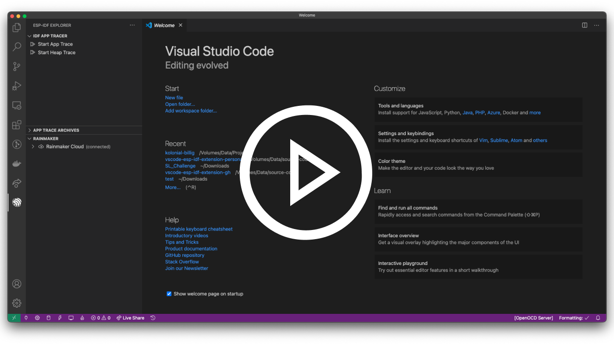

<a href="https://marketplace.visualstudio.com/items?itemName=espressif.esp-idf-extension">
  
</a>

# ESP-IDF VS Code Extension

Develop and debug applications for Espressif [ESP32](https://espressif.com/en/products/hardware/esp32), [ESP32-S2](https://www.espressif.com/en/products/socs/esp32-s2) chips with [ESP-IDF](https://github.com/espressif/esp-idf) IoT Development Framework.

<a href="https://youtu.be/Lc6ausiKvQM">
  <p align="center">
    
  </p>
</a>

The ESP-IDF extension makes it easy to develop, build, flash, monitor and debug your ESP-IDF code. See all [features](./docs/FEATURES.md).

## Quick links

- [Build from source code and how to install](./docs/INSTALL.md)
- [Configuration settings](./docs/SETTINGS.md)
- [Commands](#Available-commands)
- [Contribute](./docs/CONTRIBUTING.md)
- [Features](./docs/FEATURES.md)
- [Github Repository](https://github.com/espressif/vscode-esp-idf-extension)
- [Github issues](https://github.com/espressif/vscode-esp-idf-extension/issues)
- [How to use](#How-to-use)
- [Setup process](./docs/SETUP.md)
- [Releases](https://github.com/espressif/vscode-esp-idf-extension/releases)
- [Working with multiple projects](#Working-with-multiple-projects)

## Prerequisites

There are few dependencies required in your system and available in environment variable PATH before installing this extension:

| Linux                                                        | MacOS                                                        | Windows                                                      |
| ------------------------------------------------------------ | ------------------------------------------------------------ | ------------------------------------------------------------ |
| [Python 3.5](https://www.python.org/download/releases/3.5/)+ | [Python 3.5](https://www.python.org/download/releases/3.5/)+ | [Python 3.5](https://www.python.org/download/releases/3.5/)+ |
| [Git](https://git-scm.com/downloads)                         | [Git](https://git-scm.com/downloads)                         | [Git](https://git-scm.com/downloads)                         |
| [CMake](https://cmake.org/download)                          | [CMake](https://cmake.org/download)                          |                                                              |
| [Ninja-build](https://github.com/ninja-build/ninja/releases) | [Ninja-build](https://github.com/ninja-build/ninja/releases) |                                                              |

All the other dependencies like ESP-IDF and ESP-IDF Tools can be installed using the **ESP-IDF: Configure ESP-IDF extension** setup wizard or following the steps in the [setup documentation](./docs/SETUP.md).

> Please note that this extension **only [supports](https://github.com/espressif/esp-idf/blob/master/SUPPORT_POLICY.md)** the release versions of ESP-IDF, you can still use the extension on `master` branch or some other branch, but certain feature might not properly work.

## How to use

- Install this extension in your Visual Studio Code.
- Then
  - Either open Visual Studio Code and create a workspace folder.
  - Run `code ${YOUR_PROJECT_DIR}` from the command line.
- Check you have installed the [Prerequisites](#Prerequisites)
- Press <kbd>F1</kbd> and type **ESP-IDF: Configure ESP-IDF extension** to open the extension configuration wizard. This will install ESP-IDF and tools and configure the extension.

  - Please take a look at [SETUP](./docs/SETUP.md) for details about extension configuration.

- Press <kbd>F1</kbd> and type **ESP-IDF: Create ESP-IDF project** to generate a template ESP-IDF project.

  > **Note:** If you want to get code navigation and ESP-IDF function references, build the project a first time. This will generate the required **compile_commands.json** used by [Microsoft C/C++ Extension](https://marketplace.visualstudio.com/items?itemName=ms-vscode.cpptools) to resolve header/source links. You can do a rebuild by pressing <kbd>F1</kbd> and typing **ESP-IDF: Build your project**. If you don't want to build your project beforehand, you can configure your project using [C/C++ Configuration](./docs/C_CPP_CONFIGURATION.md)

- Do some coding!
- Check you set the correct port of your device by pressing <kbd>F1</kbd>, typing **ESP-IDF: Select port to use:** and choosing the serial port your device is connected.
- When you are ready, build your project. Then flash to your device by pressing <kbd>F1</kbd> and typing **ESP-IDF: Flash your device** then selecting Flash allows you to flash the device.
- You can later start a monitor by pressing <kbd>F1</kbd> and typing **ESP-IDF: Monitor your device** which will log the activity in a Visual Studio Code terminal.
- If you want to start a debug session, just press F5 (make sure you had at least build and flash once before so the debugger works correctly). To make sure you can debug your device, set the proper `idf.openOcdConfigs` settings in your settings.json or by pressing <kbd>F1</kbd> and typing **ESP-IDF: Device configuration**.

## Available commands

Click <kbd>F1</kbd> to show Visual studio code actions, then type **ESP-IDF** to see possible actions.

| Command Description                             | Keyboard Shortcuts (Mac)               | Keyboard Shortcuts (Windows/ Linux)       |
| ----------------------------------------------- | -------------------------------------- | ----------------------------------------- |
| Configure ESP-IDF extension                     |                                        |                                           |
| Create ESP-IDF project                          | <kbd>⌘</kbd> <kbd>E</kbd> <kbd>C</kbd> | <kbd>Ctrl</kbd> <kbd>E</kbd> <kbd>C</kbd> |
| Add vscode configuration folder                 |                                        |                                           |
| Add Arduino ESP32 as ESP-IDF Component          |                                        |                                           |
| Configure Paths                                 |                                        |                                           |
| Set Espressif device target                     |                                        |                                           |
| Device configuration                            |                                        |                                           |
| SDK Configuration editor                        |                                        |                                           |
| Set default sdkconfig file in project           |                                        |                                           |
| Select port to use                              | <kbd>⌘</kbd> <kbd>E</kbd> <kbd>P</kbd> | <kbd>Ctrl</kbd> <kbd>E</kbd> <kbd>P</kbd> |
| Full clean project                              | <kbd>⌘</kbd> <kbd>E</kbd> <kbd>F</kbd> | <kbd>Ctrl</kbd> <kbd>E</kbd> <kbd>F</kbd> |
| Build your project                              | <kbd>⌘</kbd> <kbd>E</kbd> <kbd>B</kbd> | <kbd>Ctrl</kbd> <kbd>E</kbd> <kbd>B</kbd> |
| Flash your project                              | <kbd>⌘</kbd> <kbd>E</kbd> <kbd>F</kbd> | <kbd>Ctrl</kbd> <kbd>E</kbd> <kbd>F</kbd> |
| Monitor your device                             | <kbd>⌘</kbd> <kbd>E</kbd> <kbd>M</kbd> | <kbd>Ctrl</kbd> <kbd>E</kbd> <kbd>M</kbd> |
| Build, Flash and start a monitor on your device | <kbd>⌘</kbd> <kbd>E</kbd> <kbd>D</kbd> | <kbd>Ctrl</kbd> <kbd>E</kbd> <kbd>D</kbd> |
| Open ESP-IDF Terminal                           | <kbd>⌘</kbd> <kbd>E</kbd> <kbd>T</kbd> | <kbd>Ctrl</kbd> <kbd>E</kbd> <kbd>T</kbd> |
| Pick a workspace folder                         |                                        |                                           |
| Size analysis of the binaries                   | <kbd>⌘</kbd> <kbd>E</kbd> <kbd>S</kbd> | <kbd>Ctrl</kbd> <kbd>E</kbd> <kbd>S</kbd> |
| Show Examples Projects                          |                                        |                                           |
| Add Editor coverage                             |                                        |                                           |
| Remove Editor coverage                          |                                        |                                           |
| Get HTML Coverage Report for project            |                                        |                                           |
| Search in documentation...                      | <kbd>⌘</kbd> <kbd>E</kbd> <kbd>D</kbd> | <kbd>Ctrl</kbd> <kbd>E</kbd> <kbd>D</kbd> |
| Install ESP-ADF                                 |                                        |                                           |
| Install ESP-MDF                                 |                                        |                                           |
| Install ESP-IDF Python Packages                 |                                        |                                           |
| Open NVS Partition Editor                       |                                        |                                           |

The **Add Arduino ESP32 as ESP-IDF Component** command will add [Arduino ESP32](https://github.com/espressif/arduino-esp32) as a ESP-IDF component in your current directory with in `${CURRENT_FOLDER}/components/arduino`. You can also use **Create ESP-IDF project** with the `arduino-as-component` template to create a new project folder that includes arduino as ESP-IDF component.

The **Show Examples Projects** command allows you create a new project using one of the examples in ESP-IDF, ESP-ADF or ESP-MDF directory if related configuration settings are set.
The **Install ESP-ADF** will clone ESP-ADF and set `idf.espAdfPath` (`idf.espAdfPathWin` in Windows).
The **Install ESP-MDF** will clone ESP-MDF and set `idf.espMdfPath` (`idf.espMdfPathWin` in Windows).

## Available Tasks in tasks.json

There is also some tasks defined in Tasks.json, which can be executed by running <kbd>F1</kbd> and writing `Tasks: Run task` and selecting one of
the following:

1. `Build` - Build Project
2. `Set Target to esp32`
3. `Set Target to esp32s2`
4. `Clean` - Clean the project
5. `Flash` - Flash the device
6. `Monitor` - Start a monitor terminal
7. `OpenOCD` - Start the openOCD server
8. `BuildFlash` - Execute a build followed by a flash command.

Note that for OpenOCD tasks you need to define OPENOCD_SCRIPTS in your system environment variables with openocd scripts folder path.

## Working with multiple projects

For big projects, a user will typically have one or more projects to build, flash or monitor. The ESP-IDF extension follows the [Visual Studio Code Workspace file schema](https://code.visualstudio.com/docs/editor/multi-root-workspaces#_workspace-file-schema) to identify all projects folders inside the current workspace (which would be the root folder).

You can select the current project by clicking the **ESP-IDF Current Project** Item in the Visual Studio Code Status bar or by pressing F1 and typing **ESP-IDF: Pick a workspace folder for IDF commands** which will determine the folder where to obtain the ESP-IDF Settings such as current device USB port, ESP-IDF path, etc.

Projects folders and workspace level settings are defined in the `.code-workspace` file such as:

```json
{
  "folders": [
    {
      "path": "./project1"
    },
    {
      "path": "./project2"
    }
  ],
  "settings": {
    "idf.port": "/dev/ttyUSB1",
    "idf.espIdfPath": "${env:HOME}/esp/esp-idf"
  }
}
```

Settings in the root folder's `.code-workspace` can be used when your **ESP-IDF Current Project** directory doesn't contain a `.vscode/settings.json` file. If there is no

If you want to open a project with multiple subprojects in Visual Studio Code, click Menu **File** then **Open Workspace** which will open a window to select the `.code-workspace` of your root project.
You can either manually create this `.code-workspace` file and define all sub folders (projects) or when you click Menu **File** --> **Save Workspace as...** which doesn't automatically add any folder inside the current directory.
You can add a folder to the workspace when you click Menu **File** --> **Add Folder to Workspace...**.

> **NOTE:** You still need to manually select the debug configuration in the Debug tab that correspond to your current workspace folder. There is a project folder suffix on each debug configuration.

## Forum

Check out the IDEs for ESP-IDF in [ESP32 forums](https://esp32.com).

## Code of Conduct

This project and everyone participating in it is governed by the [Code of Conduct](./docs/CODE_OF_CONDUCT.md). By participating, you are expected to uphold this code. Please report unacceptable behavior to [vscode@espressif.com](mailto:vscode@espressif.com).

## License

This extension is licensed under the Apache License 2.0. Please see the [LICENSE](./LICENSE) file for additional copyright notices and terms.
