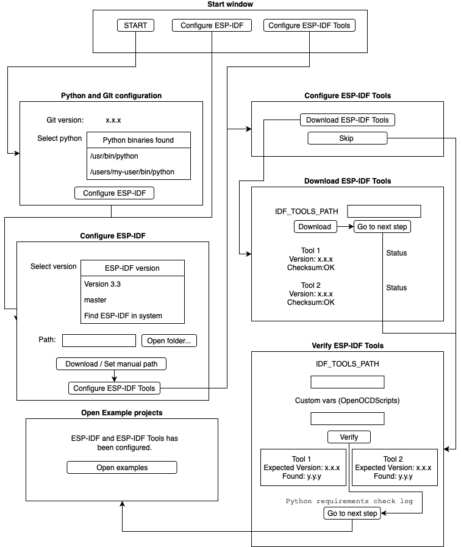

# Onboarding ESP-IDF Extension

When you start ESP-IDF extension, the onboarding window can help you set up ESP-IDF, ESP-IDF Tools and their Python requirements to easily start working on your projects.

## Prerequisites

Install [ESP-IDF Prerequisites](https://docs.espressif.com/projects/esp-idf/en/latest/get-started/index.html#step-1-install-prerequisites) for your operating system.

For this extension you also need [Python](https://www.python.org/download) and [Git](https://www.python.org/downloads). If you are on MacOS and Linux, you also need to preinstall [CMake](https://cmake.org/download) and [Ninja](https://github.com/ninja-build/ninja/releases). For Windows users, CMake and Ninja are part of this configuration.

## How to configure correctly this extension

1. Press **START** on the onboarding window and check that git is installed. Also select the Python executable to use in this extension. The python executable is saved in **idf.pythonSystemBinPath** or **idf.pythonSystemBinPathWin** for Windows users.

2. Go to **Configure ESP-IDF** to download ESP-IDF or select an existing ESP-IDF folder in your system. In this window you can select the version you wish to download and the path to install it or you can select ESP-IDF directory, which will be validated. This path is saved as `idf.espIdfPath` which is used to replace system environment variable `IDF_PATH` (inside Visual Studio Code only) before running extension commands.

3. Go to **Configure ESP-IDF Tools** will allow you to download required ESP-IDF Tools or manually set them. 
    1. If you are downloading them, choose the directory where to install them (Default directory is **$HOME/.espressif** for Linux/MacOS users or **%USER_PROFILE%\.espressif** for Windows users) which will saved as `idf.toolsPath`. After installing the ESP-IDF Tools, a python virtual environment will be created for ESP-IDF in **${`idf.toolsPath`}/python_env** and the virtualenv python full path executable will be saved in `idf.pythonBinPath` or `idf.pythonBinPathWin` for Windows users. **This python executable will be used to execute all python dependent commands in this ESP-IDF extension**. After you download the ESP-IDF Tools, their bin folder directories will be set in  `idf.customExtraPaths` and their required environment variables in `idf.customExtraVars` (such as OPENOCD_SCRIPTS).
 
4. The next step is to verify each installed tool version is correct for the `idf.espIdfPath` ESP-IDF. If you skipped ESP-IDF tools download, you need to manually set each tool bin directory in `idf.customExtraPaths` by typing all required tools executable location separated by ; (Windows users) or : (Linux/MacOS users). 

For example if
- OpenOCD executable path is _$HOME/.espressif/tools/openocd/version/openocd-esp32/bin/openocd_ or _%USER_PROFILE%\.espressif\tools\openocd\version\openocd-esp32\bin\openocd_ (Windows)
- XtensaEsp32 executable path is _$HOME/.espressif/tools/xtensa-esp32/version/xtensa-esp32/bin/xtensa-esp32-gcc_ or _%USER_PROFILE%\.espressif\tools\xtensa\version\xtensa-esp32\bin/xtensa-esp32-gcc_ (Windows)

you need to set in `idf.customExtraPaths`:

- _$HOME\.espressif\tools\openocd\version\openocd-esp32\bin:$HOME/.espressif/tools/xtensa-esp32/version/xtensa-esp32/bin_ (Linux/MacOS users) or _%USER_PROFILE%\.espressif\tools\openocd\version\openocd-esp32\bin;%USER_PROFILE%\.espressif\tools\xtensa-esp32\version\xtensa-esp32\bin_ (Windows users). 

`idf.customExtraVars` is an object saved in Visual Studio Code's settings.json that looks like this:
```
{
    ...,
    OPENOCD_SCRIPTS: "...",
    OTHER_ENV_VAR: "...",
    ...
}
```

The list of required `idf.customExtraVars` will be shown in the current step (Verify ESP-IDF Tools) and they should be filled for the extension to work properly. 

After verifying ESP-IDF Tools, the current `idf.pythonBinPath` executable is used to test all ESP-IDF requirements.txt are fulfilled as well.

5. After verifying ESP-IDF tools and required python packages, the extension has been configured correctly. An option to open **ESP-IDF: Show examples** is shown.

Here is diagram to configure ESP-IDF extension:



## Notes

Consider that installing ESP-IDF Python Requirements (In Step 2) will fail if your `idf.pythonSystemBinPath` is set to a Python virtual environment executable.

If you try to download ESP-IDF in a directory where a folder esp-idf already exists an error will be shown. Please delete this esp-idf folder or choose another destination directory.