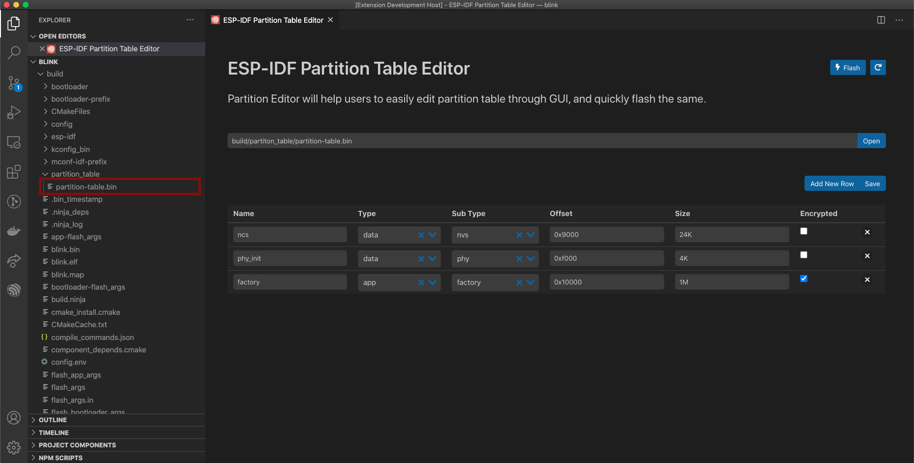

# Partition Table Editor UI for ESP-IDF

Our VS Code Extension comes with UI for editing your [partition table](https://docs.espressif.com/projects/esp-idf/en/latest/esp32/api-guides/partition-tables.html) and flash it to your chip, instead of editing the csv files directly we present you with comfortable UI where you can edit an existing partition table or create a new one of your choosing.

## Prerequisites

- ESP-IDF `>=v4.x`
- IDF VSCode extension version `>=0.6.0`
- ESP Wrover Kit (optional for flashing the modified partition table)

## Steps

- Open any IDF where you want to have custom partition table.
- Set `CONFIG_PARTITION_TABLE_CUSTOM` in the menuconfig and set your partition table csv file name.
- Launch command palate using <kbd>F1</kbd>, and select `Open Partition Table Editor`.
  > If there is no partition table file created based on the `` config, set via menuconfig, we will create an empty file.
- Once partition table editor is open, you can edit your partition table, as you desire. For more info please refer to [this article](https://docs.espressif.com/projects/esp-idf/en/latest/esp32/api-guides/partition-tables.html).
- Once you're satisfied press `Save` to save the changes made by you, _this will override the content of csv file_
- Now you can click the `Build & Flash` button on the top-right, to build & flash the partition table to the chip.

## Screenshot

---

> If you find any of the data/graph/tables represent wrong data points please help us correct/improve the same by [reporting bugs here](http://github.com/espressif/vscode-esp-idf-extension/issues)
