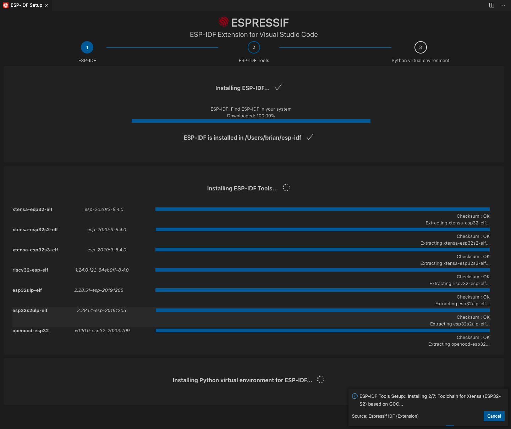

# ESPRESSIF IDF extension for Visual Studio Code

# Table Of Contents (TOC)

- [ Installing Prerequisites ](#Prerequisites) <br>
- [ Installing Prerequisites ](#Prerequisites) <br>
- [ Installing Prerequisites ](#Prerequisites) <br>

# Installation

1. Download and install [Visual Studio Code](https://code.visualstudio.com/).
2. Open the **Extensions** view by clicking on the Extension icon in the Activity Bar on the side of VS Code or the View: Extensions command <kbd>⇧</kbd> <kbd>⌘</kbd> <kbd>X</kbd>.
3. Search the extension with any related keyword like `espressif`, `esp-idf`, `esp32` or `esp32s2`.
4. Install the extension.


5. In Visual Studio Code, select menu "View" and then "Command Palette", where you can type [configure esp-idf extension]. Then, select the **ESP-IDF: Configure ESP-IDF extension** option.
6. The setup wizard window will be shown with setup options: **Express**, **Advanced** or **Use existing setup**.


7. Choose **Express** for the fastest option (or **Use existing setup** if you have ESP-IDF installed already)
8. Then you need to choose an ESP-IDF version to download (or use an existing one) and the python executable to create the virtual environment.


9. You will see a page showing the setup progress status. You will see ESP-IDF download progress, ESP-IDF Tools download and install progress and the creation of a python virtual environment.



10. If everything is installed correctly, you will a see a message that all settings have been configured. You can start using the extension.


> **NOTE**: **Use existing setup** is only shown if:
>
> - ESP-IDF is found in `IDF_PATH` environment variable, `$HOME/esp/esp-idf` on MacOS/Linux and `%USERPROFILE%\esp\esp-idf` or `%USERPROFILE%\Desktop\esp-idf` in Windows.
> - ESP-IDF Tools and ESP-IDF Python virtual environment for the previos ESP-IDF are found in `IDF_TOOLS_PATH` environment variable, `$HOME\.espressif` on MacOS/Linux and `%USERPROFILE%\.espressif` on Windows.

> **NOTE**: The advance mode allows you to choose where to install ESP-IDF Tools and virtual environment if downloading ESP-IDF tools, or to use existing ESP-IDF tools by manually entering each ESP-IDF tool absolute path.

# Troubleshooting

If something went wrong during the install please check for any error on one of these:

1. In Visual Studio Code select menu "View" -> Output -> ESP-IDF
2. Use the `ESP-IDF: Doctor command` to generate a report of your configuration.
3. Check log file which can be obtained from

- Windows: `%USERPROFILE%\.vscode\extensions\espressif.esp-idf-extension-VERSION\esp_idf_vsc_ext.log`
- Linux & MacOSX: `$HOME/.vscode/extensions/espressif.esp-idf-extension-VERSION/esp_idf_vsc_ext.log`

# Extension activation self configuration

When you start ESP-IDF extension, it will try to self-configure by looking for existing ESP-IDF directory in `IDF_PATH` environment variable, `$HOME/esp/esp-idf` on MacOS/Linux and `%USERPROFILE%\esp\esp-idf` or `%USERPROFILE%\Desktop\esp-idf` in Windows. It will look for ESP-IDF Tools and ESP-IDF Python virtual environment in `IDF_TOOLS_PATH` environment variable, `$HOME\.espressif` on MacOS/Linux and `%USERPROFILE%\.espressif` on Windows.

If ESP-IDF and corresponding ESP-IDF tools are found, these paths will be saved as Visual Studio Code Configuration settings, which are located in `press F1 -> type Preferences: Open Settings (UI)` or `press F1 -> type Preferences: Open Settings (JSON)`.

These settings, as described in [ESP-IDF Specific Settings](./SETTINGS.md#ESP-IDF-Specific-Settings), are

- `idf.espIdfPath` for IDF_PATH,
- `idf.customExtraPaths` for ESP-IDF Tools paths to be appended to environment variable PATH,
- `idf.pythonBinPath` for absolute virtual environment python path and
- `idf.customExtraVars` for additional environment variables from ESP-IDF tools such as OPENOCD_SCRIPTS.

If ESP-IDF and ESP-IDF tools are not available, you can use the [Setup Wizard](#Setup-Wizard) to download them and configure the extension for you or manually configure the extension as explained in [JSON Manual Configuration](#JSON-Manual-Configuration) or [Settings UI Manual Configuration](#UI-Manual-Configuration).

## Setup Wizard

In Visual Studio Code press **F1** and type **ESP-IDF: Configure ESP-IDF extension**.

Setup wizard provides 3 choices:

- **Express install**: Fastest option.
  1.  Choose to either download selected ESP-IDF version or find ESP-IDF in your system.
  2.  Download and install ESP-IDF Tools. This step will use the existing value in `idf.toolsPath` or `idf.toolsPathWin` as ESP-IDF Tools directory.
  3.  Create python virtual environment with required packages on existing ESP-IDF Tools directory.
- **Advanced install**: Configurable option.
  1.  Choose to either download selected ESP-IDF version or find ESP-IDF in your system.
  2.  Download or use existing ESP-IDF Tools:
      - Choose directory for ESP-IDF Tools and install ESP-IDF Tools. This step will update the existing value in `idf.toolsPath` or `idf.toolsPathWin`.
      - Specify directory than contains executable for each required ESP-IDF tool with matching version.
  3.  Create python virtual environment with required packages in chosen ESP-IDF Tools directory.
- **Use existing setup**: If ESP-IDF is found in `idf.espIdfPath` (or `$HOME/esp/esp-idf` on MacOS/Linux and `%USERPROFILE%\esp\esp-idf` or `%USERPROFILE%\Desktop\esp-idf` in Windows) and valid ESP-IDF tools in `idf.toolsPath` (or `$HOME\.espressif` on MacOS/Linux and `%USERPROFILE%\.espressif` in Windows) then this option is shown to use an existing setup. This option will additionally install extension and ESP-IDF debug adapter python packages requirements.
  > **NOTE:** ESP-IDF Tools will be installed on the path specified in `idf.toolsPath` on MacOS/Linux or `idf.toolsPathWin` in Windows, which has a default path value of in `$HOME\.espressif` on MacOS/Linux and `%USERPROFILE%\.espressif` on Windows, respectively.

After choosing any of the previous options, a status page is displayed showing ESP-IDF, tools and python environment setup progress status. When the setup is finished, a message is shown that "All settings have been configured. You can close this window."

## JSON Manual Configuration

The user can manually configure the extension by setting the following configuration settings with corresponding values. Please take a look at [Configuration settings](./docs/SETTINGS.md) for more information.

1. In Visual Studio Code press **F1** and type **Preferences: Open Settings (JSON)**. This will open the user global settings for Visual Studio Code.
   > **NOTE:** The user could choose to modify its workspace settings.json for a workspace limited configuration or a project limited configuration in the project's `.vscode/settings.json`. Please take a look at [Working with multiple projects](./docs/MULTI_PROJECTS.md).
2. Your settings.json should look like:

MacOS/Linux

```json
{
  "idf.espIdfPath": "path/to/esp-idf",
  "idf.customExtraPaths": "UPDATED_PATH",
  "idf.customExtraVars": "{\"OPENOCD_SCRIPTS\":\"OPENOCD_FOLDER/share/openocd/scripts\"}",
  "idf.pythonBinPath": "PYTHON_INTERPRETER",
  "idf.openOcdConfigs": [
    "interface/ftdi/esp32_devkitj_v1.cfg",
    "board/esp32-wrover.cfg"
  ],
  "idf.port": "DEVICE_PORT"
}
```

Windows

```json
{
  "idf.espIdfPathWin": "path/to/esp-idf",
  "idf.customExtraPaths": "UPDATED_PATH",
  "idf.customExtraVars": "{\"OPENOCD_SCRIPTS\":\"OPENOCD_FOLDER/share/openocd/scripts\"}",
  "idf.pythonBinPathWin": "PYTHON_INTERPRETER",
  "idf.openOcdConfigs": [
    "interface/ftdi/esp32_devkitj_v1.cfg",
    "board/esp32-wrover.cfg"
  ],
  "idf.portWin": "DEVICE_PORT"
}
```

where:

- **UPDATED_PATH** is the "Updated PATH variable" generated by `$IDF_PATH/export.sh`,
- **PYTHON_INTERPRETER** is the "Using Python interpreter in" value generated by `$IDF_PATH/export.sh`,
- **DEVICE_PORT** is your device serial port (i.e. COM1, /dev/cu.usbserial-1433401 or /dev/ttyUSB1)
- `idf.openOcdConfigs` are the config files used for OpenOCD for your device (relative paths to `OPENOCD_SCRIPTS` directory of OpenOCD-ESP32 tool).

**DO NOT USE ~, $HOME OR %USERPROFILE%, ENVIRONMENT VARIABLES ARE NOT RESOLVED IN THIS CONFIGURATION SETTINGS. You must use ${env:HOME} instead of \$HOME (Linux/MacOS) or %HOME% (Windows).**

Make sure to install the extension and extension debug adapter Python requirements by running the following commands in your terminal:

```
PYTHON_INTERPRETER -m pip install -r EXTENSION_PATH/requirements.txt
```

```
PYTHON_INTERPRETER -m pip install -r EXTENSION_PATH/esp_debug_adapter/requirements.txt
```

where EXTENSION_PATH is

- `%USERPROFILE%\.vscode\extensions\espressif.esp-idf-extension-VERSION` on Windows
- `$HOME/.vscode/extensions/espressif.esp-idf-extension-VERSION` on Linux/MacOS.

## Example configuration setting values

An example ESP-IDF path is to set `idf.espIdfPath` to `/home/myUser/to/esp-idf` (MacOS/Linux) or set `idf.espIdfPathWin` to `C:\Users\myUser\esp\esp-idf` (Windows)

An example python path for `idf.pythonBinPath` (MacOS/Linux) is

- `/home/myUser/.espressif/python_env/idf4.0_py3.5_env/bin/python`
  An example python path for `idf.pythonBinPathWin` (Windows) is
- `C:\Users\myUser\.espressif\python_env\idf4.0_py3.5_env\Scripts\python.exe`

For example if required ESP-IDF Tools are:

- OpenOCD executable path is `/home/myUser/.espressif/tools/openocd-esp32/version/openocd-esp32/bin/openocd` or `C:\Users\myUser\.espressif\tools\openocd-esp32\version\openocd-esp32\bin\openocd` (Windows)
- XtensaEsp32 executable path is `/home/myUser/.espressif/tools/xtensa-esp32/version/xtensa-esp32/bin/xtensa-esp32-gcc` or `C:\Users\myUser\.espressif\tools\xtensa\version\xtensa-esp32\bin\xtensa-esp32-gcc` (Windows)

you need to set in `idf.customExtraPaths`:

- Linux/MacOS

```
/home/myUser/.espressif/tools/openocd/version/openocd-esp32/bin:/home/myUser/.espressif/tools/xtensa-esp32/version/xtensa-esp32/bin
```

- Windows

```
C:\Users\myUser\.espressif\tools\openocd-esp32\version\openocd-esp32\bin;C:\Users\myUser\.espressif\tools\xtensa-esp32\version\xtensa-esp32\bin
```

`idf.customExtraVars` is an stringified JSON object saved in Visual Studio Code's settings.json (**Make sure to replace \${TOOL_PATH} with the existing tool directory path**):

```
"idf.customExtraVars": "{\"OPENOCD_SCRIPTS\":\"/home/myUser/.espressif/tools/openocd-esp32/version/openocd-esp32/share/openocd/scripts\"}"
```

The list of required ESP-IDF Tools (`idf.customExtraPaths`) and environment variables (`idf.customExtraVars`) can be found in `$IDF_PATH/tools/tools.json`

> **NOTE:** Make sure to replace \${TOOL_PATH} of `$IDF_PATH/tools/tools.json` in`idf.customExtraPaths` and `idf.customExtraVars` with existing ESP-IDF tool directory path.

`idf.openOcdConfigs` use openOCD Configuration files depending on your board and chip target. More information [here](https://docs.espressif.com/projects/esp-idf/en/latest/esp32/api-guides/jtag-debugging/tips-and-quirks.html#jtag-debugging-tip-openocd-configure-target).

## UI Manual Configuration

This is the same as [JSON Manual Configuration](#JSON-Manual-Configuration) but the name of each configuration setting is the description given in the [ESP-IDF Settings](./SETTINGS.md).
You also need to install extension and debug adapter python packages requirements.txt.
