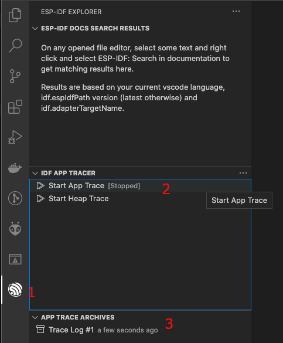

# Application tracing

Let's open a ESP-IDF project. For this tutorial we will use the `system/app_trace_to_host` example.

1. Click menu View -> Command Palette... and search for the **ESP-IDF: Show Examples Projects** command and choose `Use current ESP-IDF (/path/to/esp-idf)`. If the user doesn't see the option, please review the setup in [Install tutorial](./install.md).

2. A window will be open with a list a projects, go the **system** section and choose the `app_trace_to_host`. You will see a **Create project using example app_trace_to_host** button in the top and a description of the project below. Click the button and the project will be opened in a new window.

  

For this example, the project has been already configured for application tracing purposes. For more information please take a look at the [Application Level Tracing library documentation](https://docs.espressif.com/projects/esp-idf/en/latest/esp32/api-guides/app_trace.html).

3. Configure, build and flash your project as explained in the [Basic use tutorial](./basic_use.md).

4. Click the `ESP-IDF Explorer` in the [activity bar](https://code.visualstudio.com/docs/getstarted/userinterface). On the `IDF APP TRACER` section, click the `Start App Trace`. This will execute the extension's openOCD server and send the corresponding tracing commands to generate a tracing log. You can see the generated tracing log in the `APP TRACE ARCHIVES` named with `Trace Log #1`. Each time you execute `Start App Trace` a new tracing will be generated and shown in the archives list. You can also start tracing by running the **ESP-IDF: App Trace** command.

> **NOTE:** The openOCD server output is shown in menu `View` -> Output -> OpenOCD.

> **NOTE:** Make sure that openOCD configuration files are properly configured as described in [Debugging tutorial](./debugging.md).

  

5. Click on `Trace Log #1` to open a window with the trace report. Click `Show report` button to see the trace output.

  

