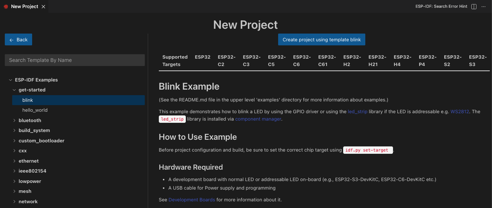
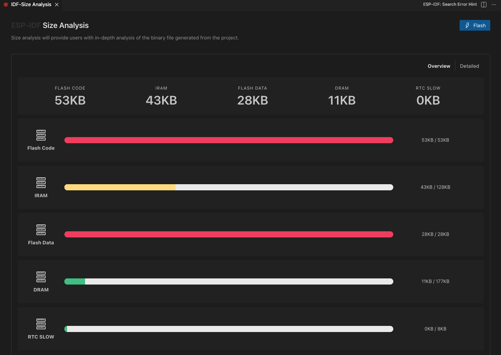

# Basic Use of the Extension.

In this tutorial you will learn how to use the basic commands of this extension to develop your application with Espressif devices.

You have several options to create a project:

- Using one the examples from ESP-IDF or any additional supported framework using the **ESP-IDF: Show Examples Projects** command.
- Use one of the templates included with this extension using the **ESP-IDF: Create ESP-IDF Project** command.

> **NOTE:** To configure any additional supported framework, please review [Configuring Additional Frameworks](./additional_frameworks.md)

1. Let's use the ESP-IDF get-started's blink example for this tutorial. Click menu View -> Command Palette... and type **ESP-IDF: Show Examples Projects** and choose `Use Current ESP-IDF (/path/to/esp-idf)`. If the user doesn't see the option, please review the setup in [Install tutorial](./install.md).
2. A window will be open with a list a projects, go the **get-started** section and choose the `blink_example`. You will see a **Create blink_example Project** button in the top and a description of the project below. Click **Create blink_example Project** button.

<p>
  
</p>

3. Now select a container directory where to copy the example project. For example, if the user choose `/Users/myUser/someFolder` the resulting folder will be `/Users/myUser/someFolder/blink`. This new project directory will be created and opened in Visual Studio Code.

4. First the user should select an Espressif target (esp32, esp32s2, etc.) with the **ESP-IDF: Set Espressif Device Target** command. Default is `esp32` and the one used in this tutorial.

5. Next configure your project using menuconfig. Use the **ESP-IDF: SDK Configuration Editor** command (<kbd>CTRL</kbd> <kbd>E</kbd> <kbd>G</kbd> keyboard shortcut ) where the user can modify the ESP-IDF project settings. After all changes are made, click save and close this window.

> **NOTE:** The **SDK Configuration Editor** is built from the project's `build/config/kconfig_menus.json` which is generated by the build system from ESP-IDF and user defined components `Kconfig` files on the first run of `SDK Configuration Editor`. This process takes a bit of time so we keep the process running in the background to speed things up. If you are making changes to any Kconfig file or you want to re-run the SDK Configuration editor from scratch, you need to dispose the current process with the `ESP-IDF: Dispose Current SDK Configuration Editor Server Process` and run the `ESP-IDF: SDK Configuration Editor` again.

<p>
  
</p>

6. Configure the `.vscode/c_cpp_properties.json` as explained in [C/C++ Configuration](../C_CPP_CONFIGURATION.md).

7. Now to build the project, use the **ESP-IDF: Build your Project** command (<kbd>CTRL</kbd> <kbd>E</kbd> <kbd>B</kbd> keyboard shortcut). The user will see a new terminal being launched with the build output and a notification bar with Building Project message until it is done then a Build done message when finished. You could modify the behavior of the build task with `idf.cmakeCompilerArgs` for Cmake configure step and `idf.ninjaArgs` for Ninja step. For example, using `[-j N]` where N is the number of jobs run in parallel.

> **NOTE:** There is a `idf.notificationSilentMode` configuration setting if the user does not wants to see the output automatically. Please review [ESP-IDF Settings](../SETTINGS.md)) to see how to modify this configuration setting.

<p>
  
</p>

8. (OPTIONAL) Use the **ESP-IDF: Size Analysis of the Binaries** command (<kbd>CTRL</kbd> <kbd>E</kbd> <kbd>S</kbd> keyboard shortcut) to review the application size information.

<p>
  
</p>

8. Before flashing the project, the user needs to specify the serial port of the device with the **ESP-IDF: Select Port to Use** command (<kbd>CTRL</kbd> <kbd>E</kbd> <kbd>P</kbd> keyboard shortcut). You can choose between UART/JTAG flashing mode and then a list of serial ports will be shown for the user to select.

> **NOTE:** Please take a look at [ESP-PROG Board the Instructions](https://docs.espressif.com/projects/espressif-esp-iot-solution/en/latest/hw-reference/ESP-Prog_guide.html#step-by-step-instruction) or [Configuring ESP32 Target](https://docs.espressif.com/projects/esp-idf/en/stable/esp32/api-guides/jtag-debugging/index.html#configuring-esp32-target) your Espressif device and JTAG interface to your computer.

9. Now to flash the project, use the **ESP-IDF: Flash your Project** command (<kbd>CTRL</kbd> <kbd>E</kbd> <kbd>F</kbd> keyboard shortcut). Choose `UART` or `JTAG` flash mode ([Configure JTAG Flashing](#About-JTAG-flashing)) and then flashing will start in the previously selected serial port. The user can also use the **ESP-IDF: Flash (UART) your Project** or **ESP-IDF: Flash (with JTAG)** directly.
   > **NOTE:** When using the **ESP-IDF: Select Flash Method and Flash** command, your choice will be saved in the `idf.flashType` configuration setting.

The user will see a new terminal being launched with the flash output and a notification bar with `Flashing Project` message until it is done then a Flash done message when finished.

> **NOTE:** There is an `idf.flashBaudRate` configuration settings to modify the flashing baud rate. Please review [ESP-IDF Settings](../SETTINGS.md) to see how to modify this configuration setting.

<p>
  
</p>

10. Now to start monitoring your device, use the **ESP-IDF: Monitor your Device** command (<kbd>CTRL</kbd> <kbd>E</kbd> <kbd>M</kbd> keyboard shortcut). The user will see a new terminal being launched with the `idf.py monitor` output.

> **NOTE** The ESP-IDF Monitor baud rate value is taken from `idf.monitorBaudRate` with fallback on your project's SDKConfig `CONFIG_ESPTOOLPY_MONITOR_BAUD` (idf.py monitor' baud rate). This value can also be override by setting the environment variable `IDF_MONITOR_BAUD` or `MONITORBAUD` in your system environment variables or this extension's `idf.customExtraVars` configuration setting. Please review [ESP-IDF Settings](../SETTINGS.md)) to see how to modify `idf.customExtraVars`.

<p>
  
</p>

## Next Steps

You can debug ESP-IDF projects as shown in the [Debug tutorial](./debugging.md).

The **ESP-IDF: Open ESP-IDF Terminal** will launch a system terminal with ESP-IDF, ESP-IDF Tools and ESP-IDF Python Virtual Environment loaded as environment variables. Just typing `idf.py` or `esptool.py` should work to execute scripts from ESP-IDF and additional frameworks.

See other [ESP-IDF Extension Features](../FEATURES.md).

## About JTAG Flashing

JTAG flash mode requires openOCD v0.10.0-esp32-20201125 or later. To replace OpenOCD, just get one of the latest [OpenOCD releases](https://github.com/espressif/openocd-esp32/releases) and replace in `idf.customExtraPaths` the OpenOCD binary path like:

```
c:\\esp\\tools\\.espressif\\tools\\openocd-esp32\\v0.10.0-esp32-20200709\\openocd-esp32\\bin
```

for the bin directory of your desired OpenOCD release

```
c:\\esp\\tools\\.espressif\\tools\\openocd-esp32\\v0.10.0-esp32-20201202\\openocd-esp32\\bin
```

Also update `idf.customExtraVars` OPENOCD_SCRIPTS to the new OpenOCD Scripts folder path.

Please review [ESP-IDF Settings](../SETTINGS.md) to see how to modify these values.
