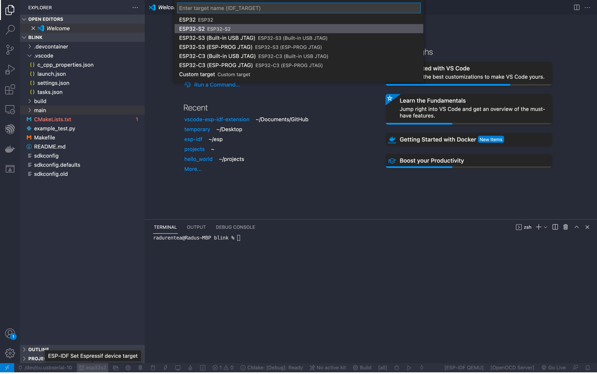
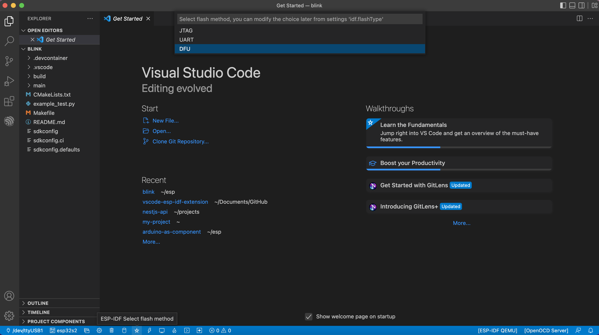

# Device Firmware Upgrade via USB.

## Requirements:

- ESP32-S2 or an ESP32-S3 chip
- You will need to do some electrical connection work. (Here is a guide for the S2 board: https://blog.espressif.com/dfu-using-the-native-usb-on-esp32-s2-for-flashing-the-firmware-b2c4af3335f1)
- The chip needs to be in bootloader mode for it to be detected as a DFU device. This can be achieved by pressing the “reset” button, while holding the “boot” button pressed
- For Windows only: You have to register on Windows the device with the WinUSB driver.
    > **NOTE:** The drivers can be installed by the [Zadig tool](https://zadig.akeo.ie/). Please make sure that the device is in download mode before you run the tool and that it detects the ESP32-S2 device before you install the drivers. The Zadig tool might detect several USB interfaces of ESP32-S2. Please install the WinUSB driver only for the interface where there is no driver installed (probably it is Interface 2) and do not re-install the driver for the other interface.

## Flashing:

1. Select a device target which is DFU compatible (ESP32-S2/ ESP32-S3) 

  

2. Select DFU as flashing method

  

3. Build the project

  

4. Flash

  

## Useful Links:
[Espressif DFU api guide](https://docs.espressif.com/projects/esp-idf/en/latest/esp32s2/api-guides/dfu.html?highlight=dfu%20util#api-guide-dfu-build)
