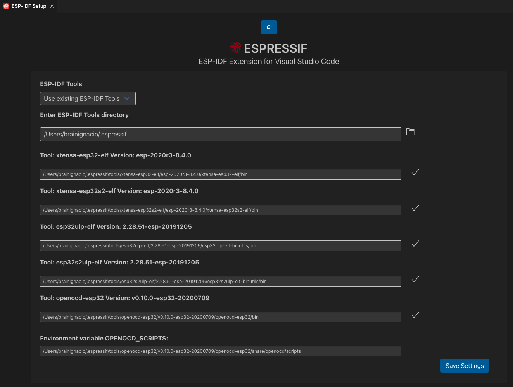

# Installation

> **NOTE:** [Troubleshooting](../../README.md#Troubleshooting)

1. If you are on Mac or Linux, install the following [ESP-IDF Prerequisites](https://docs.espressif.com/projects/esp-idf/en/latest/esp32/get-started/linux-macos-setup.html#step-1-install-prerequisites). If you are using Windows, ignore this step.
2. Download and install [Visual Studio Code](https://code.visualstudio.com/).
3. Open the **Extensions** view by clicking on the Extension icon in the Activity Bar on the side of Visual Studio Code or the **View: Extensions** command (shortcut: <kbd>⇧</kbd> <kbd>⌘</kbd> <kbd>X</kbd> or <kbd>Ctrl+Shift+X</kbd>.
4. Search for [ESP-IDF Extension](https://marketplace.visualstudio.com/items?itemName=espressif.esp-idf-extension).
5. Install the extension.
6. (OPTIONAL) Press <kbd>F1</kbd> and type **ESP-IDF: Select where to Save Configuration Settings**, which can be User Settings, Workspace Settings or Workspace Folder Settings. Please take a look at [Working with multiple projects](../MULTI_PROJECTS.md) for more information. Default is User settings.
7. In Visual Studio Code, select menu "View" and "Command Palette" and type [configure esp-idf extension]. After, choose the **ESP-IDF: Configure ESP-IDF Extension** option. You can also choose where to save settings in the setup wizard.
8. Now the setup wizard window will be shown with several setup options: **Express**, **Advanced** or **Use Existing Setup**.

> **NOTE**: **Use Existing Setup** setup mode option is only shown if:
>
> - `esp-idf.json` is found in the current `idf.toolsPath` (MacOS/Linux users) or `idf.toolsPathWin` (Windows users). This file is generated when you install ESP-IDF with the [ESP-IDF Windows Installer](https://github.com/espressif/idf-installer) or using [IDF-ENV](https://github.com/espressif/idf-env).
> - ESP-IDF is found in `idf.espIdfPath` or `idf.espIdfPathWin`, `IDF_PATH` environment variable, `$HOME/esp/esp-idf` on MacOS/Linux and `%USERPROFILE%\esp\esp-idf` or `%USERPROFILE%\Desktop\esp-idf` in Windows.
> - ESP-IDF Tools and ESP-IDF Python virtual environment for the previous ESP-IDF are found in `idf.toolsPath` or`idf.toolsPathWin`, `IDF_TOOLS_PATH` environment variable, `$HOME\.espressif` on MacOS/Linux and `%USERPROFILE%\.espressif` on Windows.

  

9. Choose **Express** for the fastest option (or **Use Existing Setup** if ESP-IDF is already installed)
10. If you choose **Express** setup mode:
    - Pick an ESP-IDF version to download (or find ESP-IDF in your system) and the python executable to create the virtual environment.
    - Choose the location for ESP-IDF Tools and python virtual environment (also known as `IDF_TOOLS_PATH`) which is `$HOME\.espressif` on MacOS/Linux and `%USERPROFILE%\.espressif` on Windows by default.
      > **NOTE:** Windows users don't need to select a python executable since it is part of the setup.
      > **NOTE:** Make sure that `IDF_TOOLS_PATH` doesn't have any spaces to avoid any build issues.

  

11. The user will see a page showing the setup progress status showing ESP-IDF download progress, ESP-IDF Tools download and install progress as well as the creation of a python virtual environment.

  

12. (OPTIONAL) If the user have chosen the **Advanced** option, after ESP-IDF is downloaded and extracted, select to either download ESP-IDF Tools or manually provide each ESP-IDF tool absolute path and required environment variables.
    > **NOTE:** Consider that `IDF_PATH` requires each ESP-IDF tool to be of the version described in `IDF_PATH`/tools/tools.json.
    > If it is desired to use a different ESP-IDF tool version, check [JSON Manual Configuration](../SETUP.md#JSON-Manual-Configuration)

  

13. (OPTIONAL) If the user has chosen the **Advanced** mode and selected to manually provide each ESP-IDF tool absolute path, please enter the executable container directory for each binary as shown below:
    > **NOTE:** Check [JSON Manual Configuration](../SETUP.md#JSON-Manual-Configuration) for more information.

  

14. If everything is installed correctly, the user will see a message that all settings have been configured. You can start using the extension.

  

> **NOTE**: > The advance mode allows the user to choose to use existing ESP-IDF tools by manually entering each ESP-IDF tool absolute path. Again, if chose an ESP-IDF version < 5.0, make sure each ESP-IDF tool path doesn't have any spaces, since they were no suported in previous versions..

15. Now that the extension setup is finally done, check the [Basic use](./basic_use.md) to learn how to use the SDK Configuration editor, build, flash and monitor your Espressif device.

> **NOTE**: Visual Studio Code has many places where to set configuration settings. This extension uses the `idf.saveScope` configuration setting to determine where to save settings, Global (User Settings), Workspace and WorkspaceFolder. Please review [vscode settings precedence](https://code.visualstudio.com/docs/getstarted/settings#_settings-precedence).

> **NOTE:** the setup wizard will install ESP-IDF Python packages and ESP-IDF debug adapter (`EXTENSION_PATH`/esp_debug_adapter/requirements.txt) python packages. Make sure that if using an existing python virtual environment that installing these packages doesn't affect your virtual environment. The `EXTENSION_PATH` is:

- Windows: `%USERPROFILE%\.vscode\extensions\espressif.esp-idf-extension-VERSION`
- Linux & MacOSX: `$HOME/.vscode/extensions/espressif.esp-idf-extension-VERSION`

# Installing Nightly Build

To install the nightly build follow the instructions below.

Nightly builds are available for <a href="https://nightly.link/espressif/vscode-esp-idf-extension/workflows/ci/master/esp-idf-extension.vsix.zip">Visual Studio Code</a> or <a href="https://nightly.link/espressif/vscode-esp-idf-extension/workflows/ci/master/esp-idf-extension-open.vsix.zip">OpenVSX</a>.

- Open VS Code
- Go to Extensions
- Click on the `...` from the top and choose `Install from VSIX...`
- Browse to the VSIX file you downloaded
- Wait for the extension to install
- Click the Reload button on the VS Code notification that appears
