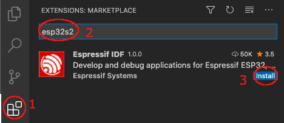

# Installation

1. Download and install [Visual Studio Code](https://code.visualstudio.com/).
2. Open the **Extensions** view by clicking on the Extension icon in the Activity Bar on the side of Visual Studio Code or the **View: Extensions** command <kbd>⇧</kbd> <kbd>⌘</kbd> <kbd>X</kbd>.
3. Search the extension with any related keyword like `espressif`, `esp-idf`, `esp32`, `esp32s2`, etc.
4. Install the extension.

  

5. In Visual Studio Code, select menu "View" and "Command Palette" and type [configure esp-idf extension]. After, choose the **ESP-IDF: Configure ESP-IDF extension** option.
6. Now the setup wizard window will be shown with several setup options: **Express**, **Advanced** or **Use existing setup**.

  

7. Choose **Express** for the fastest option (or **Use existing setup** if ESP-IDF is already installed)
8. Then pick an ESP-IDF version to download (or search for an existing ESP-IDF directory in your system) and the python executable to create the virtual environment.

  

9. The user will see a page showing the setup progress status showing ESP-IDF download progress, ESP-IDF Tools download and install progress as well as the creation of a python virtual environment.

  

10. (OPTIONAL) If the user have chosen the **Advanced** option, after ESP-IDF is downloaded and extracted, the next step is to choose the location for `IDF_TOOLS_PATH` (which is `$HOME\.espressif` on MacOS/Linux and `%USERPROFILE%\.espressif` on Windows by default) and select to download ESP-IDF Tools or manually provide each ESP-IDF tool absolute path and required environment variables.
    > **NOTE:** Consider that `IDF_PATH` requires each ESP-IDF tool to be of the version described in `IDF_PATH`/tools/tools.json.
    > If it is desired to use a different ESP-IDF tool version, check [JSON Manual Configuration](../SETUP.md#JSON-Manual-Configuration)

  

11. If everything is installed correctly, the user will see a message that all settings have been configured. You can start using the extension.

  

> **NOTE**: **Use existing setup** is only shown if:
>
> - ESP-IDF is found in `IDF_PATH` environment variable, `$HOME/esp/esp-idf` on MacOS/Linux and `%USERPROFILE%\esp\esp-idf` or `%USERPROFILE%\Desktop\esp-idf` in Windows.
> - ESP-IDF Tools and ESP-IDF Python virtual environment for the previos ESP-IDF are found in `IDF_TOOLS_PATH` environment variable, `$HOME\.espressif` on MacOS/Linux and `%USERPROFILE%\.espressif` on Windows.

> **NOTE**: The advance mode allows the user to choose where to install ESP-IDF Tools and virtual environment if downloading ESP-IDF tools, or to use existing ESP-IDF tools by manually entering each ESP-IDF tool absolute path.

Now that the extension setup is finally done, check the [basic use](./basic_use.md) to learn how to use the SDK Configuration editor, build, flash and monitor your Espressif device.

# Troubleshooting

If something went wrong during the install please check for any error on one of these:

1. In Visual Studio Code select menu "View" -> Output -> ESP-IDF
2. Use the `ESP-IDF: Doctor command` to generate a report of your configuration and it will be copied in your clipboard to paste anywhere.
3. Check log file which can be obtained from:

- Windows: `%USERPROFILE%\.vscode\extensions\espressif.esp-idf-extension-VERSION\esp_idf_vsc_ext.log`
- Linux & MacOSX: `$HOME/.vscode/extensions/espressif.esp-idf-extension-VERSION/esp_idf_vsc_ext.log`

4. In Visual Studio Code, select menu "Help" -> Toggle Developer Tools and copy any error in the Console tab related to this extension.

If there is any Python package error, please try to reinstall the required python packages with the **ESP-IDF: Install ESP-IDF Python Packages** command.

If the user can't resolve the error, please search in the [github repository issues](http://github.com/espressif/vscode-esp-idf-extension/issues) for existing errors or open a new issue [here](https://github.com/espressif/vscode-esp-idf-extension/issues/new/choose).
