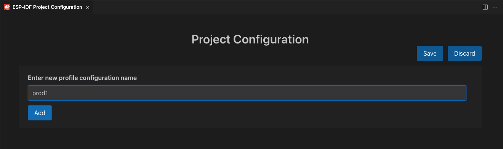

# Use multiple build configuration

Use the [ESP-IDF CMake Multiple Configuration Example](https://github.com/espressif/esp-idf/tree/master/examples/build_system/cmake/multi_config) to follow this tutorial.

Use the `ESP-IDF: Open Project Configuration` and create two configurations profiles: `prod1` and `prod2` and `sdkconfig.prod_common;sdkconfig.prod1` and `sdkconfig.prod_common;sdkconfig.prod2` on the sdkconfig defaults field as shown below:

<p>
  
</p>

<p>
  
</p>

<p>
  
</p>

After creating each profile and the configuration settings for each profile, click the `Save` button and use the `ESP-IDF: Select Project Configuration` command to choose the configuration to override extension configuration settings.

<p>
  
</p>

After a configuration profile is selected, the selected profile will be shown in the status bar as shown before.

<p>
  
</p>

Now use the `ESP-IDF: Build your Project` to build the project for `prod1` and `prod2`. You can observe binaries generated for each profiles in the path defined in each profile as before. You can use `ESP-IDF: Select Project Configuration` command to switch between configurations.

Use the `ESP-IDF: Open Project Configuration` command to modify, add or delete the configuration profiles. If you want to stop using these profile, just delete all configuration profiles.

## Multiple ESP-IDF Versions

You can use multiple ESP-IDF versions, one for each ESP-IDF project by explicitly defining your configuration settings in your current project directory `.vscode/settings.json`.

1. Set the `idf.saveScope` to WorkspaceFolder with the `ESP-IDF: Select where to Save Configuration Settings` command or directly in the `.vscode/settings.json` of desired project opened in Visual Studio Code.

2. Configure the extension as described in [here](./install.md) or use the [JSON Manual Configuration](../SETUP.md#json-manual-configuration) to set these values in your project's `.vscode/settings.json`.

3. Make sure to delete any previous build directory since a different ESP-IDF version would not work if there is any cache of previous build.

4. Repeat from 1) on any project you would like to use a different version from the global user settings.

Look at the [Working with Multiple Projects](../MULTI_PROJECTS.md) documentation to understand where and how Visual Studio Code handle configuration settings and the scope of each location.

## Using Multiple Build Configuration Manually

As shown in the [ESP-IDF CMake Multiple Configuration example](https://github.com/espressif/esp-idf/tree/master/examples/build_system/cmake/multi_config) you can use multiple build directories and multiple sdkconfig defaults files to produce different production output.

In this extension you can define the build directory with the `idf.buildPath` (`idf.buildPathWin` fo Windows) configuration setting and the list of sdkconfig default files with `idf.sdkconfigDefaults` configuration. The value of these settings will be using by the extension build command.

Say you want to make product 1:

1. you have sdkconfig files `sdkconfig.prod_common` and `sdkconfig.prod1` and you want the resulting firmware to be generated in `<your-project>/build_prod1` where `build_prod1` is the name of the custom build folder.
2. Add these settings in `<your-project>/.vscode/settings.json`:

```json
{
  // ...
  "idf.buildPath": "${workspaceFolder}/build_prod1",
  "idf.sdkconfigDefaults": ["sdkconfig.prod_common", "sdkconfig.prod1"]
  // ...
}
```

3. Build your project using the `ESP-IDF: Build your Project` command.

4. Your resulting files will be generated in `<your-project>/build_prod1` and the sdkconfig being used by the SDK Configuration Editor will be `<your-project>/build_prod1/sdkconfig`.

5. Change values in 2) for different products and configurations.
