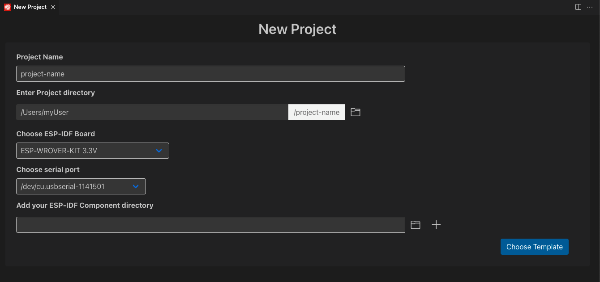
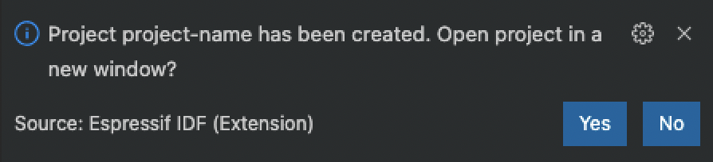

# New project wizard

This feature allows you to create a new project using the ESP-IDF, ESP-ADF and ESP-MDF frameworks and configure the extension settings and the project name.

1. Click menu View -> Command Palette... and search for the **ESP-IDF: New Project**.

  

2. Choose the project name, the directory to create this new project, the Espressif board you are using (or any general Espressif device) and the serial port of the device. You could also choose to import any component directory `component-dir` to the new project which will be copied to the new project's directory `components` sub directory (`<project-dir>/components/component-dir`).

> **NOTE:** If using the custom board option, please take a look at [Configuring of OpenOCD for specific target](https://docs.espressif.com/projects/esp-idf/en/stable/esp32/api-guides/jtag-debugging/tips-and-quirks.html#configuration-of-openocd-for-specific-target) for more information about these openOCD configuration files and the [debugging tutorial](./debugging.md) for values examples.

3. After that click the `Choose Template` button and choose a template from Extension templates and, if configured; ESP-IDF, ESP-ADF and ESP-MDF frameworks. If you want to create a blank project, choose ESP-IDF `sample_project` or the extension `template-app`.

  

4. Choose your desired template and click the `Create project using template <template-name>` button where `<template-name>` is the name of the selected template.

5. After the project is created, a notification window will show up to open the newly created project or not.

  

