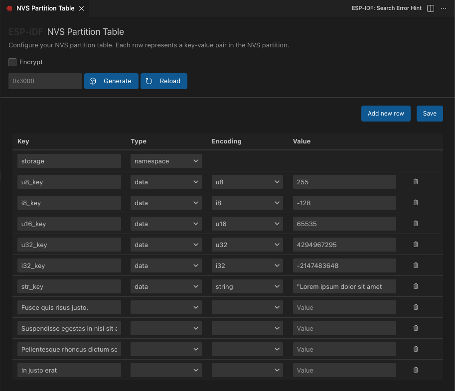

# NVS Partition Editor

The **ESP-IDF: Open NVS Partition Editor** allows the user to create a NVS partition binary file based on key-value pairs in CSV file. The resulting binary file is compatible with NVS architecture defined in [ESP-IDF Non Volatile Storage](https://docs.espressif.com/projects/esp-idf/en/latest/esp32/api-reference/storage/nvs_flash.html).

The expected CSV format is:

```
key,type,encoding,value     <-- column header (must be the first line)
namespace_name,namespace,,  <-- First entry must be of type "namespace"
key1,data,u8,1
key2,file,string,/path/to/file
```

1. Click menu View -> Command Palette... and search for **ESP-IDF: Open NVS Partition Editor** (to create a new file) or right click an existing CSV file.

2. If creating a new file, choose the name of the file. It will be created in the current editor directory.

> **NOTE:** Make sure first 2 lines of existing CSV file are as shown in expected csv format above.

3. Make desired changes to CSV file.

> **NOTE:** Make sure that the size of partition is enough for inserted data.

<p>
  
</p>

4. Save the CSV data (First time will create the csv file).

5. (OPTIONAL) Enable encryption of the binary. If encrypt is enable, can disable the generate key option to use your own key if desired, in which case the user needs to set the key absolute path.

6. Generate the partition binary.

This feature is based on ESP-IDF [NVS Partition Generator Utility](https://docs.espressif.com/projects/esp-idf/en/latest/esp32/api-reference/storage/nvs_partition_gen.html).

Make sure extension is configured as shown in [Install tutorial](./install.md) for this feature to work properly.
