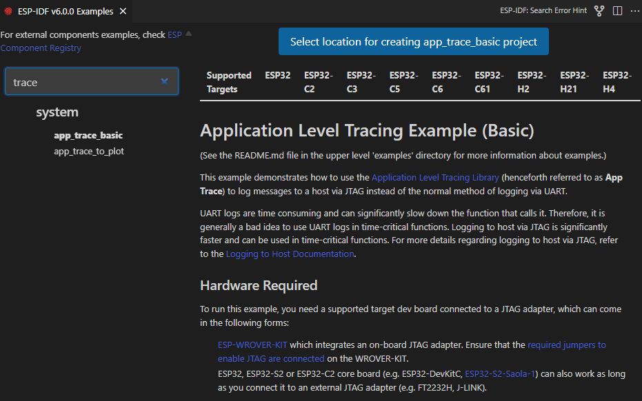
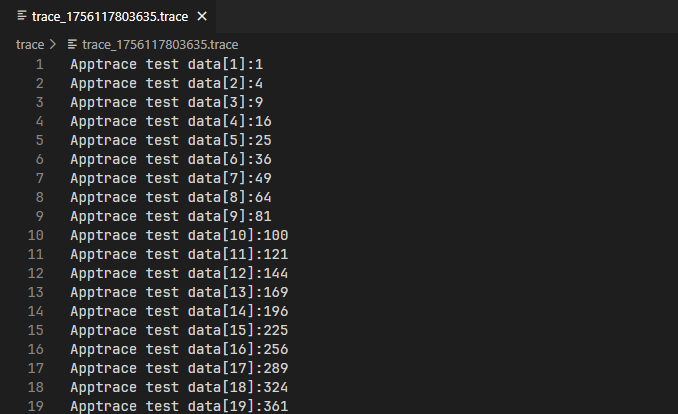

Application Tracing
=========================

This feature allows to transfer arbitrary data between host and ESP32 via JTAG interface with small overhead on program execution.

Developers can use this library to send application specific state of execution to the host and receive commands or other type of info in the opposite direction at runtime.

Let's open a ESP-IDF project. For this tutorial we will use the `system/app_trace_to_host <https://github.com/espressif/esp-idf/tree/master/examples/system/app_trace_to_host>`_ example.

- Navigate to **View** > **Command Palette**.

- Type **ESP-IDF: Show Examples Projects**, select the command and choose ``Use Current ESP-IDF (/path/to/esp-idf)``.

If you don't see the option, please review the setup in :ref:`Install ESP-IDF and Tools <installation>`.

- A window will be open with a list a projects, go the **system** section and choose the ``app_trace_to_host``. You will see a **Create Project Using Example app_trace_to_host** button in the top and a description of the project below. Click the button and the project will be opened in a new window.

For this example, the project has been already configured for application tracing purposes. On other projects you need to enable ``CONFIG_APPTRACE_DEST_TRAX`` and ``CONFIG_APPTRACE_ENABLE`` with the **ESP-IDF: SDK Configuration Editor** command.

- Configure, build and flash your project as explained in the :ref:`Build the project <build the project>`.

- Click the ``ESP-IDF Explorer`` in the `Visual Studio Code Activity bar <https://code.visualstudio.com/docs/getstarted/userinterface>`_ (1). On the ``IDF APP TRACER`` section, click the ``Start App Trace`` (2). This will execute the extension's OpenOCD server and send the corresponding tracing commands to generate a tracing log. You can see the generated tracing log in the ``APP TRACE ARCHIVES`` named with ``Trace Log #1`` (3). Each time you execute ``Start App Trace`` a new tracing will be generated and shown in the archives list. You can also start tracing by running the **ESP-IDF: App Trace** command.

.. note::
  * The OpenOCD server output is shown in menu **View** > **Output** > **ESP-IDF**.
  * Make sure that OpenOCD configuration files are properly configured with **ESP-IDF: Select OpenOCD Board Configuration** command.

.. image:: ../../../media/tutorials/app_trace/start_tracing.png

- Click on ``Trace Log #1`` to open a window with the trace report. Click ``Show Report`` button to see the trace output.

For more information please take a look at the `Application Level Tracing library Documentation <https://docs.espressif.com/projects/esp-idf/en/latest/esp32/api-guides/app_trace.html>`_.