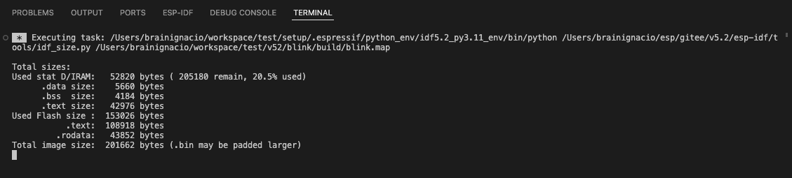

ESP-IDF Application Size Analysis
===================================

After building with select menu **View**, **Command Palette**, type **ESP-IDF: Build your Project** command; a the application size analysis task will be executed in a terminal showing the size analysis results. You can enable or disable this task being executed with **idf.enableSizeTaskAfterBuildTask** in your settings.json.

For a visual output, Select menu **View**, **Command Palette**, type **ESP-IDF: Size Analysis of the Binaries** command to visually review the application size information.

.. image:: ../../../media/tutorials/basic_use/size.png