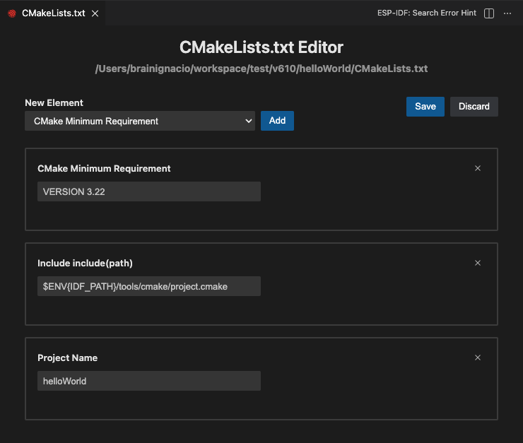
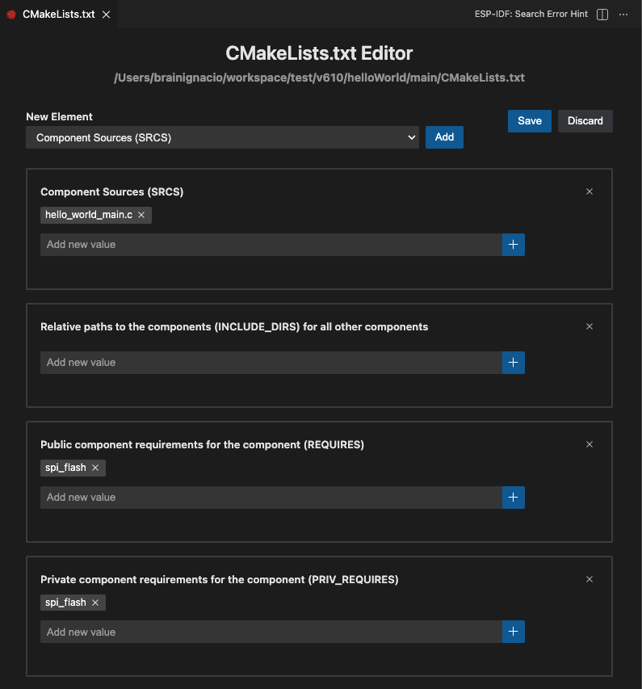

CMakeLists.txt Editor
==============================

When you right click on any CMakeLists.txt file this extension provides a custom CMakeLists.txt Editor to fill an ESP-IDF Project and Component Registration as specified in:

- `ESP-IDF Project CMakeLists.txt <https://docs.espressif.com/projects/esp-idf/en/latest/esp32/api-guides/build-system.html#project-cmakelists-file>`_
- `ESP-IDF Component CMakeLists.txt Files <https://docs.espressif.com/projects/esp-idf/en/latest/esp32/api-guides/build-system.html#component-cmakelists-files>`_

You need to choose which kind of CMakeLists.txt file (project or component) to edit. There is 2 types of input, one is a simple string and another is an array of strings, such as Component Sources (SRCS).

.. note::
  * All inputs are described in the `CMakeLists.txt schema <https://github.com/espressif/vscode-esp-idf-extension/blob/master/cmakeListsSchema.json>`_
  * This editor doesn't support all CMake functions and syntaxes. This editor should only be used for simple CMakeLists.txt options such as component registration (using idf_component_register) and basic project elements. If you need more customization or advanced CMakeLists.txt, consider reviewing `ESP-IDF Build System <https://docs.espressif.com/projects/esp-idf/en/latest/esp32/api-guides/build-system.html>`_. Also review **CMakeLists.txt editor schema** for a list of supported code.
  * THIS WILL OVERRIDE ANY EXISTING CODE IN THE FILE WITH THE ONE GENERATED IN THE EDITOR. IF YOU HAVE ANY CODE NOT INCLUDED IN THE SCHEMA (OR SINGLE LINE COMMENTS) USE A REGULAR TEXT EDITOR INSTEAD**

For this tutorial we will use the get-started's blink example.

1. Right click the ``<project_path>/blink/CMakeLists.txt``, click on **ESP-IDF: CMakeLists.txt Editor** and select ``Project CMakeLists.txt``.

2. We can add new elements by selecting them from the ``New Element`` dropdown and clicking the ``Add`` button. For simplicity we will just change the project name and save changes with the ``Save`` button.

We can observe when we re-open the file in a regular text-editor changes are reflected.

3. Now let's create a new ESP-IDF component in this project to modify its ``CMakeLists.txt``. Click menu **View** > **Command Palette** and type **ESP-IDF: Create New ESP-IDF Component** and enter the new component name.

4. A new component will be created in ``<project_path>/blink/components/<component_name>``. Opening in the regular text editor, the user will see an ``idf_component_register`` method with:

.. code-block:: C

  idf_component_register(SRCS "my_component.c"
                         INCLUDE_DIRS "include")

Right click on ``<project_path>/blink/components/<component_name>/CMakeLists.txt``, click on **ESP-IDF: CMakeLists.txt Editor** and select ``Component CMakeLists.txt``.

5. Observe that some fields are of array types such as **Component Sources (SRCS)** since we can add several paths while other are just string input fields (as described in cmakeListsSchema.json).

.. note::
  While using this extension, source files are added and deleted automatically from the same directory where CMakeLists.txt is located without user intervention.

6. Add a new element ``Public Component Requirements for the Component (REQUIRES)`` and click the ``Add`` button. A new array field will appear.

7. As described in `ESP-IDF Component CMakeLists.txt Files <https://docs.espressif.com/projects/esp-idf/en/latest/esp32/api-guides/build-system.html#component-cmakelists-files>`_, ``REQUIRES`` is used to list the component dependencies. Type ``mbedtls`` and click the ``+`` button (can also press enter on typing).

8. Click on ``Save`` button and close the CMakeLists.txt editor. If you open ``<project_path>/blink/components/<component_name>/CMakeLists.txt`` on a regular text editor, the user will see:

.. code-block:: C
  
  idf_component_register(SRCS "my_component.c"
                         INCLUDE_DIRS "include"
                         REQUIRES "mbedtls")

9. Check `ESP-IDF Project CMakeLists.txt <https://docs.espressif.com/projects/esp-idf/en/latest/esp32/api-guides/build-system.html#project-cmakelists-file>`_ and `ESP-IDF Component CMakeLists.txt Files <https://docs.espressif.com/projects/esp-idf/en/latest/esp32/api-guides/build-system.html#component-cmakelists-files>`_ for additional fields information.
