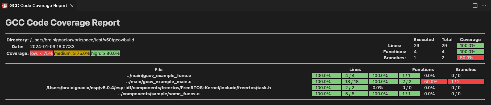

ESP-IDF Coverage
===============================

Source code coverage is data indicating the count and frequency of every program execution path that has been taken within a program runtime. `GCOV <https://en.wikipedia.org/wiki/Gcov>`_ is a GCC tool that, when used in concert with the compiler, can generate log files indicating the execution count of each line of a source code.

Your ESP-IDF project should be configured to generate ``gcda/gcno`` coverage files using ``gcov``. Please read `GCOV Code Coverage <https://docs.espressif.com/projects/esp-idf/en/latest/esp32/api-guides/app_trace.html#gcov-source-code-coverage>`_ to learn more about code coverage with GCOV in ESP-IDF projects.

You can use the **ESP-IDF: Configure Project SDKConfig for Coverage** to set required configuration in the SDK Configuration Editor.

Code coverage example
-------------------------------

Let's use the ESP-IDF `GCOV Example <https://github.com/espressif/esp-idf/tree/master/examples/system/gcov>`_ for this tutorial.

- Navigate to **View** > **Command Palette**.

- Type **ESP-IDF: New Project** and choose ESP-IDF version to use.

If you don't see the option, please review the current ESP-IDF setup in :ref:`Installation <installation>`.

- A window will be open with settings to configure the project. Later you can choose from a list a ESP-IDF examples, go the **system** section and choose the ``gcov``. You will see a **Create Project Using Example gcov** button in the top and a description of the project below. Click **Create Project Using Example GCOV** button.

.. image:: ../../../media/tutorials/coverage/gcov_example.png

- Now select a container directory where to copy the example project. For example, if you choose ``/Users/myUser/someFolder`` the resulting folder will be ``/Users/myUser/someFolder/gcov``. This new project directory will be created and opened in Visual Studio Code.

- First you should select an Espressif target (esp32, esp32s2, etc.) with:

  - Navigate to **View** > **Command Palette**.
  - Type **ESP-IDF: Set Espressif Device Target** command. Default is ``esp32`` and the one used in this tutorial.

- Next configure your sdkconfig project with the **ESP-IDF: Configure Project SDKConfig for Coverage** command or by yourself using the **ESP-IDF: SDK Configuration Editor** command where you can modify the ESP-IDF project settings. After all changes are made, click save and close this window.

.. image:: ../../../media/tutorials/basic_use/gui_menuconfig.png

- The example will enable the following options by default:

  - Enable the Application Tracing Module under ``Component Config`` > ``Application Level Tracing`` > ``Data Destination`` by choosing ``Trace Memory``.
  - Enable GCOV to host interface under ``Component Config`` > ``Application Level Tracing`` > ``GCOV to Host Enable``.
  - Enable OpenOCD Debug Stubs under ``Component Config`` > ``ESP32-specific`` > ``OpenOCD Debug Stubs``.

- Now build the project, flash your device and start the ESP-IDF Monitor you can use the **ESP-IDF: Build your Project**, **ESP-IDF: Flash your Project** and **ESP-IDF: Monitor Device** commands.

.. note::
  There is also a **ESP-IDF: Build, Flash and Start a Monitor on your Device** command which does all three former commands in one.

- Next step is to launch OpenOCD and send some commands. To start openOCD from the extension, execute the **ESP-IDF: OpenOCD Manager** command or from the ``OpenOCD Server (Running | Stopped)`` button in the Visual Studio Code status bar. OpenOCD server output is shown in menu **View** > **Output** > **ESP-IDF**.

- Launch a new terminal with menu **Terminal** > New Terminal and execute ``telnet <oocd_host> <oocd_port>`` which by default is ``telnet localhost 4444``. Latest MacOS users can use ``nc <oocd_host> <oocd_port>`` if ``telnet`` is not in the system.

.. note::
  you can modify **openocd.tcl.host** and **openocd.tcl.port** configuration settings to modify these values.

- Send the OpenOCD command ``esp gcov dump`` for hard-coded dump which will dump two hard-coded dumps based on this example. After that send the ``esp gcov`` command for instant run-time dump.

.. image:: ../../../media/tutorials/coverage/oocd_cmds.png

- After dumping data one or more times, open the desired file in your editor and execute the **ESP-IDF: Add Editor Coverage** command to highlight the editor with code coverage.

- You can customize highlight color using these extension settings.json configuration settings:

  - Covered lines use **idf.coveredLightTheme** for light themes and **idf.coveredDarkTheme** for dark themes.
  - Partially covered lines use **idf.partialLightTheme** for light themes and **idf.partialDarkTheme** for dark themes.
  - Non-covered lines use **idf.uncoveredLightTheme** for light themes and **idf.uncoveredDarkTheme** for dark themes.

Visual Studio code support ``"red"``, ``rgb(255,0,120)`` or ``rgba(120,0,0,0.1)``.

.. image:: ../../../media/tutorials/coverage/editor_coverage.png

- When finished, use the **ESP-IDF: Remove Editor Coverage** command to remove the code coverage.

- Navigate to **View** > **Command Palette**.

- Type  **ESP-IDF: Get HTML Coverage Report for Project** select the command to generate a HTML report for code coverage.

.. note::
  * Check the :ref:`Troubleshooting <troubleshooting-section>` section if you have any issues.
