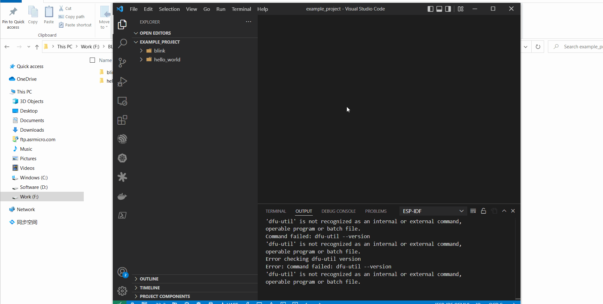
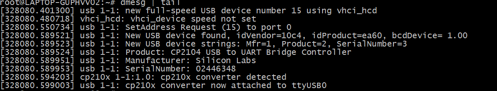
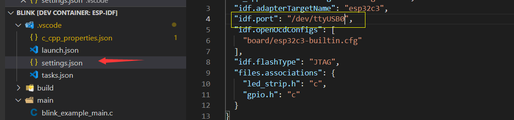
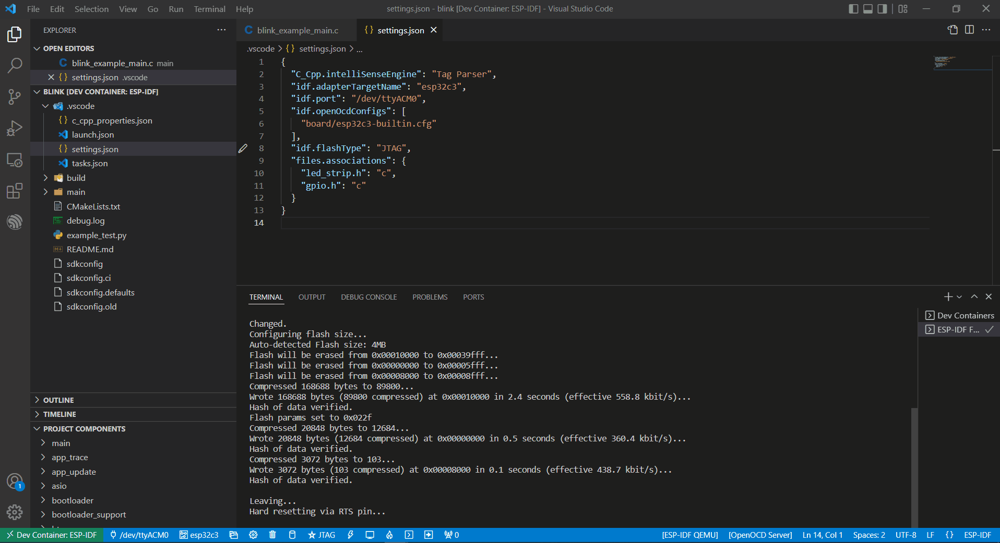
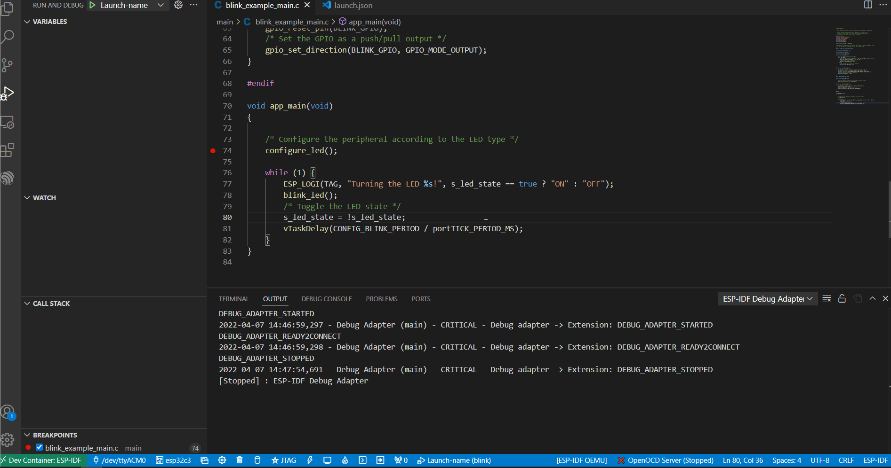

Using Docker Container
======================

:link_to_translation:`zh_CN:[中文]`

This tutorial demonstrates how to use the `IDF Docker Image <https://docs.espressif.com/projects/esp-idf/en/latest/esp32/api-guides/tools/idf-docker-image.html>`_ to enable ``idf.py flash`` and ``idf.py monitor`` within a container. To achieve this, configure the serial ports to pass from the host Windows machine to WSL.

.. warning::

    USB passthrough is not yet supported on macOS. To connect to an Espressif device's serial port from a Docker container on macOS, consider `Using Remote Serial Port <https://docs.espressif.com/projects/esp-idf/en/latest/esp32/api-guides/tools/idf-docker-image.html#using-remote-serial-port>`_. The RFC port can be manually defined in the ``idf.port`` configuration setting for the ``ESP-IDF: Flash your Project`` command to work.

This tutorial guides you on developing projects using ``Visual Studio Code`` + ``ESP-IDF extension`` + ``ESP-IDF Docker Image``.

Required Tools
--------------

Install the following tools before starting the project:

1. Windows WSL (see installation steps below)
2. `Visual Studio Code <https://code.visualstudio.com>`_
3. `usbipd-win <https://github.com/dorssel/usbipd-win/releases>`_
4. `Docker Desktop For Windows <https://hub.docker.com>`_

Other tools are defined in the project's Dockerfile and will be included in the container.

Docker Desktop
--------------

Docker Desktop is an application for macOS and Windows that builds and shares containerized applications. For more details, refer to `Docker get started documentation <https://docs.docker.com/get-started/>`_. Here, Docker is used to import and manage the ``ESP-IDF Docker Image``, including starting, restarting, and closing it.

.. note::

    The default installation path for Docker is the C drive. Use ``mklink`` commands to move it to another drive if space is limited on the C drive.

Installing Ubuntu on Windows for Docker
---------------------------------------

If WSL is not installed, run:

.. code-block::

    wsl --install

Update the WSL kernel with:

.. code-block::

    wsl --update

Check the available WSL distributions using the ``Powershell`` command prompt:

.. code-block::

    wsl -l -o

.. image:: ../../../media/tutorials/using_docker_container/wsl-l-o.png

To install a Ubuntu distribution in WSL on Windows, type the following command:

.. code-block::

    wsl --install --distribution Ubuntu

``usbipd-win`` in Docker
------------------------

To access USB, serial, and JTAG devices from the local Windows system, you must install ``usbipd-win``. Without it, downloading, monitoring, and debugging on the IDF Docker image is not possible. The installation process is similar to other Windows applications and will not be detailed here.

After installing the necessary tools, perform the following configurations.

Check WSL Ubuntu on Windows for Docker
~~~~~~~~~~~~~~~~~~~~~~~~~~~~~~~~~~~~~~

1.  Verify that the current WSL version is 2.

    .. code-block::

        wsl -l -v

    .. image:: ../../../media/tutorials/using_docker_container/wsl-l-v.png

2.  If the version is not 2, upgrade to version 2.

    .. code-block::

        wsl --set-version Ubuntu 2

3.  Set the Ubuntu distribution as the default.

    .. code-block::

        wsl -s Ubuntu

4.  Finally, verify that above commands have taken effect using the ``wsl --status`` command.

    .. image:: ../../../media/tutorials/using_docker_container/wsl-status.png

Docker Desktop for Windows
~~~~~~~~~~~~~~~~~~~~~~~~~~

As the Ubuntu distribution has been updated to version 2, adjustments on the Docker side are required, and Ubuntu should also be chosen as the default WSL integration.

.. image:: ../../../media/tutorials/using_docker_container/wsl-integration.png

1.  Install ``usbipd`` in the PowerShell command prompt.

    .. code-block::

        winget install usbipd

2.  Configure the USB serial device to connect to WSL using ``usbipd``.

3.  Open the PowerShell command prompt with administrator rights and then enter the following command to get a list of USB serial devices.

    .. code-block::

        usbipd list

4.  To access a specified device from Windows on WSL locally, bind the device with ``usbipd``. Open the PowerShell command prompt with administrator rights and enter the following command.

    .. code-block::

        usbipd bind --busid <BUSID>

    .. note::

        Use this command only once unless the computer restarts. **1-1** is the device's ``<BUSID>`` you want to bind.

5.  After binding, attach the specified device to WSL with the following command in the PowerShell command prompt. The ``--auto-attach`` parameter ensures the device remains visible in the container after unplugging and replugging.

    .. code-block::

        usbipd attach --wsl --busid <BUSID> --auto-attach

6.  Finally, verify the connection on the WSL side by entering the following command.

    .. code-block::

        dmesg | tail

    .. image:: ../../../media/tutorials/using_docker_container/wsl_demsg_tail.png

    As shown above, the **1-1** device is attached to ``ttyACM0``, indicating that WSL can now access the **1-1** USB device.

Install Remote - Containers extension in Visual Studio Code
~~~~~~~~~~~~~~~~~~~~~~~~~~~~~~~~~~~~~~~~~~~~~~~~~~~~~~~~~~~

Install the **Dev Containers**, **Remote Development**, and **ESP-IDF** extensions as shown below.

.. image:: ../../../media/tutorials/using_docker_container/dev_containers.png

.. image:: ../../../media/tutorials/using_docker_container/remote_development.png

.. image:: ../../../media/tutorials/using_docker_container/esp-idf.png

Practice
--------

After completing the previous steps, the WSL or Docker container should be ready for use. Here is an example to demonstrate how to utilize these tools.

Example Project with Docker Container
~~~~~~~~~~~~~~~~~~~~~~~~~~~~~~~~~~~~~

Take ``Blink`` and ``Hello_world`` projects as examples, you can place additional example projects in the same folder and mount them together in the IDF Docker image. This approach saves disk space, as creating a separate container for each example project is inefficient.

.. image:: ../../../media/tutorials/using_docker_container/example_projects.png

As shown in the snapshot above, the ``Blink`` and ``Hello_world`` example projects are in the same folder. You only need to open this folder with VS Code.

.. image:: ../../../media/tutorials/using_docker_container/example_project_vscode.gif

Observe that there is a ``.devcontainer`` folder in the ``example_project`` folder, which is not included by default. This is generated using the ESP-IDF extension of VS Code to create and configure the ESP-IDF Docker image for container development.

To generate your own ``.devcontainer`` folder content, follow these steps:

1. Open the example project with VS Code and go to ``View`` > ``Command Palette``.
2. In the pop-up dialog box, search for the ``ESP-IDF: Add Docker Container Configuration`` command.
3. The ``.devcontainer`` folder will be generated for the currently opened project.

For more information about ``devcontainer.json``, please refer to the comments.

.. code-block:: JSON

    {
        /* A name for the dev container displayed in the UI */
        "name": "ESP-IDF",
        /* container name when creating container */
        "image": "espressif/idf:latest",
        /* mount the local folder to /workspaces folder of Docker image */
        "workspaceMount": "source=${localWorkspaceFolder},target=/workspaces/project-name,type=bind",
        /* the path of workspace folder, which means that this folder will be opened after container is running
        */
        "workspaceFolder": "/workspaces/project-name",
        /* mount the VS Code extensions to the target path, and then they don't need to be installed again when rebuilding the container
        */
        "mounts": [
            "source=extensionCache,target=/root/.vscode-server/extensions,type=volume"
        ],
        /* follow the commands of Dockerfile to create the container
        */
        "build": {
            "dockerfile": "Dockerfile"
        },
        /* Machine specific settings that should be copied into the container
        */
        "settings": {
            "terminal.integrated.defaultProfile.linux": "bash",
            "idf.gitPath": "/usr/bin/git"
        },
        /* An array of extensions that should be installed into the container. */
        "extensions": ["espressif.esp-idf-extension"],
        /* start the container with privileged mode, otherwise the devices cannot be accessed on the Docker image.
        */
        "runArgs": ["--privileged"]
    }

All related configurations are now complete.

Create a Container
~~~~~~~~~~~~~~~~~~

1.  To create a container and begin development, click the ``><`` button at the bottom left of VS Code. Select **Open Folder in Container** to initiate the container creation.

    .. note::

        The first time you run the process, it may be slightly slow because the ESP-IDF Docker image needs to be downloaded.

2.  Open the ``Blink`` example project. To switch to another project, change the path from ``"workspaceFolder": "/workspaces/blink"`` to ``"workspaceFolder": "/workspaces/<ProjectName>"``, where ``<ProjectName>`` is the name of the desired project. Then, re-select ``Open Folder in Container``.

    .. image:: ../../../media/tutorials/using_docker_container/create_container.gif

    At this moment, you can start to use the ``Blink`` example project for building, flashing, monitoring, debugging, etc.

    .. warning::

        To access the serial port from the Docker container, ensure the device is attached with ``usbipd attach --wsl --busid <BUSID> --auto-attach`` **before** opening the folder in the container in VS Code. This ensures visibility. To maintain visibility when plugging and unplugging the device, include the ``--auto-attach`` parameter.

3.  For example, to use ESP32-C3, change the target device from ``esp32`` to ``esp32c3`` as shown below:

    .. image:: ../../../media/tutorials/using_docker_container/device_target_esp32_c3.png

4.  Proceed to build the example project.

    .. image:: ../../../media/tutorials/using_docker_container/container_build.gif

5.  After building, you can download the firmware using the following methods.

External USB-to-Serial for Docker Container
~~~~~~~~~~~~~~~~~~~~~~~~~~~~~~~~~~~~~~~~~~~

Follow the ``usbipd`` instructions as described. Here, the ``Silicon Labs CP210x USB to UART Bridge`` is used as an example and is attached to the Docker image.

This device is attached to ``ttyUSB0``, so you need to update ``idf.port`` accordingly.

The container does not recognize the configuration change immediately.

.. image:: ../../../media/tutorials/using_docker_container/unkown_ttyUSB0.png

Reopen the container by selecting ``Reopen Folder Locally`` to reload the new configuration.

.. image:: ../../../media/tutorials/using_docker_container/container_reopen.gif

Finally, click the ``Flash`` button to download the firmware.

.. image:: ../../../media/tutorials/using_docker_container/container_flash_uart.gif

Internal USB-to-Serial for Docker Container
~~~~~~~~~~~~~~~~~~~~~~~~~~~~~~~~~~~~~~~~~~~

Similar to `External USB-to-Serial for Docker Container`_, the only difference is the device name attached, where the external usb-serial is ``ttyUSBx``, while the internal usb-serial is ``ttyACMx``.

.. image:: ../../../media/tutorials/using_docker_container/container_flash_uart_internal.gif

USB-to-JTAG for Docker Container
~~~~~~~~~~~~~~~~~~~~~~~~~~~~~~~~

Same as `External USB-to-Serial for Docker Container`_ and `Internal USB-to-Serial for Docker Container`_, but it needs to configure the following extra parameters:

.. image:: ../../../media/tutorials/using_docker_container/extra_parameters.png

The interface is the same as `Internal USB-to-Serial for Docker Container`_, which is ``ttyACMx``:

Debugging in Docker Container
~~~~~~~~~~~~~~~~~~~~~~~~~~~~~

Copy `OpenOCD udev rules files <https://github.com/espressif/openocd-esp32/blob/master/contrib/60-openocd.rules>`_ and paste them to the ``/etc/udev/rules.d`` directory before running OpenOCD and starting a debug session.

After configuring `USB-to-JTAG for Docker Container`_, press ``F5`` to start debugging.

.. note::

    1. To debug on Windows, unplug and re-plug the USB cable to ensure the USB port is recognized in the Windows Device Manager.
    2. Keep Docker Desktop for Windows open during container development.
