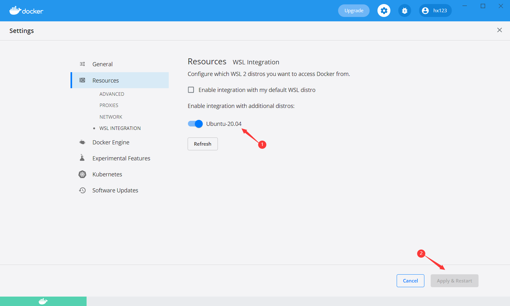
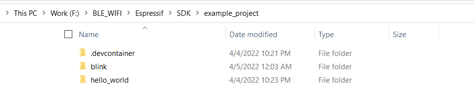
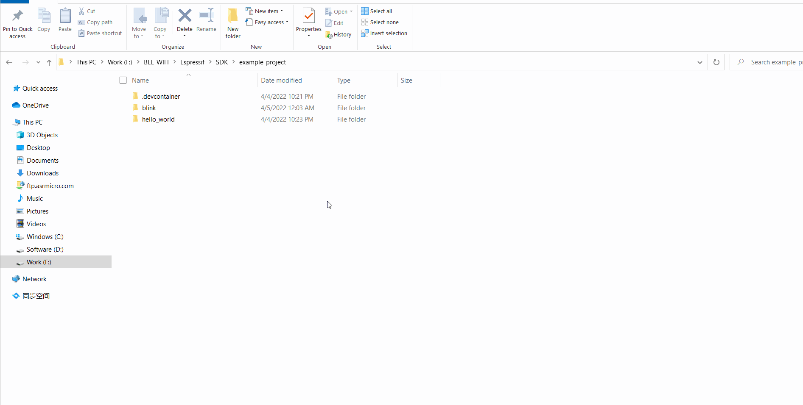
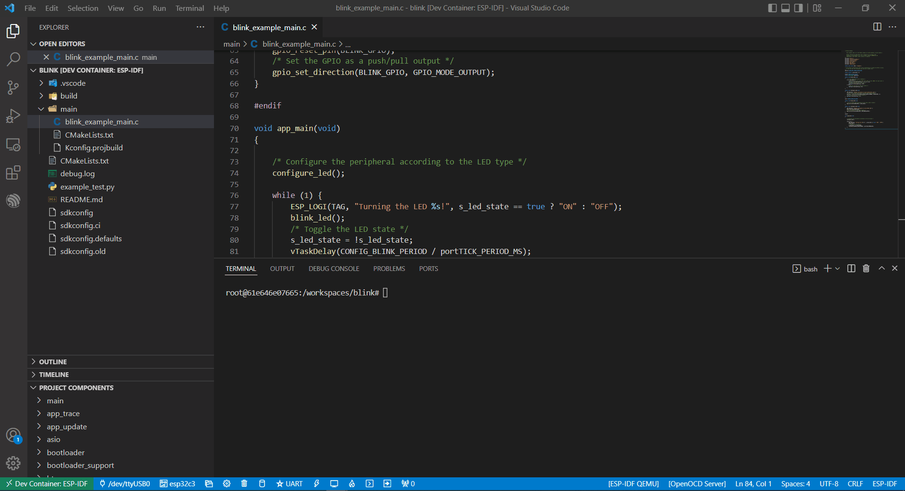

Using Docker Container
===================================

In this tutorial we leverage the `Espressif docker image <https://docs.espressif.com/projects/esp-idf/en/latest/esp32/api-guides/tools/idf-docker-image.html>`_ and few steps to enable `idf.py flash` and `idf.py monitor` to work in the container the serial ports should be configured to be passed to WSL from host Windows machine.

.. warning::
  * For MacOS users, unfortunately USB Passthrough is not yet supported in MacOS. If you are trying to connect to a Espressif device serial port from a docker container in MacOS, you could try using the `Remote Serial Port <https://docs.espressif.com/projects/esp-idf/en/latest/esp32/api-guides/tools/idf-docker-image.html?highlight=docker#using-remote-serial-port>`_. The RFC port can be manually defined in the **idf.port** configuration setting for the **ESP-IDF: Flash your Project** command to work.

In this tutorial will show you how to develop your projects based on ``Visual Studio Code`` + ``ESP-IDF extension`` + ``ESP-IDF Docker Image`` to execute all ESP-IDF extension features.

Required Tools
----------------------------------

Install the following tools before starting the project:

1. Windows WSL (steps to install below).
2. `Visual Studio Code <https://code.visualstudio.com>`_
3. `usbipd-win <https://github.com/dorssel/usbipd-win/releases>`_
4. `Docker Desktop For Windows <https://hub.docker.com>`_

Other tools are defined in the project Dockefile and will be part of the executed container.

Docker Desktop
------------------------

Docker Desktop is an application for MacOS and Windows machines for the building and sharing of containerized applications. For more details, you can refer to `Docker get started documentation <https://docs.docker.com/get-started/>`_, but the role of docker here is to import the ``ESP-IDF Docker Image`` and manage it, such as start,restart,close etc.

.. note::
  the default installing path of docker is C disk, so please move to other disks with ``mklink`` commands if the space size of C disk is not enough.

Installing Ubuntu on Windows for Docker
-----------------------------------------

If you don't have WSL installed run:

.. code-block::

  wsl --install

Update the WSL kernel with

.. code-block::

  wsl --update

Check the WSL available distributions list with the ``Powershell`` command prompt, as below

.. code-block::

  wsl -l -o

.. image:: ../../../media/tutorials/using_docker_container/wsl-l-o.png

so to install a ubuntu distribution in WSL on Windows, please type in the following command:

.. code-block::

  wsl --install --distribution Ubuntu

usbipd-win in Docker
----------------------

To access the ``USB``, ``serial`` and ``JTAG`` devices which are from the local Windows, ``usbipd-win`` must be installed, else it is impossible to download,monitor and debug on IDF docker image side. the way to install it, it is also same as Windows applications, so it will not be described in detail here.

we still need to do a bit configurations after installing the four tools above:

Check WSL Ubuntu on Windows for Docker
~~~~~~~~~~~~~~~~~~~~~~~~~~~~~~~~~~~~~~~~~

1. check the current WSL version is 2

.. code-block::

  wsl -l -v

.. image:: ../../../media/tutorials/using_docker_container/wsl-l-v.png

2. please upgrade to version 2, if not

.. code-block::

  wsl --set-version Ubuntu 2

3. set the Ubuntu distribution as default:

.. code-block::

  wsl -s Ubuntu

at last, to check if the commands have taken effect with ``wsl --status`` command.

Docker Desktop for Windows
~~~~~~~~~~~~~~~~~~~~~~~~~~~~~~~~

As the Ubuntu distribution has been updated to version 2, adjustments on the Docker side are required, and Ubuntu should also be chosen as the default WSL integration.

1. Install usbipd in Powershell command prompt:

.. code-block::

  winget install usbipd

2. Now configure the USB serial device to be able to connect to the WSL with ``usbipd``:

3. Open PowerShell command prompt with administrator rights and then type in the command

.. code-block::

  usbipd list 

for a list of USB serial devices.

4. To access the specified device from Windows on WSL locally, the device must be bound with **usbipd**. Open PowerShell command prompt with administrator rights and then type in the command:

.. code-block::

  usbipd bind --busid <BUSID>

.. note::
  this command needs to be used only one time,unless the computer has restarted. **1-1** is the device's bus id ``<BUSID>`` I would like to bind.

5. After binding, please attach the specified device to WSL with this command in the Powershell command prompt. The ``--auto-attach`` parameter allows the device to be visible in the container after unplug and plug.

.. code-block::

  usbipd attach --wsl --busid <BUSID> --auto-attach

6. At last, let us check if it works well on both side and type this command on WSL side.

.. code-block::

  dmesg | tail

.. image:: ../../../media/tutorials/using_docker_container/wsl_demsg_tail.png

As we can see above, **1-1** device has been attached to ``ttyACM0``, that means WSL can access the **1-1** USB device now.

Install Remote Containers extension in Visual Studio Code
~~~~~~~~~~~~~~~~~~~~~~~~~~~~~~~~~~~~~~~~~~~~~~~~~~~~~~~~~~~

Install the **Remote - Containers**, **Remote Development** and **ESP-IDF** extensions, as below:

.. image:: ../../../media/tutorials/using_docker_container/esp-idf.png

Practice
------------------------------------

After all previous steps have taken effect, the WSL or docker container should be ready to use. Here is an example to show you how to utilize these tools.

Example Project with Docker Container
~~~~~~~~~~~~~~~~~~~~~~~~~~~~~~~~~~~~~~~~~

Using ``Blink`` and ``Hello_world`` projects as examples, If you have more example projects, you can put them in the same folder and mount them together in the IDF Docker image; otherwise, it will take your much more space size on your disk as you need to create one container for each example project, that is not a good solution.

as seen from snapshot above, ``Blink`` and ``Hello_world`` example projects have been put in the same folder and we only need to open this folder with vscode:

Observe that there is a ``.devcontainer`` folder in the example_project folder, which is not included by default; this is generated by using the ESP-IDF extension of Visual Studio Code to create and configure the ESP-IDF docker image for container development.

If you also need to generate their own ``.devcontainer`` folder content, as follows:

1. Open example project with vscode and then press menu **View** > **Command Palette**.
2. In the pop-up dialog box, search for the **ESP-IDF: Add Docker Container Configuration** command.
3. The ``.devcontainer`` folder will be generated for the currently opened project.

.. image:: ../../../media/tutorials/using_docker_container/dev_container.gif

For more information about ``devcontainer.json``, please refer to the comments.

.. code-block:: JSON
  
  {
    /* A name for the dev container displayed in the UI */
    "name": "ESP-IDF",
    /* container name when creating container */
    "image": "espressif/idf:latest",
    /* mount the local folder to /workspaces folder of docker image */
    "workspaceMount": "source=${localWorkspaceFolder},target=/workspaces/project-name,type=bind",
    /* the path of workspace folder, that means this folder will be opened after container is running
    */
    "workspaceFolder": "/workspaces/project-name",
    /* mount the vscode extensions to the target path, and then they don't need to install again when rebuilding the container
    */
    "mounts": [
      "source=extensionCache,target=/root/.vscode-server/extensions,type=volume"
    ],
    /* follow the commands of Dockerfile to create the container
    */
    "build": {
      "dockerfile": "Dockerfile"
    },
    /* Machine specific settings that should be copied into the container
    */
    "settings": {
      "terminal.integrated.defaultProfile.linux": "bash",
      "idf.espIdfPath": "/opt/esp/idf",
      "idf.toolsPath": "/opt/esp",
      "idf.gitPath": "/usr/bin/git"
    },
    /* An array of extensions that should be installed into the container. */
    "extensions": ["espressif.esp-idf-extension"],
    /* start the container with privileged mode, else the devices cannot be accessed on the docker image.
    */
    "runArgs": ["--privileged"]
  }

At this point, all related configurations have been completed.

Create a Container
~~~~~~~~~~~~~~~~~~~~~

1. Create a container and then start your development by clicking the ``><`` green button at the bottom left of Visual Studio Code and select **Open Folder in Container** to start creating a container.

.. note::
  * It will be slightly slower, because to download the Docker image of ESP-IDF, you only need to download it once.
  
2. Next open the ``Blink`` example project; if you need to switch to another project, just change it from ``"workspaceFolder": "/workspaces/blink"`` to ``"workspaceFolder": "/workspaces/The name of the sample project you want to open"``, and then re-select **Open Folder in Container**, as follows:

At this moment, you can start to use the ``Blink`` example project for building, flashing, monitoring, debugging, etc.

.. warning::
  * In order to have access to the serial port from the Docker container, make sure you have attached the device with ``usbipd attach --wsl --busid <BUSID> --auto-attach`` **BEFORE** opening the folder in container in VS Code otherwise it won't be visible. If you want to be able to plug and unplug the device and still see it in the docker container don't forget the  ``--auto-attach`` usbipd parameter.

3. Here taking the esp32-c3 as an example, users only need to change the target device from ``esp32`` to ``esp32-c3``, as below:

.. image:: ../../../media/tutorials/using_docker_container/device_target_esp32_c3.png

4. Next, start to build the example project, as below:

5. After building, we can use the following ways to download the firmware.

External USB-Serial for Docker container
~~~~~~~~~~~~~~~~~~~~~~~~~~~~~~~~~~~~~~~~~

- Based on the description above, users can follow the usbipd instructions section mentioned. here ``Silicon Labs CP210x USB to UART Bridge`` is taken as an example, it has been attached to docker image:

.. image:: ../../../media/tutorials/using_docker_container/wsl_demsg_tail_usb_serial.png

- As you can see, this device has attached to ``ttyUSB0``, so ``idf.port`` also need to change accordingly.

.. image:: ../../../media/tutorials/using_docker_container/ttyUSB0.png

- But, the container doesn't know the configuration has changed yet at this moment.

.. image:: ../../../media/tutorials/using_docker_container/unkown_ttyUSB0.png

- So users need to reopen the container, that is **Reopen Folder Locally** and then the new configuration wil be reloaded as well.

- At last, click the ``Flash`` button and start to download the firmware.

.. image:: ../../../media/tutorials/using_docker_container/container_flash_uart.gif

Internal USB-serial for Docker container
~~~~~~~~~~~~~~~~~~~~~~~~~~~~~~~~~~~~~~~~~~

- Just as the `External USB-Serial for Docker container`_, the only difference is the number attached. where the external usb-serial is ``ttyUSBx``, while the internal usb-serial is ``ttyACMx``.

.. image:: ../../../media/tutorials/using_docker_container/container_flash_uart_internal.gif

USB-JTAG for Docker container
~~~~~~~~~~~~~~~~~~~~~~~~~~~~~~~

- Same as `External USB-Serial for Docker container`_ and `Internal USB-serial for Docker container`_, but it needs to configure the following extra parameters:

.. image:: ../../../media/tutorials/using_docker_container/extra_parameters.png

- The interface is the same as `Internal USB-serial for Docker container`_, that is ``ttyACMx``:

.. image:: ../../../media/tutorials/using_docker_container/container_flash_jtag.gif

Debugging in Docker Container 
~~~~~~~~~~~~~~~~~~~~~~~~~~~~~~~

- Make sure to copy the `OpenOCD udev rules files <https://github.com/espressif/openocd-esp32/blob/master/contrib/60-openocd.rules>`_ into the ``/etc/udev/rules.d`` directory before running OpenOCD and starting a debug session.

- After following `USB-JTAG for Docker container`_, press ``F5`` to start to debug:

.. image:: ../../../media/tutorials/using_docker_container/container_debug.gif

**Precautions**

1. If you want to debug on Windows, you need to unplug the USB cable and re-plug in it again, otherwise the corresponding USB port cannot be found in the Windows device manager.
2. Docker Desktop For Windows needs to be opened and cannot be closed during container development.

