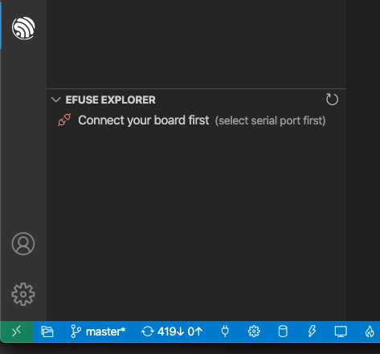
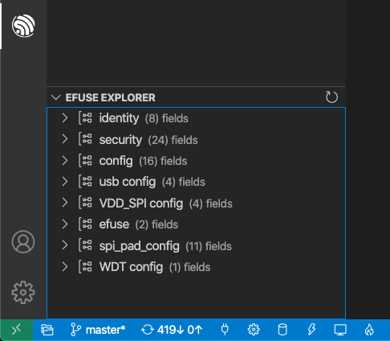
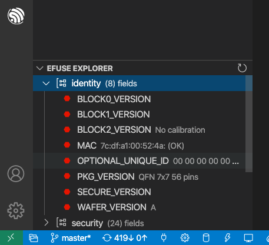

EFuse Explorer
========================

This feature requires ESP-IDF ``>=v4.3``.

Espressif chips has a number of eFuses which can store system and user parameters. Each eFuse is a one-bit field which can be programmed to 1 after which it cannot be reverted back to 0. This feature is based on ESP-IDF `espfuse.py <https://docs.espressif.com/projects/esp-idf/en/latest/esp32/api-reference/system/efuse.html#espefuse-py>`_ script to read and write efuses.

Make sure your board is connected and select the serial port by selecting menu **View**, **Command Palette** and type **ESP-IDF: Select Port to Use** command.

Click the ``ESP-IDF Explorer`` in the `Visual Studio Code Activity bar <https://code.visualstudio.com/docs/getstarted/userinterface>`_. On the ``EFUSE EXPLORER`` section, click the ``Connect your Board First``.

A list of EFuses categories will now be shown in a tree structure.

If you click on any category, the user will see the category Efuses and Values.

