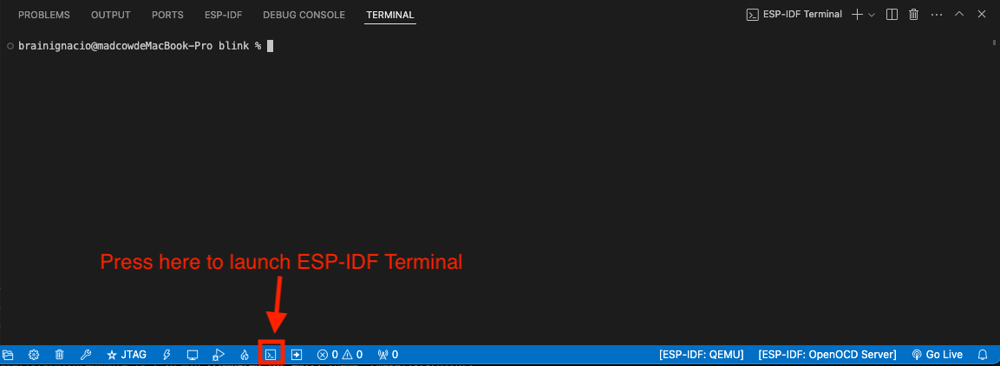

ESP-IDF Terminal
===============================

Select menu **View**, **Command Palette**, type **ESP-IDF: Open ESP-IDF Terminal** will launch a system terminal with ESP-IDF, ESP-IDF Tools and ESP-IDF Python Virtual Environment loaded as environment variables. Just typing ``idf.py`` or ``python -m esptool`` should work to execute scripts from ESP-IDF and additional frameworks.

