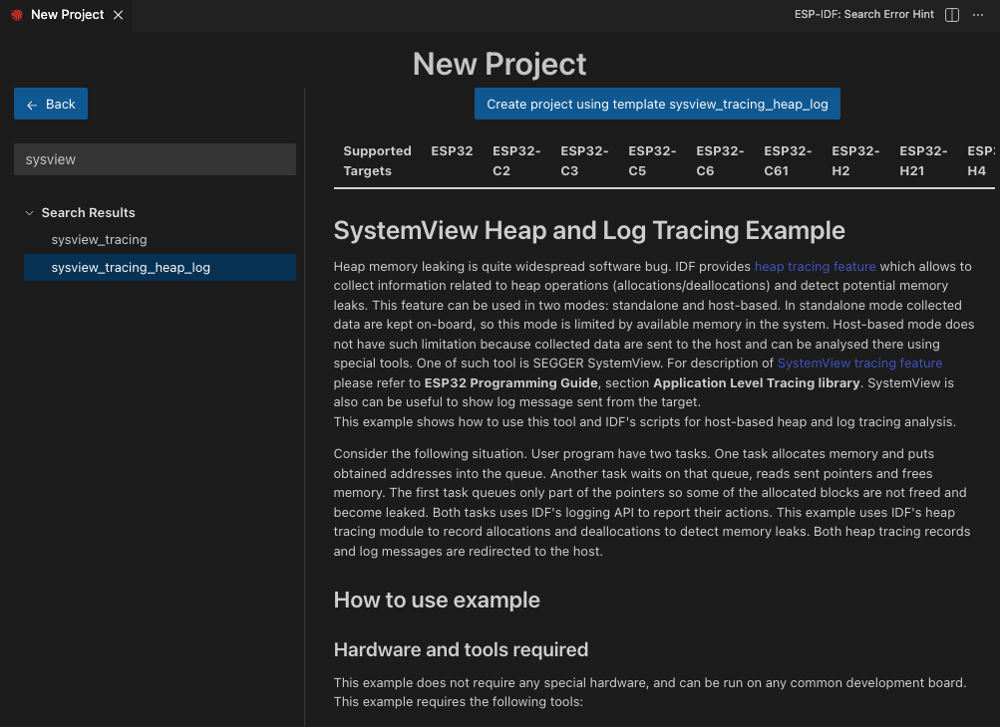
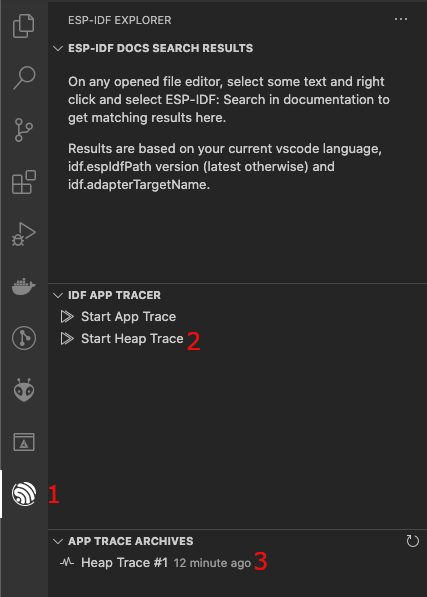
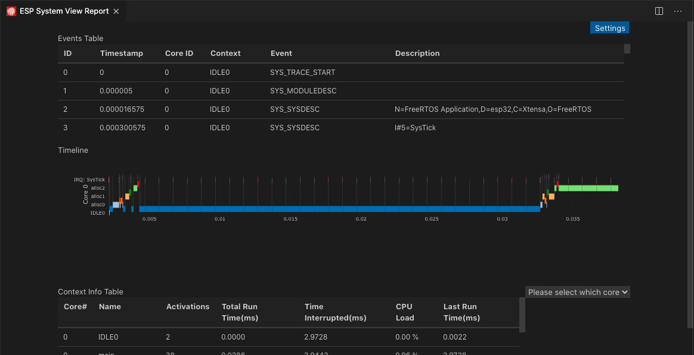

Heap Tracing
========================

Heap Tracing allows tracing of code which allocates/frees memory. More information in `Heap tracing documentation <https://docs.espressif.com/projects/esp-idf/en/latest/api-reference/system/heap_debug.html#heap-tracing>`_. Please also review `System behaviour analysis <https://docs.espressif.com/projects/esp-idf/en/latest/esp32/api-guides/app_trace.html#system-behavior-analysis-with-segger-systemview>`_ for systemView tracing configuration.

Let's open a ESP-IDF project. For this tutorial we will use the ``system/sysview_tracing_heap_log`` example.

- Navigate to **View** > **Command Palette**.

- Type **ESP-IDF: Show Examples Projects**, select the command and choose ``Use Current ESP-IDF (/path/to/esp-idf)``.

If you don't see the option, please review the setup in :ref:`Install ESP-IDF and Tools <installation>`.

- A window will be open with a list a projects, go the **system** section and choose the ``sysview_tracing_heap_log``. You will see a **Create Project Using Example sysview_tracing_heap_log** button in the top and a description of the project below. Click the button and the project will be opened in a new window.

For this example, the project has been already configured for application tracing purposes.

.. note::
  * For more information please take a look at the `Application Level Tracing library documentation <https://docs.espressif.com/projects/esp-idf/en/latest/esp32/api-guides/app_trace.html>`_.

- Configure, build and flash your project as explained in the :ref:`Build the project <build the project>`.

.. note::
  * The OpenOCD server output is shown in menu **View** > **Output** > **ESP-IDF**.
  * Make sure that OpenOCD configuration files are properly configured with **ESP-IDF: Select OpenOCD Board Configuration** command.

- Click the ``ESP-IDF Explorer`` in the `Visual Studio Code Activity bar <https://code.visualstudio.com/docs/getstarted/userinterface>`_ (1). On the ``ESP-IDF APP TRACER`` section, click the ``Start Heap Trace`` (2). This will execute the extension's OpenOCD server and send the corresponding tracing commands to generate a tracing log. You can see the generated tracing log in the ``APP TRACE ARCHIVES`` named with ``Heap Trace Log #1`` (3). Each time you execute ``Start Heap Trace`` a new tracing will be generated and shown in the archives list. You can also start tracing by running the **ESP-IDF: App Trace** command.

- Click on ``Heap Trace Log #1`` and choose the ``Heap Tracing`` option for ``ESP-IDF Tracing`` report window. Click ``Show Report`` button to reload the visualization.

.. image:: ../../../media/tutorials/heap_trace/heap_trace_report.png

- Click on ``Heap Trace Log #1`` and choose the ``SystemView Tracing`` option for the ``ESP-IDF System View Report`` window.

