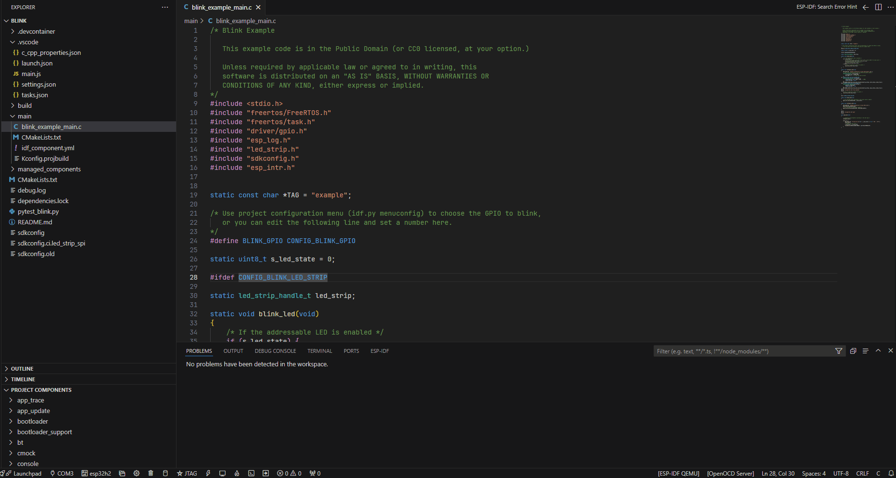

.. _hints_viewer:

Hints Viewer
============

:link_to_translation:`zh_CN:[中文]`

This feature enhances your development experience by providing helpful hints for errors detected in your code.

The ``idf.py`` tool suggests hints for resolving errors. It uses a database of hints stored in ``$IDF_PATH/tools/idf_py_actions/hints.yml``. Hints will be printed if a match is found for the given error.

Hover Over Errors for Hints
~~~~~~~~~~~~~~~~~~~~~~~~~~~

When you hover over errors in the text editor, a hint displays if the error matches one listed in the ``hints.yml`` file.

Bottom Panel for Hints
~~~~~~~~~~~~~~~~~~~~~~

1.  **Automatic Updates:** The ESP-IDF bottom panel updates automatically to display hints based on the errors in your currently opened file.

    .. image:: ../../../media/tutorials/hints/bottom_panel.png

2.  **Manual Search:** You can manually search for hints by copying and pasting errors.

    .. image:: ../../../media/tutorials/hints/manual_search.gif
