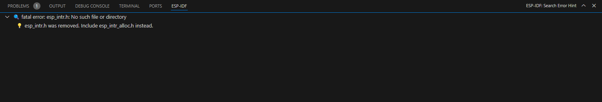

Hints Viewer
=================

This feature enhances your development experience by providing helpful hints for errors detected in your code.

Features
-------------

Hover Over Errors for Hints
~~~~~~~~~~~~~~~~~~~~~~~~~~~~~~

When you hover over errors in the text editor, if the error matches one listed in our hints.yml file, a hint is displayed.

.. image:: ../../../media/tutorials/hints/hover.gif

Bottom Panel for Hints
~~~~~~~~~~~~~~~~~~~~~~~~~~~~~~

1. **Automatic Updates:** The ESP-IDF bottom panel automatically updates to display hints based on the errors in your currently opened file.

2. **Manual Search:** You can manually search for hints by copy pasting errors.

.. image:: ../../../media/tutorials/hints/manual_search.gif
