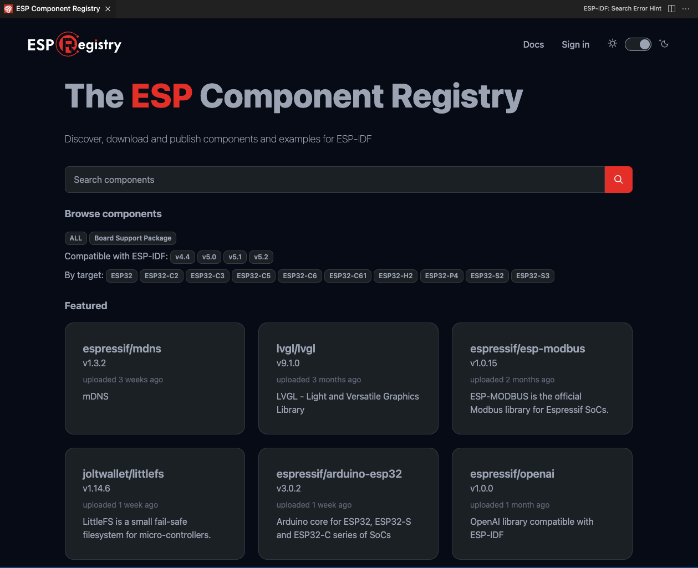
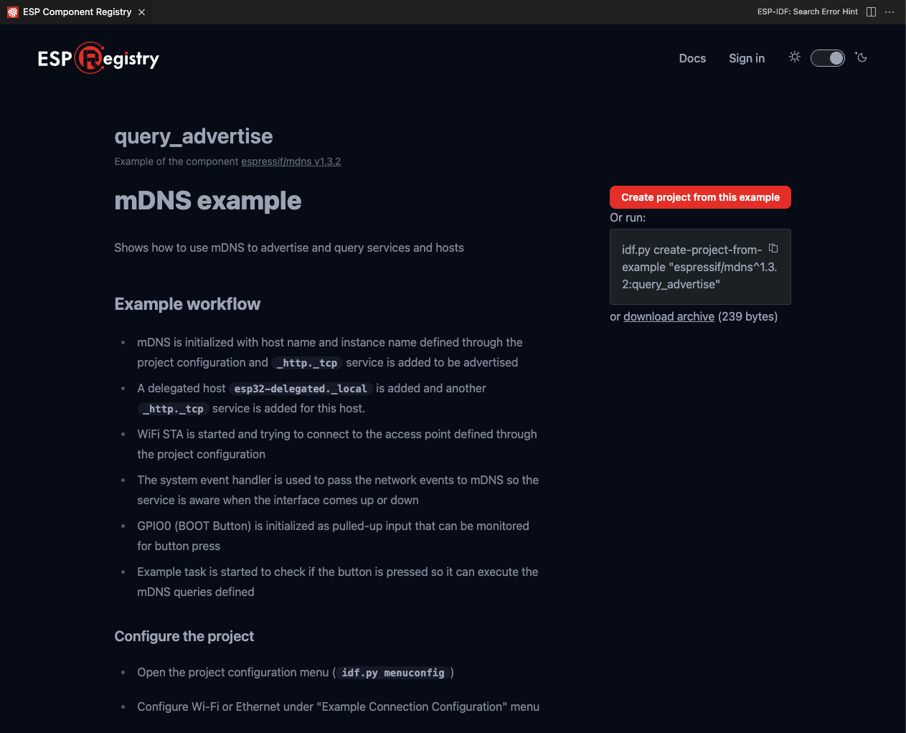

Install ESP-IDF Components
==========================

:link_to_translation:`zh_CN:[中文]`

The ``ESP-IDF: Show ESP Component Registry`` command launches a UI showing the `ESP Component Registry <https://components.espressif.com>`_.

You can browse various ESP components and install them in your current ESP-IDF project using the ``Install`` button.

.. image:: ../../../media/tutorials/features/install-component.png

You can also create a new project from an ESP component example using the ``Create project from this example`` button.

For more information, refer to `ESP Component Registry Documentation <https://docs.espressif.com/projects/idf-component-manager/en/latest/>`_.

Install Arduino-ESP32 as Component
----------------------------------

The ``ESP-IDF: Add Arduino-ESP32 as ESP-IDF Component`` command adds `Arduino-ESP32 <https://github.com/espressif/arduino-esp32>`_ as an ESP-IDF component in your current directory (``${CURRENT_DIRECTORY}/components/arduino``).

.. note::

    Not all versions of ESP-IDF are supported. Check `Arduino-ESP32 <https://github.com/espressif/arduino-esp32>`_ to see if your ESP-IDF version is compatible.
