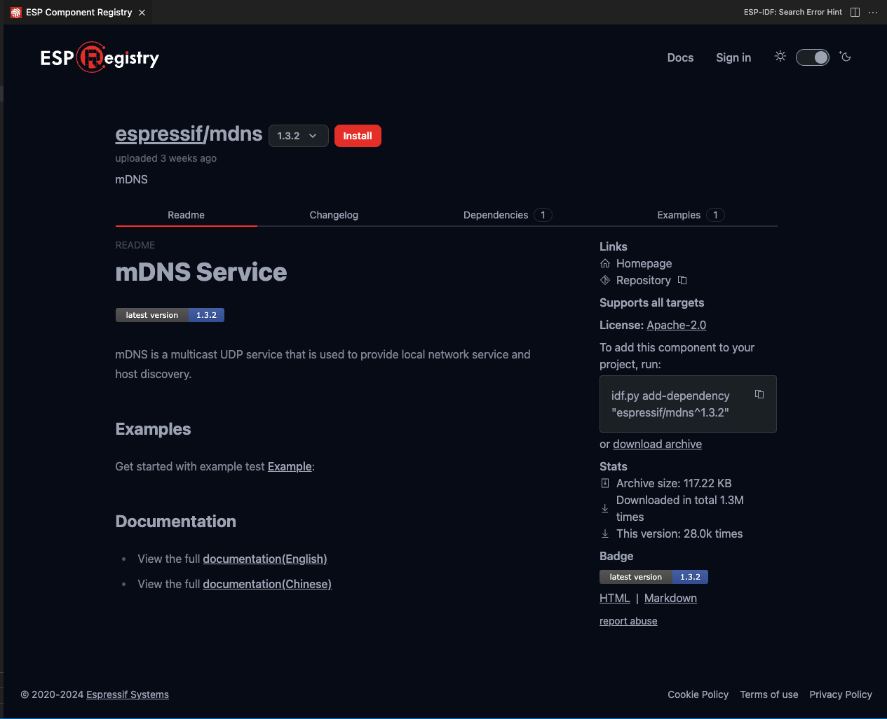

Install ESP-IDF Components
===============================

The **ESP-IDF: ESP Component Registry** will launch a UI showing the `ESP Component Registry <https://components.espressif.com>`_.

.. image:: ../../../media/tutorials/features/component-registry.png

You can browse many different ESP components and install them on your current ESP-IDF project with the ``Install`` button.

You can also create a new project from ESP component example using the ``Create project from this template`` button.

.. image:: ../../../media/tutorials/features/create-project-from-component-example.png

Find out more about the `ESP Component Registry official documentation <https://docs.espressif.com/projects/idf-component-manager/en/latest/>`_.

Install Arduino-ESP32 as Component
-------------------------------------

The **ESP-IDF: Add Arduino-ESP32 as ESP-IDF Component** command will add `Arduino-ESP32 <https://github.com/espressif/arduino-esp32>`_ as a ESP-IDF component in your current directory (``${CURRENT_DIRECTORY}/components/arduino``). You can also use the **ESP-IDF: Create Project from Extension Template** command with ``arduino-as-component`` template to create a new project directory that includes Arduino-esp32 as an ESP-IDF component.

.. note::
  Not all versions of ESP-IDF are supported. Make sure to check `Arduino-ESP32 <https://github.com/espressif/arduino-esp32>`_ to see if your ESP-IDF version is compatible.