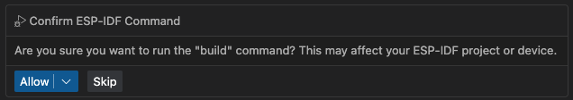

ESP-IDF Chat Commands
=================================

This feature lets you run ESP-IDF commands directly from the VS Code chat window.
Instead of typing terminal commands, you can simply ask in chat - and the tool will execute common ESP-IDF actions for you, like building, flashing, or monitoring your project.

.. _available-language-commands:
Available Commands
------------------

The tool supports the following ESP-IDF commands:

Command Parameters
~~~~~~~~~~~~~~~~~~

Some commands support additional parameters to customize their behavior:

* **``target``** - Specifies the ESP32 target device (for ``setTarget`` command). Supported values: esp32, esp32s2, esp32s3, esp32c3, esp32c6, esp32h2, esp32p4, esp32c2, esp32c5, esp32c61, esp32h21, esp32h4, linux
* **``partitionToUse``** - Specifies which partition to build or flash (for ``build``, ``flash``, and ``buildFlashMonitor`` commands). Supported values: app, bootloader, partition-table
* **``flashType``** - Specifies the flash method to use (for ``flash`` and ``buildFlashMonitor`` commands). Supported values: UART, JTAG, DFU

Build and Flash Commands
~~~~~~~~~~~~~~~~~~~~~~~~

* **``build``** - Build the ESP-IDF project (``espIdf.buildDevice``)
  * Optional parameter: ``partitionToUse`` (app, bootloader, partition-table)
* **``flash``** - Flash the built application to the device (``espIdf.flashDevice``)
  * Optional parameters: ``partitionToUse`` (app, bootloader, partition-table), ``flashType`` (UART, JTAG, DFU)
* **``monitor``** - Monitor the device output (``espIdf.monitorDevice``)
* **``buildFlashMonitor``** - Build, flash, and monitor the project in one command (``espIdf.buildFlashMonitor``)
  * Optional parameters: ``partitionToUse`` (app, bootloader, partition-table), ``flashType`` (UART, JTAG, DFU)

Project Management Commands
~~~~~~~~~~~~~~~~~~~~~~~~~~~

* **``fullClean``** - Perform a full clean of the project (``espIdf.fullClean``)
* **``menuconfig``** - Open the ESP-IDF menuconfig interface (``espIdf.menuconfig.start``)
* **``size``** - Analyze the application size (``espIdf.size``)
* **``eraseFlash``** - Erase the device flash memory (``espIdf.eraseFlash``)

Configuration Commands
~~~~~~~~~~~~~~~~~~~~~~

* **``selectPort``** - Select the serial port for communication (``espIdf.selectPort``)
* **``setTarget``** - Set the ESP32 target device (``espIdf.setTarget``)
  * Optional parameter: ``target`` (esp32, esp32s2, esp32s3, esp32c3, esp32c6, esp32h2, esp32p4, esp32c2, esp32c5, esp32c61, esp32h21, esp32h4, linux)
* **``doctor``** - Run the ESP-IDF doctor command to diagnose issues (``espIdf.doctorCommand``)

Development Commands
~~~~~~~~~~~~~~~~~~~~

* **``newProject``** - Create a new ESP-IDF project (``espIdf.newProject.start``)
* **``partitionTable``** - Open the partition table editor (``esp.webview.open.partition-table``)
* **``componentManager``** - Open the ESP component manager (``esp.component-manager.ui.show``)
* **``apptrace``** - Start application tracing (``espIdf.apptrace``)
* **``heaptrace``** - Start heap tracing (``espIdf.heaptrace``)

Usage
------

Press menu ``View`` > ``Chat`` to open the chat window.

You can type in the chat windows using natural language, and the tool will interpret your request to execute the appropriate ESP-IDF command.

**Natural Language Patterns**: 
- "build the project"
- "flash the device" 
- "monitor the output"
- "clean the project"
- "configure the project"
- "analyze size"
- "erase flash"
- "select port"
- "set target to esp32c6"
- "run doctor"
- "create new project"
- "edit partition table"
- "manage components"
- "start app trace"
- "start heap trace"

You can alternatively type ``#espIdfCommands <tag>`` to invoke the command directly. Replace ``<tag>`` with one of the supported command tags from :ref:`Available Commands <available-language-commands>`. 

.. note::

    * While the Chat can understand natural language, using the specific ``#espIdfCommands <tag>`` command format ensures accurate command execution.
    * The tool is designed to handle one command at a time. For multiple actions, please enter them separately.
    * Ensure your ESP-IDF environment is properly set up in VS Code for the commands to work correctly. Review the documentation to :ref:`Install ESP-IDF and Tools <installation>`.

For example, to build the project, you can type:

.. code-block:: text

    build the project

.. code-block:: text

    #espIdfCommands build    

A dialog will appear to ``Confirm ESP-IDF Command``. Click ``Allow`` to proceed.

The command will execute, and the output will be displayed in the terminal (if the command uses a terminal) and the chat window. Some commands may not produce output and launch a UI (like ``newProject``).

Examples
~~~~~~~~~~~~~~

Here are some examples of how to use the commands with parameters:

**Setting Target:**
* "set target to esp32s3"
* "#espIdfCommands setTarget esp32c6"

**Building Specific Partitions:**
* "build app"
* "#espIdfCommands build bootloader"
* "build bootloader"
* "#espIdfCommands build partition-table"

**Flashing with Different Methods:**
* "flash with UART"
* "#espIdfCommands flash UART"
* "flash with JTAG"
* "#espIdfCommands flash JTAG"
* "flash with DFU"
* "#espIdfCommands flash DFU"

**Combined Operations:**
* "build and flash app with UART"
* "#espIdfCommands buildFlashMonitor app UART"
* "build and flash bootloader with JTAG"
* "#espIdfCommands buildFlashMonitor bootloader JTAG"
* "build and flash partition table with DFU"
* "#espIdfCommands buildFlashMonitor partition-table DFU"
