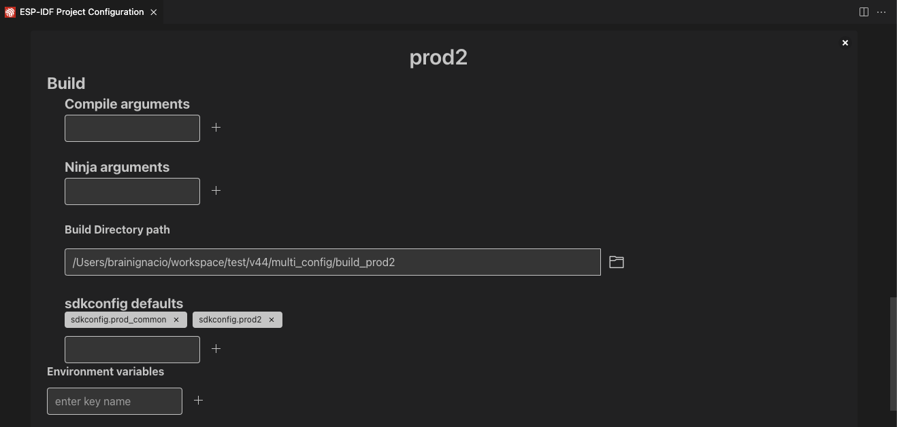
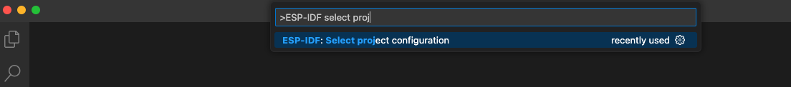

.. _multiple projects:

Working with Multiple Projects
==============================

:link_to_translation:`zh_CN:[中文]`

For big projects, the user often manage multiple projects for building, flashing or monitoring. The ESP-IDF extension follows the `Visual Studio Code Workspace File Schema <https://code.visualstudio.com/docs/editor/multi-root-workspaces#_workspace-file-schema>`_ to identify all project folders inside the current workspace (the root folder). For more details, please refer to `User and Workspace Settings <https://code.visualstudio.com/docs/getstarted/settings#_creating-user-and-workspace-settings>`_.

Configuration settings are overridden in the following order:

1.  Workspace folder configuration settings in ``${workspaceFolder}/.vscode/settings.json``
2.  Workspace configuration settings in the workspace's ``<name>.code-workspace`` file
3.  User settings defined in ``settings.json``

    - **Windows**: ``%APPDATA%\Code\User\settings.json``
    - **MacOS**: ``$HOME/Library/Application Support/Code/User/settings.json``
    - **Linux**: ``$HOME/.config/Code/User/settings.json``

This extension uses the ``idf.saveScope`` configuration setting to specify where to save settings for features such as the Setup Wizard. You can modify this using the ``ESP-IDF: Select where to Save Configuration Settings`` command.

Select the current project by clicking the ``ESP-IDF: Current Project`` icon in the Visual Studio Code status bar or by pressing F1 and typing ``ESP-IDF: Pick a Workspace Folder``. This determines the folder for ESP-IDF settings such as the current device USB port, ESP-IDF path, etc.

Project folders (known in VS Code as workspace folders) and workspace-level settings are defined in a ``<name>.code-workspace`` file, such as:

.. code-block:: JSON

    {
        "folders": [
            {
                "path": "./project1"
            },
            {
                "path": "./project2"
            }
        ],
        "settings": {
            "idf.port": "/dev/ttyUSB1",
            "idf.espIdfPath": "${env:HOME}/esp/esp-idf"
        }
    }

Settings in the root folder's ``.code-workspace`` are used when your ``ESP-IDF: Current Project`` directory lacks a ``.vscode/settings.json`` file.

To open a project with multiple sub-projects in Visual Studio Code, go to ``File`` > ``Open Workspace`` to select the ``.code-workspace`` file describing your workspace.

You can either manually create this ``.code-workspace`` file and define all sub-folders (sub-projects), or go to ``File`` > ``Save Workspace as`` to save it, which does not automatically add any folder inside the current directory.

Add a folder to the workspace by clicking ``File`` > ``Add Folder to Workspace``.

.. note::

    You must manually select the corresponding debug configuration in the ``Debug`` tab of your current workspace folder. Each debug configuration has a project directory suffix.

Example
-------

Consider the following multiple projects directory tree example:

.. code-block::

    ---> /my-projects-root
    ------> /my-projects-root/project1
    ------> /my-projects-root/project2
    ------------> /my-projects-root/project2/.vscode/settings.json

And ``my-ws.code-workspace``:

.. code-block:: JSON

    {
        "folders": [
            {
                "path": "/my-projects-root/project1"
            },
            {
                "path": "/my-projects-root/project2"
            }
        ],
        "settings": {
            "idf.port": "/dev/ttyUSB1",
            "idf.espIdfPath": "${env:HOME}/esp/esp-idf"
        }
    }

1.  Open Visual Studio Code, go to ``File`` > ``Open Workspace`` and open ``my-ws.code-workspace``, you will see only the folders defined in this workspace (``/my-projects-root/project1`` and ``/my-projects-root/project2``).

    - For ``project1``, Visual Studio Code uses the settings from ``my-ws.code-workspace`` first, then other required settings from the User Settings.
    - For ``project2``, Visual Studio Code uses those settings from ``/my-projects-root/project2/.vscode/settings.json`` first, then any missing settings from ``my-ws.code-workspace``, and finally from the User settings.

2.  Open the ``/my-projects-root`` or ``/my-projects-root/project1`` directory, Visual Studio Code uses the User Settings.

    - If you just open the ``/my-projects-root/project2`` directory, Visual Studio Code uses ``/my-projects-root/project2/.vscode/settings.json`` first, then other required settings from the User Settings.

    .. note::

        If you open ``/my-projects-root``, any of the sub-projects will not be recognized as workspace folders. You need to add them to ``my-ws.code-workspace`` (manually or by clicking ``File`` > ``Add Folder to Workspace``) and open this workspace as specified before.

Use Multiple Build Configurations in the Same Workspace Folder
--------------------------------------------------------------

Use the ESP-IDF CMake `Multiple Build Configurations Example <https://github.com/espressif/esp-idf/tree/master/examples/build_system/cmake/multi_config>`_ to follow this tutorial.

Use the ``ESP-IDF: Open Project Configuration`` command to create two configuration profiles: ``prod1`` and ``prod2``. Set ``sdkconfig.prod_common;sdkconfig.prod1`` and ``sdkconfig.prod_common;sdkconfig.prod2`` in the sdkconfig defaults field as shown below:

.. image:: ../../../media/tutorials/project_conf/enterConfigName.png

.. image:: ../../../media/tutorials/project_conf/prod1.png

After creating each profile and setting the configuration, click the ``Save`` button. Use the ``ESP-IDF: Select Project Configuration`` command to choose the configuration to override extension configuration settings.

Once a configuration profile is selected, it will appear in the status bar as shown before.

.. image:: ../../../media/tutorials/project_conf/configInStatusBar.png

Now, use the ``ESP-IDF: Build your Project`` command to build the project for ``prod1`` and ``prod2``. You will see binaries generated for each profile in the specified path. Use the ``ESP-IDF: Select Project Configuration`` command to switch between configurations.

Use the ``ESP-IDF: Open Project Configuration`` command to modify, add, or delete the configuration profiles. To stop using these profiles, delete all configuration profiles.

Multiple ESP-IDF Versions
-------------------------

You can use multiple ESP-IDF versions, one for each project, by explicitly defining your configuration settings in the ``.vscode/settings.json`` file of your current project directory.

1. Set ``idf.saveScope`` to workspace folder using the ``ESP-IDF: Select where to Save Configuration Settings`` command, or by directly editing the ``.vscode/settings.json`` file of the desired project in Visual Studio Code.

2. Configure the extension as described in :ref:`Install ESP-IDF and Tools <installation>`.

3. Delete any previous build directory, as an different ESP-IDF version will not work if there is any cache of previous build.

4. Repeat from step 1 for any project where you want to use an ESP-IDF version different from the global user settings.

Using Multiple Build Configurations Manually
--------------------------------------------

As shown in the ESP-IDF CMake `Multiple Build Configurations Example <https://github.com/espressif/esp-idf/tree/master/examples/build_system/cmake/multi_config>`_, you can use multiple build directories and multiple sdkconfig defaults files to produce different production outputs.

In this extension, you can define the build directory with the ``idf.buildPath`` (``idf.buildPathWin`` for Windows) configuration setting, and define the list of sdkconfig defaults files with ``idf.sdkconfigDefaults``. These settings will be used by the extension build command.

For example, to create product 1:

1.  Create sdkconfig files ``sdkconfig.prod_common`` and ``sdkconfig.prod1``, and the resulting firmware will be generated in ``<your-project>/build_prod1``, where ``build_prod1`` is the custom build folder name.
2.  In your project’s ``.vscode/settings.json`` file, add the following settings:

    .. code-block:: JSON

        {
            // ...
            "idf.buildPath": "${workspaceFolder}/build_prod1",
            "idf.sdkconfigDefaults": ["sdkconfig.prod_common", "sdkconfig.prod1"]
            // ...
        }

3.  Build your project using the ``ESP-IDF: Build your Project`` command.

4.  The resulting files will be generated in ``<your-project>/build_prod1``, and the sdkconfig used by the SDK Configuration Editor will be ``<your-project>/build_prod1/sdkconfig``.

5.  Change the values in step 2 for different products and configurations accordingly.
