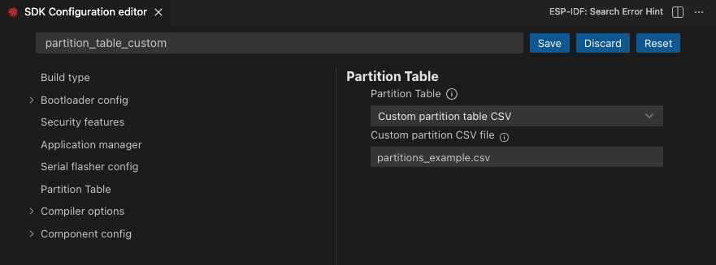
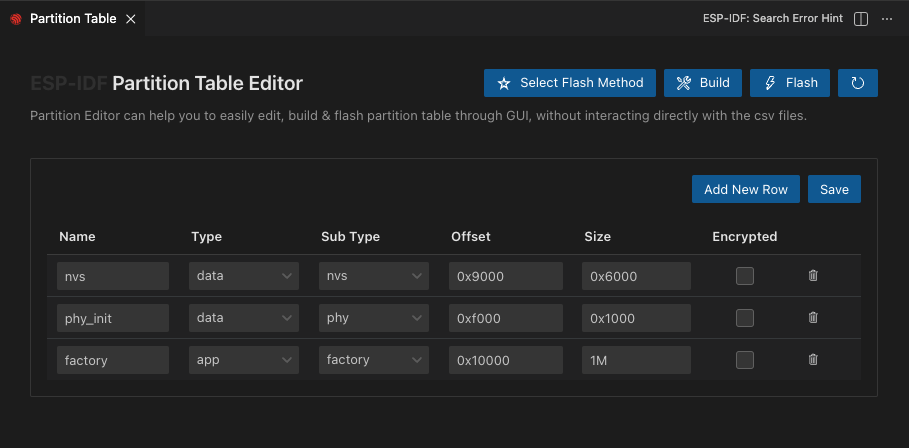

Partition Table Editor
=========================

- Click menu **View** > **Command Palette...** 
- Type **ESP-IDF: SDK Configuration Editor** and select the command.

.. image:: ../../../media/tutorials/partition_table/sdkconfig.png

- Search for ``partition_table_custom`` and select ``Custom Partition Table CSV`` from Partition Table and set the filename. It will search this file in your current project directory.

- If the partition table file doesn't exists, when you execute the command the file will be created. But if the partition table file already exists, make sure that the first two lines of the partion table csv file are:

.. code-block::

  # ESP-IDF Partition Table
  # Name, Type, SubType, Offset, Size, Flag

- Once partition table editor is open, the user can edit the partition table as desired. For more information please refer to `ESP-IDF Partition Tables <https://docs.espressif.com/projects/esp-idf/en/latest/esp32/api-guides/partition-tables.html>`_ documentation.

- Once the user is satisfied press ``Save`` to save the changes, `this will overrid the content of csv file`.

- Now you can click the ``Select Flash Method``, ``Build``, ``Flash`` right top buttons in order to build and flash the partition table to the chip.