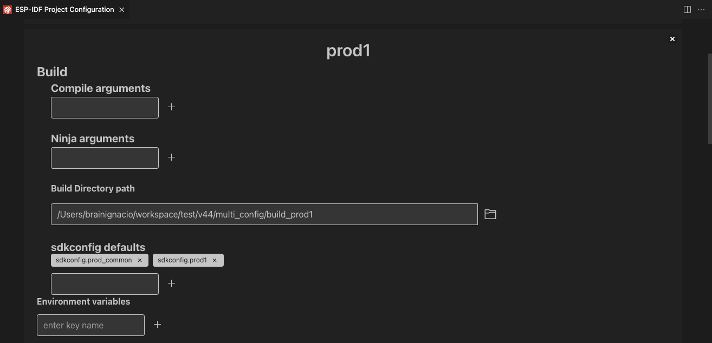

Project Configuration Editor
====================================

:link_to_translation:`zh_CN:[中文]`

Project Configuration Table of Contents
----------------------------------------

.. contents::
   :depth: 2
   :local:

The extension have multiple settings to configure the ESP-IDF project (see the table below). To allow you to have multiple configurations settings for the same project, you can use the **Project Configuration Editor** to define multiple profiles with different settings for each profile.

Configuring the extension for **one** build configuration
----------------------------------------------------------

A typical `ESP-IDF Project Structure <https://docs.espressif.com/projects/esp-idf/en/latest/esp32/api-guides/build-system.html#example-project>`_ is like this:

.. code-block::

    - /path/to/esp-project/
                - CMakeLists.txt
                - sdkconfig
                - components/ - component1/ - CMakeLists.txt
                                            - Kconfig
                                            - src1.c
                              - component2/ - CMakeLists.txt
                                            - Kconfig
                                            - src1.c
                                            - include/ - component2.h
                - main/       - CMakeLists.txt
                              - src1.c
                              - src2.c

                - build/

In the ESP-IDF CMake build system, the project configuration settings are saved using the SDK Configuration Editor which store these values in a ``/path/to/esp-project/sdkconfig`` file. The default case is to create an ``/path/to/esp-project/sdkconfig`` file in the ESP-IDF project root directory and a ``/path/to/esp-project/build`` directory as the build directory path.

When the current ESP-IDF project is under version control system, the ``/path/to/esp-project/sdkconfig`` can change on any user build which can alter the project expected behavior. For such a reason is better to move those project specific settings to an ``sdkconfig.defaults`` file (or list of files) which is not modified by the build system. ``/path/to/esp-project/sdkconfig`` can be added to the ``.gitignore`` list. This ``sdkconfig.defaults`` can be generated by the ``ESP-IDF: Save Default SDKCONFIG file (save-defconfig)`` (ESP-IDF v5.0 or higher) command.

.. note::
  The ``sdkconfig.defaults`` file is used by the build system to override defaults project settings when creating the ``sdkconfig`` file as described in the ESP-IDF documentation `custom sdkconfig defaults <https://docs.espressif.com/projects/esp-idf/en/latest/esp32/api-guides/build-system.html#custom-sdkconfig-defaults>`_.

With this extension settings, the default build path (``/path/to/esp-project/build``), sdkconfig file path and sdkconfig.defaults can be modified from their default location, the one described in the project structure before.

In this extension you can define the build directory with the ``idf.buildPath`` (``idf.buildPathWin`` for Windows) configuration setting and the list of sdkconfig default files with ``idf.sdkconfigDefaults`` configuration. These values will be used by the extension build command.

Say you want to make product 1:

1. you have sdkconfig files ``sdkconfig.prod_common`` and ``sdkconfig.prod1`` and you want the resulting firmware to be generated in ``<your-project>/build_prod1`` where ``build_prod1`` is the name of the custom build folder.
2. Add these settings in ``<your-project>/.vscode/settings.json``:

.. code-block:: JSON

    {
      // ...
      "idf.buildPath": "${workspaceFolder}/build_prod1",
      "idf.sdkconfigDefaults": ["sdkconfig.prod_common", "sdkconfig.prod1"]
      // ...
    }

3. Build your project using the ``ESP-IDF: Build your Project`` command.

4. Your resulting files will be generated in ``<your-project>/build_prod1`` and the sdkconfig being used by the SDK Configuration Editor will be ``<your-project>/build_prod1/sdkconfig``.

 .. note::
    The ESP-IDF CMake Multiple configuration example defines the sdkconfig location in the CMakeLists.txt file and it will make ``idf.sdkconfigFilePath`` **NOT** work.

5. Change values in (2) for different products and configurations.

With the ``ESP-IDF: Project Configuration Editor`` you can define multiple locations of the build directory with ``Build Directory Path``, ``SDKConfig File Path`` for the SDKConfig file and ``SDKConfig Defaults`` list of SDKConfig files to create the SDKConfig file in the specified ``SDKConfig File Path`` path. 

Configuring the extension for multiple build configurations
------------------------------------------------------------

1. Click menu **View** > **Command Palette...** 
2. Type ``ESP-IDF: Open Project Configuration`` and select the command. 
3. This will launch a Project configuration wizard to manage the project configuration profiles to record the following settings for each configuration:

+-----------------------------------+------------------------------------------------------------------------------------------------------------------+
| Setting ID                        | Description                                                                                                      |
+===================================+==================================================================================================================+
| **idf.cmakeCompilerArgs**         | Arguments for CMake compilation task                                                                             |
+-----------------------------------+------------------------------------------------------------------------------------------------------------------+
| **idf.ninjaArgs**                 | Arguments for Ninja build task                                                                                   |
+-----------------------------------+------------------------------------------------------------------------------------------------------------------+
| **idf.buildPath**                 | Custom build directory name for extension commands. (Default: \${workspaceFolder}/build)                         |
+-----------------------------------+------------------------------------------------------------------------------------------------------------------+
| **idf.sdkconfigFilePath**         | Absolute path for sdkconfig file                                                                                 |
+-----------------------------------+------------------------------------------------------------------------------------------------------------------+
| **idf.sdkconfigDefaults**         | List of sdkconfig default values for initial build configuration                                                 |
+-----------------------------------+------------------------------------------------------------------------------------------------------------------+
| **idf.customExtraVars**           | Variables to be added to system environment variables. IDF_TARGET is set here                                    |
+-----------------------------------+------------------------------------------------------------------------------------------------------------------+
| **idf.flashBaudRate**             | Flash Baud rate                                                                                                  |
+-----------------------------------+------------------------------------------------------------------------------------------------------------------+
| **idf.monitorBaudRate**           | Monitor Baud Rate (Empty by default to use SDKConfig CONFIG_ESP_CONSOLE_UART_BAUDRATE)                           |
+-----------------------------------+------------------------------------------------------------------------------------------------------------------+
| **idf.openOcdDebugLevel**         | Set openOCD Debug Level (0-4) Default: 2                                                                         |
+-----------------------------------+------------------------------------------------------------------------------------------------------------------+
| **idf.openOcdConfigs**            | Configuration Files for OpenOCD. Relative to OPENOCD_SCRIPTS folder                                              |
+-----------------------------------+------------------------------------------------------------------------------------------------------------------+
| **idf.openOcdLaunchArgs**         | Launch Arguments for OpenOCD. Default is [], if defined idf.openOcdConfigs and idf.openOcdDebugLevel ae ignored  |
+-----------------------------------+------------------------------------------------------------------------------------------------------------------+
| **idf.preBuildTask**              | Command string to execute before build task                                                                      |
+-----------------------------------+------------------------------------------------------------------------------------------------------------------+
| **idf.postBuildTask**             | Command string to execute after build task                                                                       |
+-----------------------------------+------------------------------------------------------------------------------------------------------------------+
| **idf.preFlashTask**              | Command string to execute before flash task                                                                      |
+-----------------------------------+------------------------------------------------------------------------------------------------------------------+
| **idf.postFlashTask**             | Command string to execute after flash task                                                                       |
+-----------------------------------+------------------------------------------------------------------------------------------------------------------+

4. After defining a profile and the settings for each profile use:

- Click menu **View** > **Command Palette...** 
- Type ``ESP-IDF: Select Project Configuration`` command to choose the configuration to override extension configuration settings.

There are many use cases for having multiple configurations profiles. It allows you to store settings together and easily switch between one and the other.

Project configuration profiles are saved in the ``<your-project>/esp_idf_project_configuration.json`` file.
------------------------------------------------------------------------------------------------------------

The project configuration file is a JSON file that contains the configuration settings for the extension. The file is created when you use the **ESP-IDF: Open Project Configuration** command and it will be saved in the root directory of your ESP-IDF project.

The file is a JSON object with a list of profiles. Each profile is a JSON object with the following properties:

.. code-block:: JSON

    {
      "profile1": {
         // profile1 settings
      },
      "profile2": {
         // profile2 settings
      }
    }

The profile name is the key of the JSON object and the value is a JSON object with the configuration settings for that profile. The profile name can be any string, but it is recommended to use a descriptive name that reflects the purpose of the profile.
The profile name is used to identify the profile when using the **ESP-IDF: Select Project Configuration** command. The profile name is also used to display the current profile in the status bar.
The profile name is not case sensitive, so ``prod1`` and ``Prod1`` are considered the same profile.

The profile settings are stored in a JSON object with the following properties, notice that arrays are expected to have ``string`` elements:

.. code-block:: JSON

    {
      "profileName": {
         "build": {
            "compileArgs": [],
            "ninjaArgs": [],
            "buildDirectoryPath": "",
            "sdkconfigDefaults": [],
            "sdkconfigFilePath": ""
         },
         "env": {},
         "idfTarget": "",
         "flashBaudRate": "",
         "monitorBaudRate": "",
         "openOCD": {
            "debugLevel": 0,
            "configs": [],
            "args": []
         },
         "tasks": {
            "preBuild": "",
            "preFlash": "",
            "postBuild": "",
            "postFlash": ""
         }
      }
    }

While each field is self-explanatory, here is the mapping of the profile settings to the extension settings:

+-----------------------------------+------------------------------------------------------------------------------------------------------------------+
| Setting ID replaced               | Field in Profile that override this setting                                                                      |
+===================================+==================================================================================================================+
| **idf.cmakeCompilerArgs**         | ["profileName"].build.compileArgs                                                                                |
+-----------------------------------+------------------------------------------------------------------------------------------------------------------+
| **idf.ninjaArgs**                 | ["profileName"].build.ninjaArgs                                                                                  |
+-----------------------------------+------------------------------------------------------------------------------------------------------------------+
| **idf.buildPath**                 | ["profileName"].build.buildDirectoryPath                                                                         |
+-----------------------------------+------------------------------------------------------------------------------------------------------------------+
| **idf.sdkconfigFilePath**         | ["profileName"].build.sdkconfigFilePath                                                                          |
+-----------------------------------+------------------------------------------------------------------------------------------------------------------+
| **idf.sdkconfigDefaults**         | ["profileName"].build.sdkconfigDefaults                                                                          |
+-----------------------------------+------------------------------------------------------------------------------------------------------------------+
| **idf.customExtraVars**           | ["profileName"].env and ["profileName"].idfTarget will replace idf.customExtraVars["IDF_TARGET"]                 |
+-----------------------------------+------------------------------------------------------------------------------------------------------------------+
| **idf.flashBaudRate**             | ["profileName"].flashBaudRate                                                                                    |
+-----------------------------------+------------------------------------------------------------------------------------------------------------------+
| **idf.monitorBaudRate**           | ["profileName"].monitorBaudRate                                                                                  |
+-----------------------------------+------------------------------------------------------------------------------------------------------------------+
| **idf.openOcdDebugLevel**         | ["profileName"].openOCD.debugLevel                                                                               |
+-----------------------------------+------------------------------------------------------------------------------------------------------------------+
| **idf.openOcdConfigs**            | ["profileName"].openOCD.configs                                                                                  |
+-----------------------------------+------------------------------------------------------------------------------------------------------------------+
| **idf.openOcdLaunchArgs**         | ["profileName"].openOCD.args                                                                                     |
+-----------------------------------+------------------------------------------------------------------------------------------------------------------+
| **idf.preBuildTask**              | ["profileName"].tasks.preBuild                                                                                   |
+-----------------------------------+------------------------------------------------------------------------------------------------------------------+
| **idf.postBuildTask**             | ["profileName"].tasks.postBuild                                                                                  |
+-----------------------------------+------------------------------------------------------------------------------------------------------------------+
| **idf.preFlashTask**              | ["profileName"].tasks.preFlash                                                                                   |
+-----------------------------------+------------------------------------------------------------------------------------------------------------------+
| **idf.postFlashTask**             | ["profileName"].tasks.postFlash                                                                                  |
+-----------------------------------+------------------------------------------------------------------------------------------------------------------+

Multiple configuration tutorial
--------------------------------

Use the `ESP-IDF CMake Multiple configuration example <https://github.com/espressif/esp-idf/tree/master/examples/build_system/cmake/multi_config>`_ to follow this tutorial.

Use the **ESP-IDF: Open Project Configuration** and create two configurations profiles: ``prod1`` and ``prod2`` and ``sdkconfig.prod_common;sdkconfig.prod1`` and ``sdkconfig.prod_common;sdkconfig.prod2`` on the sdkconfig defaults field as shown below:

.. image:: ../../../media/tutorials/project_conf/enterConfigName.png
   :alt: Enter new profile configuration name

In each profile, on the sdkconfig defaults field, type ``sdkconfig.prod_common`` and press ``+`` to add another sdkconfig file. Type ``sdkconfig.prod1`` for the ``prod1`` profile and ``sdkconfig.prod2`` for the ``prod2`` profile.

After creating each profile and the configuration settings for each profile, click the ``Save`` button located at the top and use the **ESP-IDF: Select Project Configuration** command to choose the configuration to override extension configuration settings.

.. image:: ../../../media/tutorials/project_conf/selectConfig.png
   :alt: Select configuration

After a configuration profile is selected, the selected profile will be shown in the status bar as shown before.

Now use the **ESP-IDF: Build your Project** to build the project for the selected profile (either ``prod1`` or ``prod2``). You can observe binaries generated for each profiles in the path defined in each profile as before. You can use **ESP-IDF: Select Project Configuration** command to switch between configurations.

Use the **ESP-IDF: Open Project Configuration** command to modify, add or delete the configuration profiles. If you want to stop using these profiles, just delete all configuration profiles.

These profiles and each profile settings are going to be saved in the ``/path/to/esp-project/esp_idf_project_configuration.json``.

Development and Release Profiles for ESP-IDF Project
-------------------------------------------------------

For this example we will create two profiles, **development** and **production**, to create 2 different build directories and 2 different sdkconfig files.

1. Click menu **View** > **Command Palette...** 
2. Type **ESP-IDF: Save Default SDKCONFIG file (save-defconfig)** select the command to generate a `sdkconfig.defaults` file. This command is added in ESP-IDF v5.0. You can also create this sdkconfig.defaults manually.
3. Click menu **View** > **Command Palette...** 
4. Type **ESP-IDF: Open Project Configuration** select the command and create a new profile with name ``production``. Set ``SDKConfig Defaults`` the previous ``sdkconfig.defaults`` file. If you want to separate the build directory of this new **production** profile from the default ``/path/to/esp-project/build`` directory, specify a build directory path using the ``Build Directory Path`` field to something like ``/path/to/esp-project/build_production`` and the ``SDKConfig file path`` field to something like ``/path/to/esp-project/build_production/sdkconfig``.

5. Create a new profile with name ``development``. You can set the build directory path using the ``Build Directory Path`` field to something like ``/path/to/esp-project/build_dev`` and the ``SDKConfig File Path`` field to something like ``/path/to/esp-project/build_dev/sdkconfig`` to avoid mixing **development** with **production** files.

6. After creating each profile and the configuration settings for each profile, click the ``Save`` button and use the extension ``ESP-IDF: Select Project Configuration`` command to choose desired profile.

7. When you choose the **production** profile and use the ``ESP-IDF: Build your Project`` the ``/path/to/esp-project/build_production/sdkconfig`` would be created and the binaries are going to be created in ``/path/to/esp-project/build_production``.

8. If you choose the **development** profile, the ``/path/to/esp-project/build_dev/sdkconfig`` would be created and the binaries are going to be created in ``/path/to/esp-project/build_dev``.

9. These profiles and each profile settings are going to be saved in the ``/path/to/esp-project/esp_idf_project_configuration.json``.

The previous production profile could be split into multiple production profiles, as it is done in the :ref:`Multiple configuration tutorial <Multiple configuration tutorial>` by separating ``sdkconfig.defaults`` into common SDKConfig settings in a ``sdkconfig.prod_common`` file and product specific settings in ``sdkconfig.prod1`` file and ``sdkconfig.prod2`` file respectively. Multiple SDKConfig defaults files can be specified in the project configuration editor profile ``sdkconfig defaults`` field as ``sdkconfig.prod_common;sdkconfig.prod1`` where the values are loaded in order as explained in `here <https://docs.espressif.com/projects/esp-idf/en/latest/esp32/api-guides/build-system.html?highlight=sdkconfig%20defaults#custom-sdkconfig-defaults>`_.

You can define multiple settings for different kinds of development scenarios such as testing, profiling, etc.

