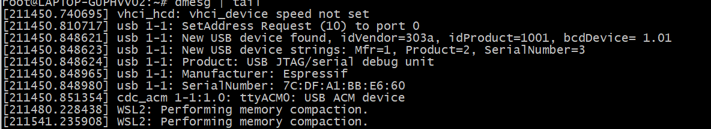
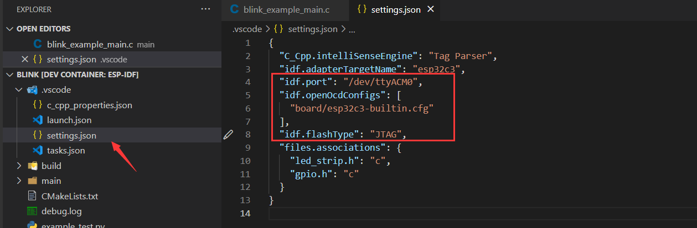

Using WSL in Windows
===================================

- In this tutorial will show you how to develop your projects based on ``Visual Studio Code`` + ``ESP-IDF Extension`` + ``Remote - WSL`` to implement all features of this extension in WSL.

- Install the following tools before starting the project:

1. Windows WSL (steps to install below).
2. `Visual Studio Code <https://code.visualstudio.com>`_
3. `usbipd-win <https://github.com/dorssel/usbipd-win/releases>`_

Installing Ubuntu on Windows (WSL)
-----------------------------------

- If you don't have WSL installed run:

.. code-block::

  wsl --install

- Update the WSL kernel with

.. code-block::

  wsl --update

- Check the WSL available distributions list with the ``Powershell`` command prompt, as below:

.. code-block::

  wsl -l -o

.. image:: ../../../media/tutorials/using_docker_container/wsl-l-o.png

- So to install a ubuntu distribution in WSL on Windows, please type in the following command:

.. code-block::

  wsl --install --distribution Ubuntu

usbipd-win in WSL
---------------------

- To access the ``USB``, ``serial`` and ``JTAG`` devices which are from the local Windows, ``usbipd-win`` must be installed, else it is impossible to download,monitor and debug on IDF docker image side. the way to install it, it is also same as Windows applications, so it will not be described in detail here.

- You still need to do a bit configurations after installing the four tools above:

Check Ubuntu on Windows (WSL)
~~~~~~~~~~~~~~~~~~~~~~~~~~~~~~~

1. Check the current WSL version is 2

.. code-block::

  wsl -l -v

.. image:: ../../../media/tutorials/using_docker_container/wsl-l-v.png

2. Please upgrade to version 2, if not

.. code-block::

  wsl --set-version Ubuntu 2

3. Set the Ubuntu distribution as default:

.. code-block::

  wsl -s Ubuntu

4. At last, to check if the commands have taken effect with ``wsl --status`` command.

.. image:: ../../../media/tutorials/using_docker_container/wsl-status.png

Adding the Required Linux Packages in WSL
~~~~~~~~~~~~~~~~~~~~~~~~~~~~~~~~~~~~~~~~~~~~~

Install `ESP-IDF requirements for Linux <https://docs.espressif.com/projects/esp-idf/en/latest/esp32/get-started/linux-setup.html#install-prerequisites>`_.

.. code-block::

  sudo apt-get install git wget flex bison gperf python3-pip python3-venv python3-setuptools cmake ninja-build ccache libffi-dev libssl-dev dfu-util

1. Install usbipd in Powershell command prompt:

.. code-block::

  winget install usbipd

2. Now configure the USB serial device to be able to connect to the WSL with ``usbipd``:

3. Open PowerShell command prompt with administrator rights and then type in the command

.. code-block::

  usbipd list 

for a list of USB serial devices.

4. To access the specified device from Windows on WSL locally, the device must be bound with **usbipd**. Open PowerShell command prompt with administrator rights and then type in the command:

.. code-block::

  usbipd bind --busid <BUSID>

.. note::
  this command needs to be used only one time,unless the computer has restarted. **1-1** is the device's bus id ``<BUSID>`` I would like to bind.

5. After binding, please attach the specified device to WSL with this command in the Powershell command prompt.

.. code-block::

  usbipd attach --wsl --busid <BUSID>

6. At last, let us check if it works well on both side and type this command on WSL side.

.. code-block::

  dmesg | tail

- As we can see above, **1-1** device has been attached to ``ttyACM0``, that means WSL can access the **1-1** USB device now.

Install Remote WSL extension in Visual Studio Code
~~~~~~~~~~~~~~~~~~~~~~~~~~~~~~~~~~~~~~~~~~~~~~~~~~~~~

Install the **Remote - WSL**, **Remote Development** and **ESP-IDF** extensions, as below:

.. image:: ../../../media/tutorials/using_docker_container/remote_wsl.png

.. image:: ../../../media/tutorials/using_docker_container/remote_development.png

.. image:: ../../../media/tutorials/using_docker_container/esp-idf.png

Open Project in WSL
~~~~~~~~~~~~~~~~~~~~~~~~~~

- Start your development by clicking the ``><`` green button at the left bottom of Visual Studio Code and select **Open Folder in WSL** to start configuring the WSL and open the ``Blink`` example project.

- Configure the ESP-IDF extension inside the WSL as described in the :ref:`Install ESP-IDF and Tools <installation>` documentation.

.. note::
  * Running the setup from WSL could override the Windows host machine configuration settings since it is using the User Settings by default. Consider saving settings to a workspace or workspace folder.

- At this moment, you can start to use the ``Blink`` example project for building, flashing, monitoring, debugging, etc.

Building the Project
~~~~~~~~~~~~~~~~~~~~~~~~~~~~

- Here taking the esp32-c3 as an example, users only need to change the target device from ``esp32`` to ``esp32-c3``, as below:

.. image:: ../../../media/tutorials/using_docker_container/device_target_esp32_c3.png

- Next, start to build the example project, as below:

.. image:: ../../../media/tutorials/using_docker_container/container_build.gif

Flashing to your Device
~~~~~~~~~~~~~~~~~~~~~~~~~~~~~

After building, we can use the following ways to download the firmware.

External USB-Serial
~~~~~~~~~~~~~~~~~~~~~~~~~~~~

- Based on the description above, users can follow the usbipd instructions section mentioned. here ``Silicon Labs CP210x USB to UART Bridge`` is taken as an example, it has been attached to docker image:

.. image:: ../../../media/tutorials/using_docker_container/wsl_demsg_tail_usb_serial.png

- As you can see, this device has attached to ``ttyUSB0``, so ``idf.port`` also need to change accordingly.

.. image:: ../../../media/tutorials/using_docker_container/ttyUSB0.png

- But, the container doesn't know the configuration has changed yet at this moment.

.. image:: ../../../media/tutorials/using_docker_container/unkown_ttyUSB0.png

- So users need to reopen the container, that is **Reopen Folder Locally** and then the new configuration wil be reloaded as well.

.. image:: ../../../media/tutorials/using_docker_container/container_reopen.gif

- At last, click the ``Flash`` button and start to download the firmware.

.. image:: ../../../media/tutorials/using_docker_container/container_flash_uart.gif

Internal USB-serial
~~~~~~~~~~~~~~~~~~~~~~~~~~~~

Just as the `External USB-Serial`_, the only difference is the number attached. where the external usb-serial is ``ttyUSBx``, while the internal usb-serial is ``ttyACMx``.

.. image:: ../../../media/tutorials/using_docker_container/container_flash_uart_internal.gif

USB-JTAG
~~~~~~~~~~~~~~~~~~~~~~~~~~~~

Same as `External USB-Serial`_ and `Internal USB-serial`_, but it needs to configure the following extra parameters:

the interface is the same as `Internal USB-serial`_, that is ``ttyACMx``:

.. image:: ../../../media/tutorials/using_docker_container/container_flash_jtag.gif

Additional steps for debugging
~~~~~~~~~~~~~~~~~~~~~~~~~~~~~~~~~~~

Make sure to copy the `OpenOCD udev rules files <https://github.com/espressif/openocd-esp32/blob/master/contrib/60-openocd.rules>`_ into the ``/etc/udev/rules.d`` directory before running OpenOCD and starting a debug session.

Debugging
~~~~~~~~~~~~~~~~~~~~~~~~~~~~

After following `USB-JTAG`_, press ``F5`` to start to debug:

.. image:: ../../../media/tutorials/using_docker_container/container_debug.gif

Precautions
~~~~~~~~~~~~~~~~~~~~~~~~~~~~

1. If you want to debug on Windows, you need to unplug the USB cable and re-plug in it again, otherwise the corresponding USB port cannot be found in the Windows device manager.
2. Docker Desktop For Windows needs to be opened and cannot be closed during container development.

