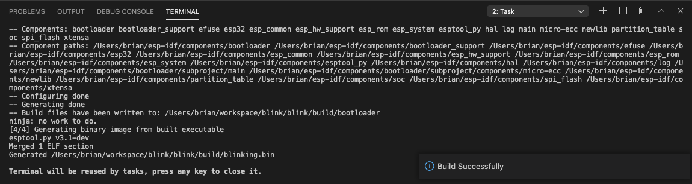
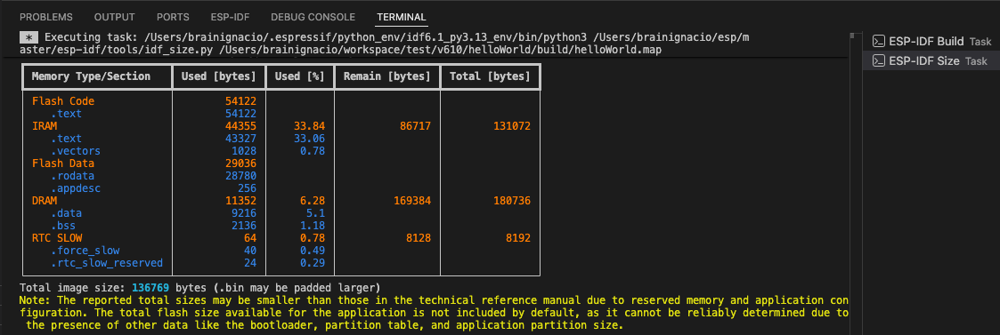

.. _build the project:

Build the Project
===============================

Now to build the project, select menu **View**, **Command Palette**, type **ESP-IDF: Build your Project** command. 

A new terminal being launched with the build output and a notification bar with Building Project message until it is done then a Build done message when finished. 

.. note::
  There is a **idf.notificationMode** configuration setting if the user does not wants to see the output automatically. Please review `ESP-IDF Settings <settings>` to see how to modify this configuration setting.

You could modify the behavior of the build task with **idf.cmakeCompilerArgs** for Cmake configure step and **idf.ninjaArgs** for Ninja step. For example, using ``idf.ninjaArgs: [-j N]`` where N is the number of jobs run in parallel.

After building the application size analysis task will be executed in a terminal showing the size analysis results.  You can enable or disable this task being executed with **idf.enableSizeTaskAfterBuildTask** in your settings.json.

Next step is to :ref:`Flash onto the device <flash the device>`.