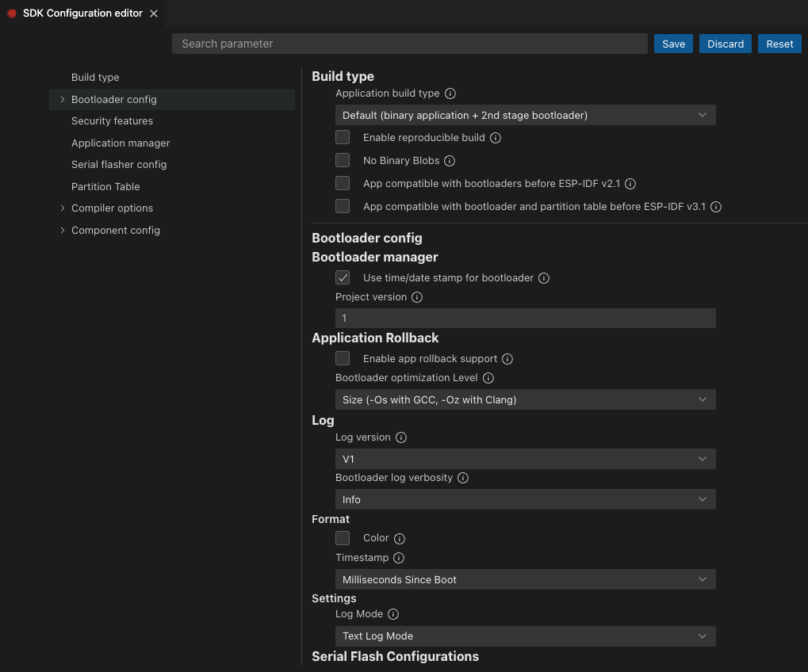

Configure Your Project
===============================

Select an Espressif target (esp32, esp32s2, etc.) by selecting menu `View`, `Command Palette` and typing **ESP-IDF: Set Espressif Device Target** command.

Use the **ESP-IDF: Select OpenOCD Board Configuration** to choose the openOCD configuration files for the extension openOCD server.

.. note::
  Please review `Configuration of OpenOCD for Specific Target <https://docs.espressif.com/projects/esp-idf/en/latest/esp32/api-guides/jtag-debugging/tips-and-quirks.html#jtag-debugging-tip-openocd-configure-target>`
  to understand which board or configuration to use for your specific hardware.

Next configure your project. Select menu `View`, `Command Palette`, type **ESP-IDF: SDK Configuration Editor** command ESP-IDF project settings.

After all changes are made, click save and close this window.

C and C++ Code navigation and syntax highlight
--------------------------------------

For code navigation and C/C++ syntax highlight you could use either the `Microsoft C/C++ Extension <https://marketplace.visualstudio.com/items?itemName=ms-vscode.cpptools>` extension or any other extension you desire.

Usually C/C++ language extensions rely on a file called `compile_commands.json` which is located on your project build directory. You can generate this file using the **ESP-IDF: ESP-IDF: Run idf.py reconfigure task**.

For Microsoft C/C++ extension, the configuration file is located in `{PROJECT_DIRECTORY_PATH}/.vscode/c_cpp_properties.json` and can be generated by creating a project using **ESP-IDF: New Project**, **ESP-IDF: Show Examples Projects** command or using the **ESP-IDF: Add .vscode Configuration Folder** command on an existing ESP-IDF projects.

The file looks like this:

.. code-block:: json
  {
    "configurations": [
      {
        "name": "ESP-IDF",
        "compilerPath": "/path/to/toolchain-gcc",
        "compileCommands": "${workspaceFolder}/build/compile_commands.json",
        "includePath": [
          "${config:idf.espIdfPath}/components/**",
          "${config:idf.espIdfPathWin}/components/**",
          "${workspaceFolder}/**"
        ],
        "browse": {
          "path": [
            "${config:idf.espIdfPath}/components",
            "${config:idf.espIdfPathWin}/components",
            "${workspaceFolder}"
          ]
        }
      }
    ]
  }

If `compile_commands.json` is not defined, the Microsoft C/C++ extension will browse the provided ESP-IDF path to provide code navigation resolution.
