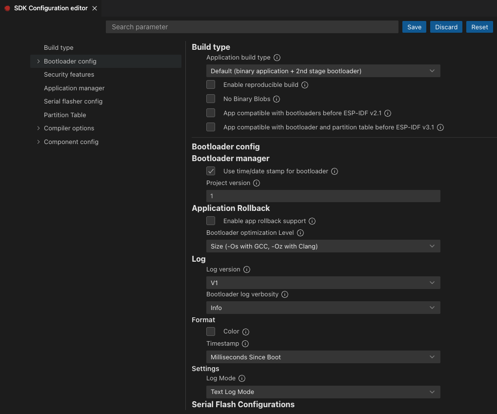
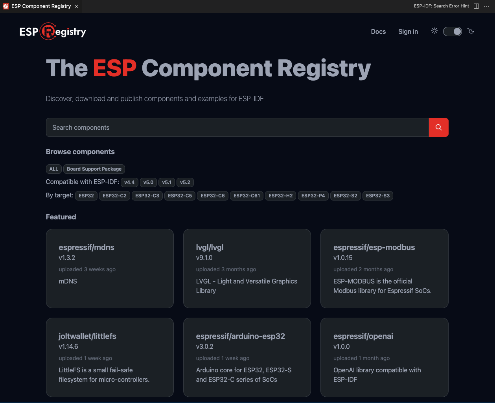
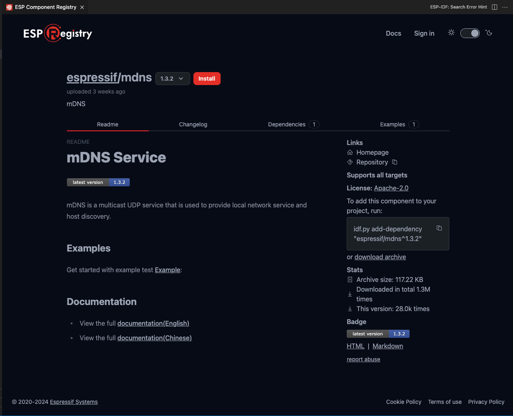

.. _configure_your_project:

Configure Your Project
======================

:link_to_translation:`zh_CN:[中文]`

Select an Espressif target (esp32, esp32s2, etc.) by going to ``View`` > ``Command Palette`` and entering ``ESP-IDF: Set Espressif Device Target`` command.

If you are using a connected ESP-IDF development board, the OpenOCD configuration will be automatically selected based on your connected board. Otherwise, you can manually select the OpenOCD configuration by going to ``View`` > ``Command Palette`` and entering ``ESP-IDF: Select OpenOCD Board Configuration``.

.. note::

    Please refer to `Configuration of OpenOCD for Specific Target <https://docs.espressif.com/projects/esp-idf/en/latest/esp32/api-guides/jtag-debugging/tips-and-quirks.html#jtag-debugging-tip-openocd-configure-target>`_ to select the appropriate OpenOCD configuration file based on your hardware.

Next, configure your project. Go to ``View`` > ``Command Palette`` and enter ``ESP-IDF: SDK Configuration Editor`` to adjust ESP-IDF project settings.

After making changes, click ``save`` and close the window.

Next, proceed to :ref:`Build Your project <build the project>`.

Adding ESP-IDF Components
-------------------------

The `ESP Component Registry <https://components.espressif.com>`_ is a collection of ESP-IDF components that can be easily added to your project. You can browse the registry, install components and create new ESP-IDF projects from component examples directly from Visual Studio Code.

In Visual Studio Code:

- Navigate to ``View`` > ``Command Palette``.
- Type ``ESP-IDF: Show ESP Component Registry`` and select the command to open the ESP Component Registry UI.

The ``ESP-IDF: Show ESP Component Registry`` command launches a UI showing the `ESP Component Registry <https://components.espressif.com>`_.

You can browse various ESP components and install them in your current ESP-IDF project using the ``Install`` button.

For more information, refer to `ESP Component Registry Documentation <https://docs.espressif.com/projects/idf-component-manager/en/latest/>`_.

Using other ESP solutions
----------------------------

If you are working with ESP solutions such as ESP-Matter or ESP-RainMaker, chances are you will find them in the ESP Component Registry and you can either create projects from their examples or install the component in your current ESP-IDF project.

In case you want to use the main branch of these ESP solutions, you just need to define the exported environment variables in your project's ``.vscode/settings.json`` file using the ``idf.customExtraVars`` VS Code configuration setting.

For example, for `ESP-Matter <https://github.com/espressif/esp-matter>`_ you need to define the ``ESP_MATTER_PATH`` variable with the path to your local ESP-Matter repository:

.. code-block:: JSON

    {
        "idf.customExtraVars": {
            "ESP_MATTER_PATH": "/path/to/esp-matter"
        }
    }

or you can do it from the Settings UI of Visual Studio Code:

- Navigate to ``View`` > ``Command Palette``.
- Type ``Preferences: Open Settings (UI)`` and select the command to open the Settings UI. Select the ``Workspace`` tab to edit the settings for the current workspace (your ESP-IDF project) or ``User`` tab to edit the settings for all VS Code instances.
- Search for ``idf custom extra vars`` or ``idf.customExtraVars``.
- Click on ``Add Item`` and add the variable name (e.g., ``ESP_MATTER_PATH``) and its value (e.g., ``/path/to/esp-matter``).

C and C++ Code Navigation and Syntax Highlighting
-------------------------------------------------

.. note::

    C and C++ code navigation is automatically configured if you create the project as described in :ref:`Configure Your Project <configure_your_project>`. Those commands generate the ``{PROJECT_DIRECTORY_PATH}/.vscode/c_cpp_properties.json`` file.

For code navigation and C/C++ syntax highlighting, you can use `Microsoft C/C++ extension <https://marketplace.visualstudio.com/items?itemName=ms-vscode.cpptools>`_, `LLVM clangd extension <https://marketplace.visualstudio.com/items?itemName=llvm-vs-code-extensions.vscode-clangd>`_, or any other preferred extension.

Usually C/C++ language extensions rely on a file called ``compile_commands.json``, which is located in your project build directory. You can generate this file using the ``ESP-IDF: Run idf.py reconfigure task``.

For `LLVM clangd extension <https://marketplace.visualstudio.com/items?itemName=llvm-vs-code-extensions.vscode-clangd>`_, the user can use the ``ESP-IDF: Configure project for ESP-Clang`` to configure this extension argument.
The command will search for ``esp-clang`` in the configured ESP-IDF setup, the build directory from ``idf.buildPath`` (``idf.buildPathWin`` in Windows) and the GCC toolchain path from current ``IDF_TARGET`` and configured ESP-IDF setup and use these paths to configure clang path and arguments.

The result looks like this:

.. code-block:: JSON

    {
        "clangd.path": "/Users/user/.espressif/tools/esp-clang/esp-18.1.2_20240912/esp-clang/bin/clangd",
        "clangd.arguments": [
            "--background-index",
            "--query-driver=/Users/user/.espressif/tools/xtensa-esp-elf/esp-14.2.0_20241119/xtensa-esp-elf/bin/xtensa-esp32-elf-gcc",
            "--compile-commands-dir=/path/to/esp-idf-project/build"
        ]
    }

For `Microsoft C/C++ extension <https://marketplace.visualstudio.com/items?itemName=ms-vscode.cpptools>`_, a configuration file is located at ``{PROJECT_DIRECTORY_PATH}/.vscode/c_cpp_properties.json``. This file can be generated by creating a project using ``ESP-IDF: New Project`` or by using the ``ESP-IDF: Add VS Code Configuration Folder`` command on an existing ESP-IDF project.

The file structure is as follows:

.. code-block:: JSON

  {
    "configurations": [
      {
        "name": "ESP-IDF",
        "compilerPath": "/path/to/toolchain-gcc",
        "compileCommands": "${workspaceFolder}/build/compile_commands.json",
        "includePath": [
          "/path/to/esp-idf/components/**",
          "${workspaceFolder}/**"
        ],
        "browse": {
          "path": [
            "/path/to/esp-idf/components",
            "${workspaceFolder}"
          ]
        }
      }
    ]
  }

If ``compile_commands.json`` is not defined, Microsoft C/C++ extension will browse the provided ESP-IDF path to resolve code navigation.
