Debug Your Project
==================

:link_to_translation:`zh_CN:[中文]`

Table of Contents
-----------------

.. contents::
   :depth: 2
   :local:

Starting a Debug Session
------------------------

Before debugging the project, you need to specify the serial port of the device:

1. Select the serial port

- Go to ``View`` > ``Command Palette``

- Enter ``ESP-IDF: Select Port to Use`` and choose the command to specify the serial port of your device

2. Make sure that OpenOCD configuration files are correct

- Go to ``View`` > ``Command Palette``

- Enter ``ESP-IDF: Select OpenOCD Board Configuration`` and choose the command to specify the OpenOCD configuration files for the extension OpenOCD server

.. note::

    * Please review `Configuration of OpenOCD for Specific Target <https://docs.espressif.com/projects/esp-idf/en/latest/esp32/api-guides/jtag-debugging/tips-and-quirks.html#jtag-debugging-tip-openocd-configure-target>`_ to understand which board or configuration to use for your specific hardware.
    * Make sure to configure your drivers as mentioned in ESP-IDF `Configure JTAG Interface <https://docs.espressif.com/projects/esp-idf/en/latest/esp32/api-guides/jtag-debugging/configure-ft2232h-jtag.html>`_ documentation.

- (Linux users) Copy the `OpenOCD udev rules files <https://github.com/espressif/openocd-esp32/blob/master/contrib/60-openocd.rules>`_ into the ``/etc/udev/rules.d`` directory before running OpenOCD and starting a debug session.

To start debugging, select ``Run`` > ``Start Debugging`` from the menu or press F5.

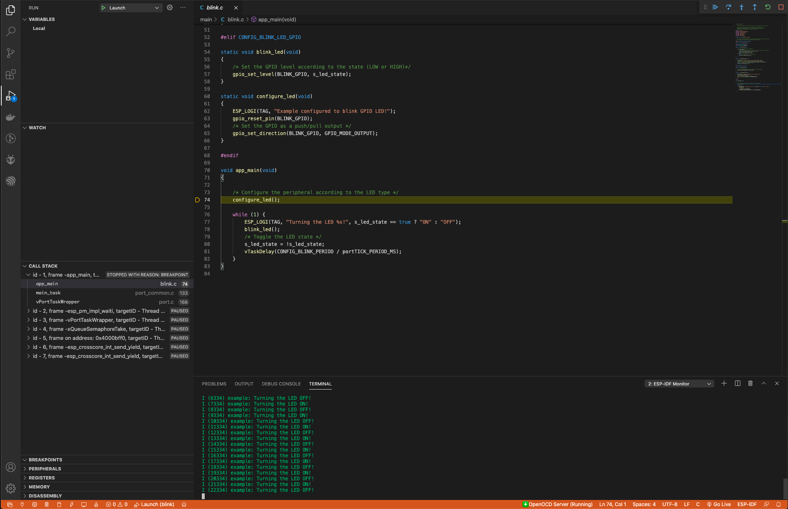

You can see the GDB output in the debug console and the OpenOCD output under ``View`` > ``Output`` by selecting ``ESP-IDF`` from the dropdown menu.

The above covers the basic functionality of the ESP-IDF extension. For more information, please refer to :ref:`Additional IDE Features <additional features>`.

Debugging Process Overview
--------------------------

.. figure:: ../_static/jtag-debugging-overview.jpg
    :align: center
    :alt: JTAG debugging – overview diagram
    :figclass: align-center

    JTAG debugging – overview diagram

1.  First, the OpenOCD server is launched in the background and the output appears under menu ``View`` > ``Output`` by selecting ``ESP-IDF`` from the dropdown menu.

    By default, the OpenOCD server is launched on localhost, port ``4444`` for Telnet communication, port ``6666`` for TCL communication and port ``3333`` for GDB. You can change these settings by modifying ``openocd.tcl.host`` and ``openocd.tcl.port``. You can adjust the verbosity of OpenOCD messages displayed in the ESP-IDF output by setting ``idf.openOcdDebugLevel``. The value can range from 0 to 4.

2.  Next, the `Eclipse CDT GDB Adapter <https://github.com/eclipse-cdt-cloud/cdt-gdb-adapter>`_ is launched in the background, with its output shown in the ``Debug Console``. This adapter initiates the GDB debug session to connect to the device.

    This adapter acts as an intermediary between Visual Studio Code, the configured toolchain GDB and the OpenOCD server. Learn more about `Espressif chips debugging <https://docs.espressif.com/projects/esp-idf/en/latest/esp32/api-guides/jtag-debugging/index.html#how-it-works>`_ and how Visual Studio Code uses `debug adapters <https://microsoft.github.io/debug-adapter-protocol/overview>`_ to communicate with various debug tools.

Setting a Custom Application Image Offset
-----------------------------------------

If you modify the application image offset, you need to update OpenOCD launch arguments accordingly. This is necessary if the OpenOCD output (Menu ``View`` > ``Output`` > ``ESP-IDF``) shows an error like:

.. code-block::

    Failed to get flash maps (-6)!
    ❌ Error: Failed to get flash maps (-6)!
    Warn : Application image is invalid! Check configured binary flash offset 'appimage_offset'.

To update OpenOCD launch arguments, open the project's ``.vscode/settings.json`` and add or modify:

.. code-block:: JSON

    {
        "idf.openOcdLaunchArgs": [
            "-c",
            "init",
            "-c",
            "reset halt",
            "-c",
            "esp appimage_offset 0x20000"
        ]
    }

where ``0x20000`` is your application image offset used in the partition table.

Navigating through the Code, Call Stack and Threads
---------------------------------------------------

When the target halts, the editor will show the line of code where the program halts and the list of threads in the ``Call Stack`` sub-window ``(a)`` on the ``Run`` icon in the Activity Bar on the side of Visual Studio Code. The first line of call stack under main ``(b)`` contains the last called function ``app_main()``, which in turn was called from ``main_task()`` as shown in the previous image. Each line of the stack also contains the file name and line number ``(c)`` where the function was called. By clicking on each of the stack entries, you will see the file opened.

By expanding threads, you can navigate throughout the application. Some threads contain longer call stacks where you can see, besides function calls, numbers like ``0x4000bff0``, representing addresses of binary code not provided in source form.

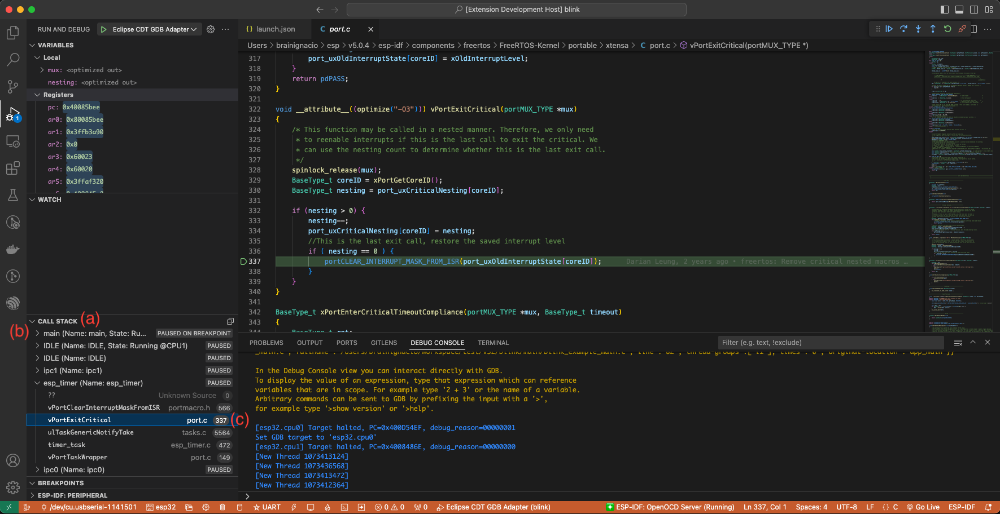

Go back to the ``app_main()`` in Thread #1 to familiarize yourself with the code in the ``blink.c`` file, which will be examined in more detail in the following examples. Debugger makes it easy to navigate through the code of entire application. This is useful when stepping through the code and working with breakpoints, as will be discussed below.

Setting and Clearing Breakpoints
--------------------------------

When debugging, you often need to pause the application at critical points in the code to examine the state of specific variables, memory, registers and peripherals. To achieve this, you can use breakpoints, which provide a convenient way to quickly halt the application at a specific line of code.

For example, establish two breakpoints where the state of LED changes. Based on the code listing below, this happens at lines 57 and 80. To set a breakpoint, go to the desired line and press F9 or click on the circle shown next to the line number in the editor margin. The list of breakpoints appears in the ``Breakpoints`` sub-window under the ``Run`` icon in the Activity Bar on the side of Visual Studio Code.

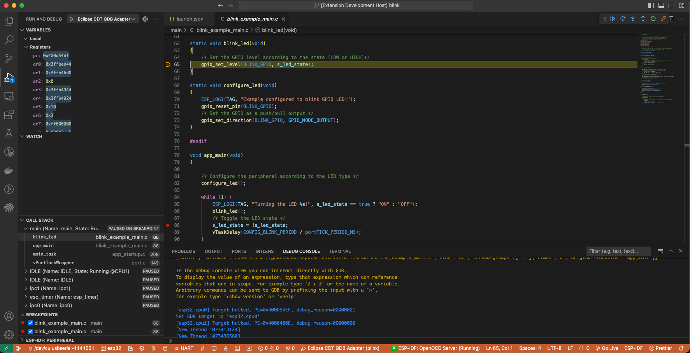

.. note::

    ESP32 supports a maximum of two hardware breakpoints. For more information, refer to `Breakpoints and Watchpoints Available <https://docs.espressif.com/projects/esp-idf/en/latest/esp32/api-guides/jtag-debugging/tips-and-quirks.html#breakpoints-and-watchpoints-available>`_.

Once a debug session starts, a **debug toolbar** will appear on the top of the VS Code editor with several actions, as explained in `Visual Studio Code Debug Actions <https://code.visualstudio.com/docs/editor/debugging#_debug-actions>`_.

Press F5 (Continue/Pause), the processor will run and halt at the next breakpoint. Press F5 again to stop at the next breakpoint, and so on. You can observe that the LED changes the state after each "Continue" command.

Learn more about breakpoints under `What Else Should I Know About Breakpoints? <https://docs.espressif.com/projects/esp-idf/en/latest/esp32/api-guides/jtag-debugging/tips-and-quirks.html#jtag-debugging-tip-where-breakpoints>`_.

Halting the Target Manually
---------------------------

When debugging, you may resume the application and enter code that waits for some event or stays in infinite loop without any break points defined. In such cases, to go back to debugging mode, you can break program execution manually by pressing "Continue/Pause" button. To check it, delete all breakpoints and click "Continue". Then click “Pause”. Application will halt at some random point and the LED will stop blinking.

You can also step through the code using the "Step Into (F11)" and "Step Over (F10)" commands. The difference is that “Step Into (F11)” enters inside subroutine calls, while “Step Over (F10)” treats it as a single source line.

Before demonstrating this functionality, make sure that you have only one breakpoint defined at line 57 of ``blink.c`` using information discussed in previous paragraphs.

Resume the program by pressing F5 and let it halt. Now press "Step Over (F10)" a few times to see how the debugger steps through the program one line at a time.

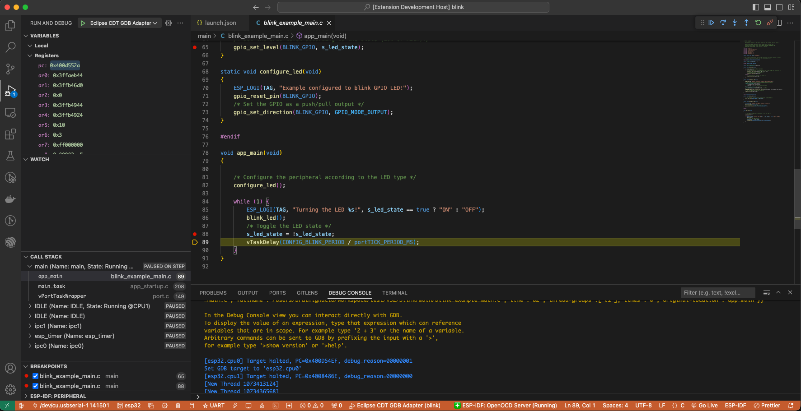

Stepping Through the Code
-------------------------

If you press "Step Into (F11)" instead, then debugger will step inside the subroutine call.

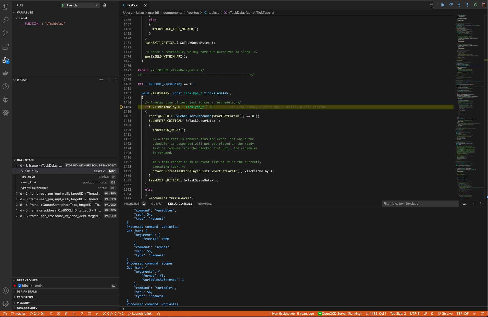

In this case, the debugger steps inside ``vTaskDelay(CONFIG_BLINK_PERIOD / portTICK_PERIOD_MS)`` and effectively moves to the ``tasks.c`` code.

.. note::

    * See `Why Stepping with "next" Does Not Bypass Subroutine Calls? <https://docs.espressif.com/projects/esp-idf/en/latest/esp32/api-guides/jtag-debugging/tips-and-quirks.html#jtag-debugging-tip-why-next-works-as-step>`_ for potential limitations using the ``next`` command.

If you press "Step Out (Shift + F11)" instead, then debugger will step outside the subroutine call.

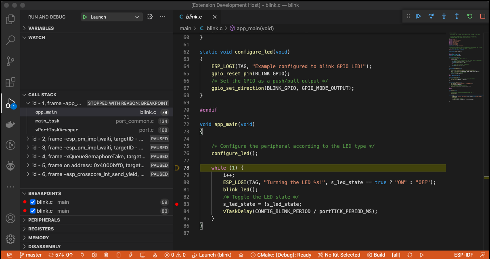

Watching and Setting Program Variables
--------------------------------------

A common debugging task is checking the value of a program variable as the program runs. To demonstrate this functionality, update file ``blink.c`` by declaring a global variable ``int i`` above the definition of the function ``blink_task``. Then add ``i++`` inside ``while(1)`` of this function to increment ``i`` on each blink.

Stop debugging by pressing "Stop (Shift + F5)". Build and flash the code to the target chip, then restart the debugger by pressing F5. Once the application halts, set a breakpoint on the line where ``i++`` is located.

In the ``Watch`` sub-window on the ``Run`` icon in the Activity Bar on the side of Visual Studio Code, click the ``+`` and enter ``i`` to start watching its value.

Resume program execution by pressing F5. Each time the program pauses, the value of ``i`` will have incremented.

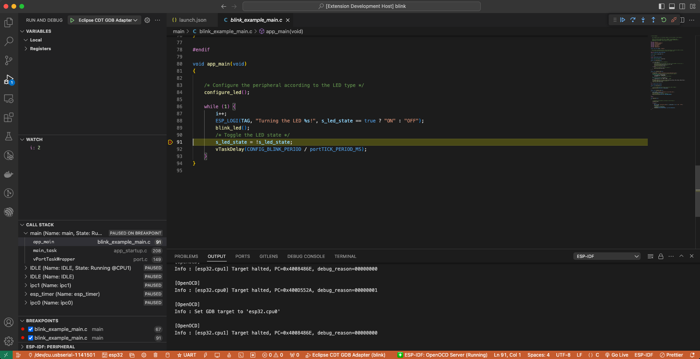

Setting Conditional Breakpoint
------------------------------

You can also set a breakpoint to halt the program execution if a certain condition is satisfied. See `Visual Studio Code Conditional Breakpoints <https://code.visualstudio.com/docs/editor/debugging#_conditional-breakpoints>`_.

To set a new conditional breakpoint, go to the desired line, right-click on the circle next to the line number (editor margin), and select ``Add Conditional Breakpoint`` action. You can also modify a breakpoint to add a condition in the list of breakpoints in the ``Breakpoints`` sub-window on the ``Run`` icon in the Activity Bar. Click the ``pencil`` icon on the breakpoint and set the breakpoint condition.

For this example, go to line 79, right-click on the circle next to the line number (editor margin), select ``Add Conditional Breakpoint`` action, and set ``i=2``. When you start debugging, the debugger will stop on line 79 when ``i`` equals 2.

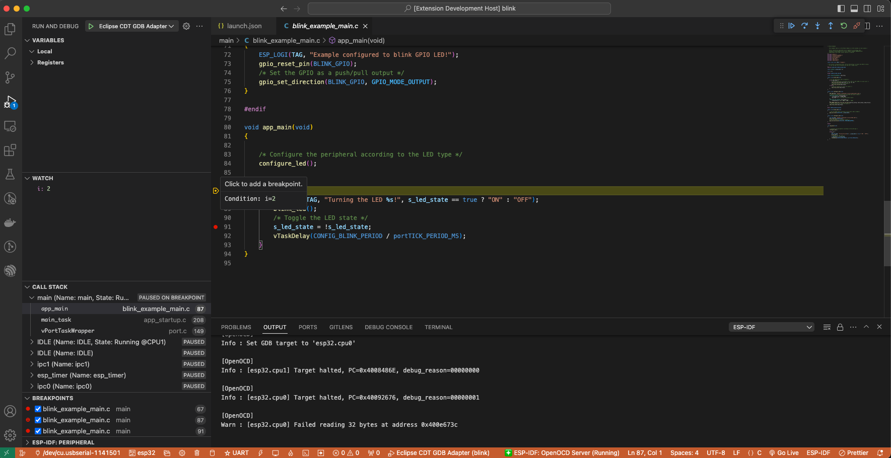

Disassembly View
----------------

You can check the assembly code during a debugging session by right-clicking on any line in in a source code file and selecting ``Open Disassembly View``. **Disassemble View** shows the assembly code with C code, where you can also set breakpoints.

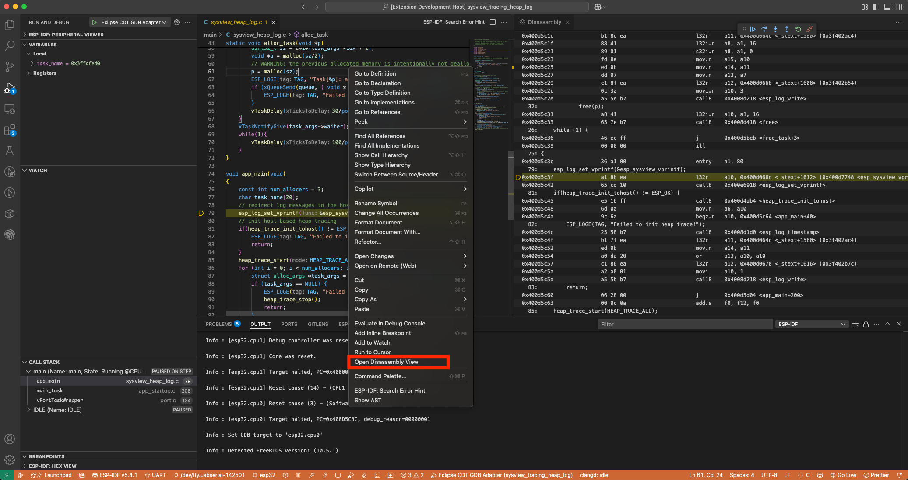

Watchpoints (Data Breakpoints)
------------------------------

See `Breakpoints and Watchpoints Available <https://docs.espressif.com/projects/esp-idf/en/latest/esp32/api-guides/jtag-debugging/tips-and-quirks.html#breakpoints-and-watchpoints-available>`_ for more information.

Send Commands to GDB
--------------------

You can send any GDB command in the debug console with ``> COMMAND``. For example, ``> i threads``.

To view binary data variables, click ``View Binary Data`` next to the variable name.

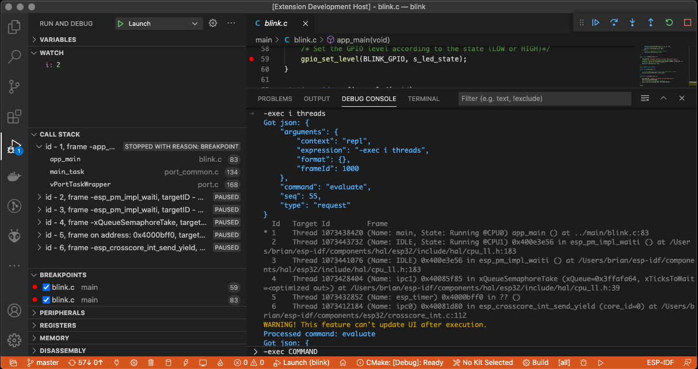

Learn more about `Command Line Debugging <https://docs.espressif.com/projects/esp-idf/en/latest/esp32/api-guides/jtag-debugging/debugging-examples.html#command-line>`_.

ESP-IDF: Peripheral View
------------------------

ESP-IDF extension provides an ``ESP-IDF: Peripheral View`` tree in the ``Run and Debug`` view. This tree view uses the SVD file specified in the ``IDF SVD File Path (idf.svdFilePath)`` configuration to populate a set of peripheral register values for the active debug session target. You can download Espressif SVD files from `Espressif SVD <https://github.com/espressif/svd>`_ repository.

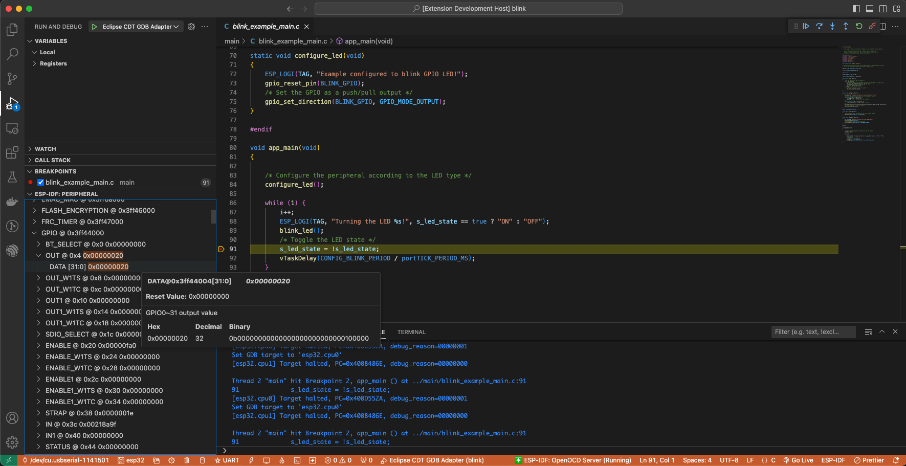

Post-mortem Debugging Use Cases
-------------------------------

You can start a monitor session to capture fatal error events with **ESP-IDF: Launch IDF Monitor for Core Dump Mode/GDB Stub Modec** command. If configured in your project's sdkconfig, it can trigger the start of a debug session for GDB remote protocol server (GDBStub) or `ESP-IDF Core Dump <https://docs.espressif.com/projects/esp-idf/en/latest/esp32/api-guides/core_dump.html#core-dump>`_ when an error occurrs. For more information, see `Panic Handler <https://docs.espressif.com/projects/esp-idf/en/latest/esp32/api-guides/fatal-errors.html#panic-handler>`_.

- **Core Dump** is configured when **Core Dump's Data Destination** is set to either ``UART`` or ``FLASH`` using the ``ESP-IDF: SDK Configuration Editor`` extension command or ``idf.py menuconfig`` in a terminal.
- **GDB Stub** is configured when **Panic Handler Behaviour** is set to ``Invoke GDBStub`` using the ``ESP-IDF: SDK Configuration Editor`` extension command or ``idf.py menuconfig`` in a terminal.
