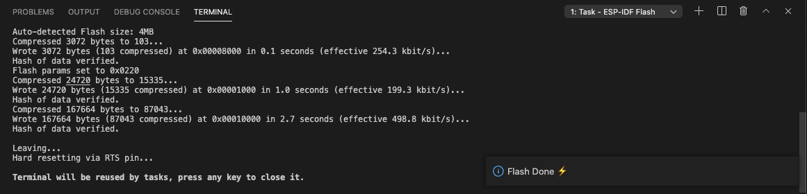

.. _flash the device:

Flash onto the Device
===============================

Before flashing the project, the user needs to specify the serial port of the device, select menu **View**, **Command Palette** and type **ESP-IDF: Select Port to Use** command.

To flash the project, select menu **View**, **Command Palette** and type **ESP-IDF: Flash your Project** command. Choose ``UART``, ``JTAG`` or ``DFU`` flash mode. Flashing task will start in the previously selected serial port, a new terminal will be launched with the flash task output and a notification bar with `Flashing Project` message until it is done then a Flash done message when finished.

.. note::
  * ``UART`` is the most common option for most Espressif devices.

.. note::
  * There is an **idf.flashBaudRate** configuration settings to modify the flashing baud rate.
  * You can also choose the flashing type ``UART``, ``JTAG`` or ``DFU`` (esp32s2 or esp32s3) based on your hardware connection by selecting menu **View**, **Command Palette** and type **ESP-IDF: Select Flash Method and Flash** command, your choice will be saved in the **idf.flashType** configuration setting.

You can also use the **ESP-IDF: Flash (UART) your Project**, **ESP-IDF: Flash (DFU) your Project** or **ESP-IDF: Flash (with JTag)** directly.

Next step is to :ref:`Monitor the output <monitor the output>`.

Links
-------------------

* `ESP-PROG guide <https://docs.espressif.com/projects/espressif-esp-iot-solution/en/latest/hw-reference/ESP-Prog_guide.html>`_ for hardware connection and configuration.
* `Configuration of OpenOCD for Specific Target <https://docs.espressif.com/projects/esp-idf/en/latest/esp32/api-guides/jtag-debugging/tips-and-quirks.html#jtag-debugging-tip-openocd-configure-target>`_ to understand which board or configuration to use for your specific hardware.
* `Establishing serial connection <https://docs.espressif.com/projects/esp-idf/en/latest/esp32/get-started/establish-serial-connection.html>`_ with Espressif serial device.