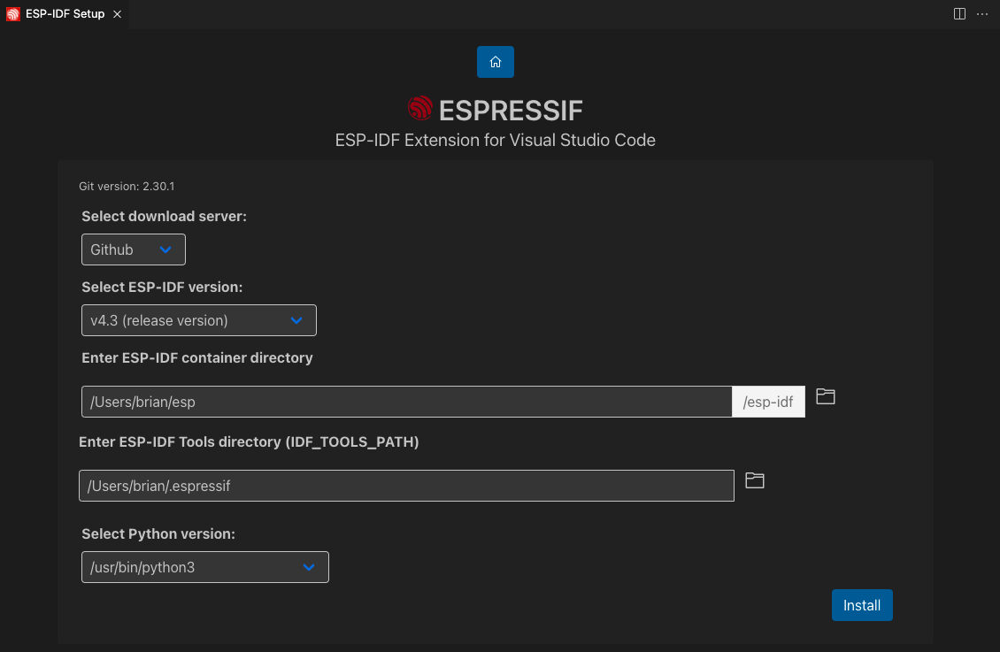

.. _installation:

Install ESP-IDF and Tools
===============================

After installing Visual Studio Code you need to install the ESP-IDF extension for Visual Studio Code.

- Navigate to  **View** > **Extensions** or keyboard shortcut :kbd:`Ctrl+Shift+X` in Windows/Linux or :kbd:`Shift+⌘+X` in MacOS.

- Search for `ESP-IDF Extension <https://marketplace.visualstudio.com/items?itemName=espressif.esp-idf-extension>`_ from the list of extensions.

1. Install the ESP-IDF extension.

- Navigate to **View** > **Command Palette**.

- Type **ESP-IDF: Configure ESP-IDF Extension** and select the command to specify to launch the setup wizard. A loading notification will be shown and later the setup wizard will appear.

.. note::
  
  * For versions of ``ESP-IDF < 5.0``, spaces are not supported inside configured paths.

.. image:: ../../media/tutorials/setup/select-mode.png

2. Choose **Express** and select the download server:

- **Espressif**: Faster speed in China using Espressif Download servers links.
- **Github**: Using github releases links.

3. Pick an ESP-IDF version to download or use the ``Find ESP-IDF in your system`` option to search for existing ESP-IDF directory.

- Choose the location for ESP-IDF Tools ( ``IDF_TOOLS_PATH``) which is ``%USERPROFILE%\.espressif`` on Windows and ``$HOME\.espressif`` on MacOS/Linux by default.

.. note::
  * Make sure that ``IDF_TOOLS_PATH`` doesn't have any spaces to avoid any build issues. Also make sure that ``IDF_TOOLS_PATH`` is not the same directory as ``IDF_PATH``.

.. note::
  * For MacOS/Linux users, select the Python executable to use to create ESP-IDF python virtual environment.

4. Click ``Install`` to begin download and install of ESP-IDF and ESP-IDF Tools.

5. A page will appear with the setup progress status showing:

- ESP-IDF download progress
- ESP-IDF Tools download and install progress
- Creation of a python virtual environment and ESP-IDF python requirements.

.. image:: ../../media/tutorials/setup/install-status.png

6. If everything is installed correctly, you will see a message that all settings have been configured. 

.. image:: ../../media/tutorials/setup/install-complete.png

.. note::
  For Linux users, a message is shown to add OpenOCD rules in ``/etc/udev/rules.d`` which you need to run with sudo privileges.

7. Next step is to :ref:`Start a ESP-IDF Project <start a esp-idf project>`.

.. warning::
  Check the :ref:`Troubleshooting <troubleshooting>` section if you have any issues during installation.

Uninstall ESP-IDF VS Code Extension
-------------------------------------

To uninstall the ESP-IDF VS Code extension, follow these steps:

1. Open Command Palette (F1) and type **ESP-IDF: Remove All ESP-IDF Settings** and select the command to remove all ESP-IDF settings.

2. Navigate to **View** > **Extensions** or use the keyboard shortcut :kbd:`Ctrl+Shift+X` in Windows/Linux or :kbd:`Shift+⌘+X` in MacOS.

3. Search for `ESP-IDF` and click on the **Uninstall** button.

4. Ensure you remove the following folders:

   - Go to your `${VSCODE_EXTENSION_DIR}` and delete the ESP-IDF plugin folder.
   
   - `${VSCODE_EXTENSION_DIR}` is the location of the extension:
     - **Windows**: `%USERPROFILE%\.vscode\extensions\espressif.esp-idf-extension-VERSION\`
     - **MacOS/Linux**: `$HOME/.vscode/extensions/espressif.esp-idf-extension-VERSION/`

.. note::

  Make sure to replace `VERSION` with the actual version number of the ESP-IDF extension installed.