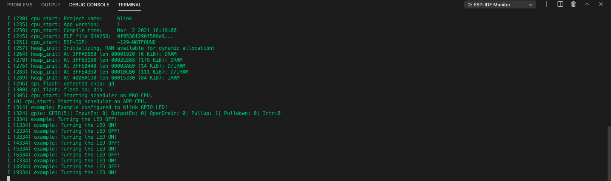

Monitor the Output
===============================

To view the serial monitor output from your device, please follow the instructions below:

1. Select the Serial Port:

- Navigate to **View** > **Command Palette**.

- Type **ESP-IDF: Select Port to Use** and select the command to specify the serial port of your device.

2. Start Monitoring:

- Go to **View** > **Command Palette**.

- Type **ESP-IDF: Monitor Device** and select the command to start monitoring your device.

Next step is to :doc:`debug your project <debugproject>`.

.. note::
  * The monitor baud rate is defined with ``CONFIG_ESPTOOLPY_MONITOR_BAUD`` from project's SDK Configuration Editor. You can override it by setting a value in **idf.monitorBaudRate**.