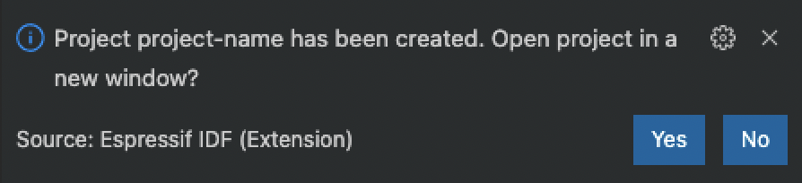

.. _create_an_esp-idf_project:

Create an ESP-IDF Project
=========================

:link_to_translation:`zh_CN:[中文]`

You can start a project in three ways:

1. :ref:`ESP-IDF New Project`
2. :ref:`ESP-IDF Existing ESP-IDF Project`

The first option is recommended because it allows to configure the project. The second and third options create the project with the current workspace folder configuration.

.. _ESP-IDF New Project:

Using ``ESP-IDF: New Project``
---------------------------------

In Visual Studio Code:

- Navigate to ``View`` > ``Command Palette``.

- Type ``ESP-IDF: New Project`` and select the command to launch the New Project wizard.

    .. image:: ../../media/tutorials/new_project/new_project_init.png

- Choose the project name.
- Choose the location for the new project.
- Select the Espressif board you are using.
- Select the serial port of the device (a list of currently connected serial devices appears in the dropdown).

    .. note::

        If you are not sure about the serial port name, refer to `Establish Serial Communication <https://docs.espressif.com/projects/esp-idf/en/latest/esp32/get-started/establish-serial-connection.html>`_.

    .. note::

        Please refer to `Configuration of OpenOCD for Specific Target <https://docs.espressif.com/projects/esp-idf/en/latest/esp32/api-guides/jtag-debugging/tips-and-quirks.html#jtag-debugging-tip-openocd-configure-target>`_ to select the appropriate OpenOCD configuration file based on your hardware.

- Optionally, you can import any ESP-IDF component directory ``component-dir`` to the new project. This will copy it to the new project's ``components`` subdirectory (``<project-dir>/components/component-dir``).

- Click the ``Choose Template`` button.

- Select ESP-IDF from the dropdown if you want to use a template.

    .. note::

        If you want to create a blank project, choose ESP-IDF ``sample_project`` or Extension ``template-app``.

    .. image:: ../../media/tutorials/new_project/new_project_templates.png

- Choose your desired template and click the ``Create Project Using Template <template-name>`` button, where ``<template-name>`` is the name of the selected template.

- After the project is created, a notification window will appear, asking whether to open the newly created project.

.. _ESP-IDF Existing ESP-IDF Project:

Opening an Existing ESP-IDF Project
--------------------------------------

ESP-IDF projects follow this directory structure:

`ESP-IDF Example Project <https://docs.espressif.com/projects/esp-idf/en/latest/esp32/api-guides/build-system.html#example-project>`_

.. code-block::

  - myProject/
              - CMakeLists.txt
              - sdkconfig
              - components/ - component1/ - CMakeLists.txt
                                          - Kconfig
                                          - src1.c
                            - component2/ - CMakeLists.txt
                                          - Kconfig
                                          - src1.c
                                          - include/ - component2.h
              - main/       - CMakeLists.txt
                            - src1.c
                            - src2.c

              - build/

In Visual Studio Code:

- Navigate to ``View`` > ``Command Palette``.

- Type ``ESP-IDF: Import ESP-IDF Project`` and select the command to import an existing ESP-IDF project.

This command adds both Visual Studio Code configuration files (settings.json, launch.json) and Docker container files (Dockerfile and .devcontainer.json).

The next step is to :ref:`Connect a device <connectdevice>`.

Adding Visual Studio Code configuration files and Docker container
------------------------------------------------------------------

In Visual Studio Code, go to ``File`` > ``Open Folder`` and open a directory containing a ``CMakeLists.txt`` file in the root (e.g., myProject), which follows the ESP-IDF structure.

1.  To add Visual Studio Code configuration files (settings.json, launch.json):

    - Navigate to ``View`` > ``Command Palette``.

    - Type ``ESP-IDF: Add .vscode Configuration Folder`` and select the command.

2.  To open the project within the ESP-IDF Docker container:

    - Navigate to ``View`` > ``Command Palette``.

    - Type ``ESP-IDF: Add Docker Container Configuration`` and select the command to add the ``.devcontainer`` directory to your current directory.

    - Navigate to ``View`` > ``Command Palette``.

    - Type ``Dev Containers: Open Folder in Remote Container`` and select the command to open the existing project inside the container created from the Dockerfile in the previous step.
