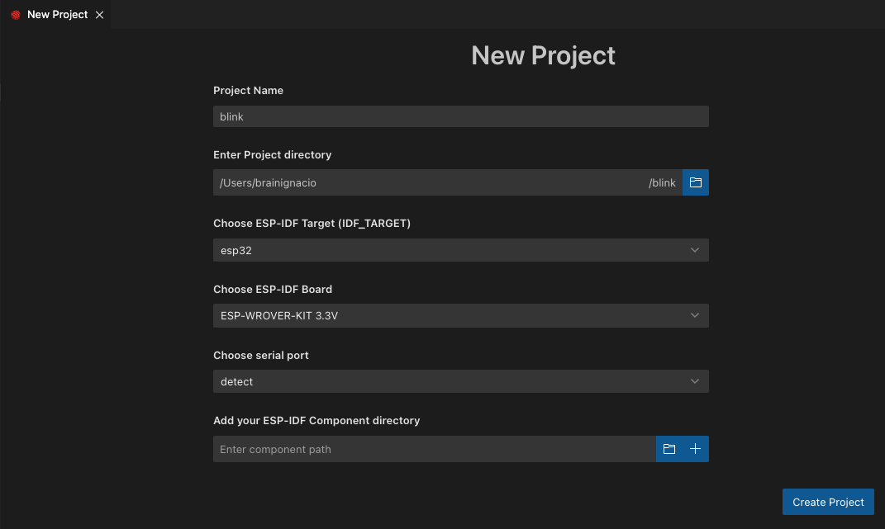
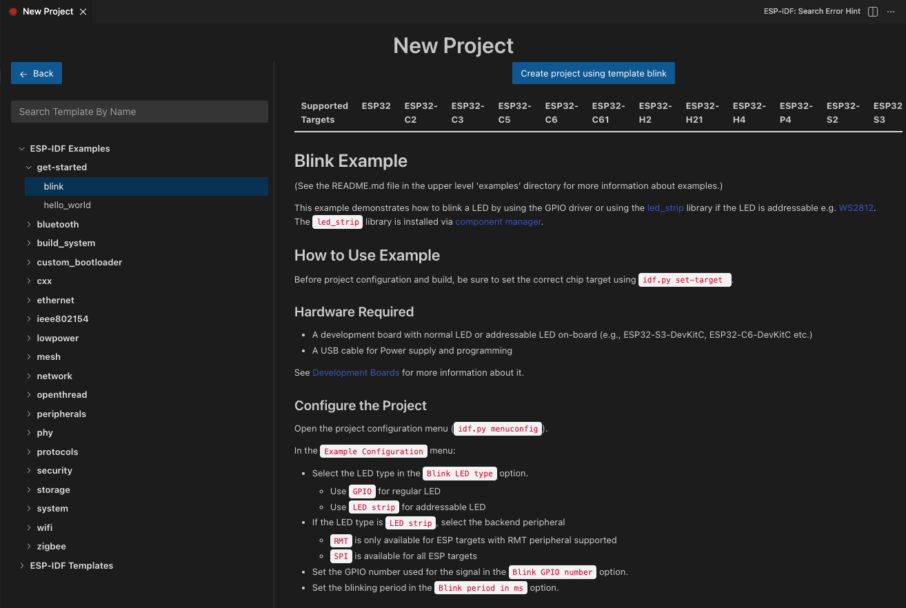

.. _start a esp-idf project:

Start a ESP-IDF Project
===============================

You can create a project using **ESP-IDF: New Project** or **ESP-IDF: Show Examples Projects** commands.

The first option is recommended as it allows you to configure the project while the second just create the project without configuration.

1. Using **ESP-IDF: New project**
-----------------------------------

In Visual Studio Code, select menu **View**, **Command Palette** and type **ESP-IDF: New Project**.

- Choose the project name,
- Choose where to create this new project
- Select the Espressif board you are using
- Select the serial port of the device. (A list of currently serial devices is shown in the dropdown)

.. note::
  * Please review `Establish serial communication <https://docs.espressif.com/projects/esp-idf/en/latest/esp32/get-started/establish-serial-connection.html>`_ if you are not sure about the serial port name.

.. note::
  * Please review `Configuration of OpenOCD for Specific Target <https://docs.espressif.com/projects/esp-idf/en/latest/esp32/api-guides/jtag-debugging/tips-and-quirks.html#jtag-debugging-tip-openocd-configure-target>`_ to understand which board or configuration to use for your specific hardware.

- Optionally, You could also choose to import any ESP-IDF component directory ``component-dir`` to the new project which will be copied to the new project's directory ``components`` sub directory (``<project-dir>/components/component-dir``).

After that click ``Choose Template`` button.

Choose ESP-IDF from the dropdown if you want to use an example as template.

.. note::
  If you want to create a blank project, choose ESP-IDF ``sample_project`` or  Extension ``template-app``.

Choose your desired template and click the **Create Project Using Template <template-name>** button where **<template-name>** is the name of the selected template.

After the project is created, a notification window will show up to open the newly created project or not.

.. image:: ../../media/tutorials/new_project/new_project_confirm.png
  :height: 100px

2. Using **Show Examples Projects**
-----------------------------------

In Visual Studio Code, select menu **View**, **Command Palette** and type **ESP-IDF: Show Examples Projects** to create a new project from ESP-IDF examples.

Select ``ESP-IDF`` from the dropdown. A window will appear showing a list of ESP-IDF examples.

When you select an example the readme will be shown and a **Create project using example example_name** button.

Choose a destination to create the new project. A notification will be shown to Open folder in a new window.

.. image:: ../../media/tutorials/new_project/new_project_confirm.png
  :height: 100px

3. Opening an Existing ESP-IDF Project
----------------------------------------

An ESP-IDF project follow the tree directory structure as shown in `ESP-IDF Example Project <https://docs.espressif.com/projects/esp-idf/en/latest/esp32/api-guides/build-system.html#example-project>`_ is:

.. code-block::
  
  - myProject/
              - CMakeLists.txt
              - sdkconfig
              - components/ - component1/ - CMakeLists.txt
                                          - Kconfig
                                          - src1.c
                            - component2/ - CMakeLists.txt
                                          - Kconfig
                                          - src1.c
                                          - include/ - component2.h
              - main/       - CMakeLists.txt
                            - src1.c
                            - src2.c

              - build/

When you open a directory in Visual Studio Code with menu **File** -> **Open Folder** which contains a **CMakeLists.txt** file in the root directory (myProject) that follows the ESP-IDF structure.

If you need to add Visual Studio Code configuration files, use the **ESP-IDF: Add .vscode Configuration Folder** command to add these files to the existing folder.

If you want to use a project in a Docker container with Visual Studio Code `Remote - Containers <https://marketplace.visualstudio.com/items?itemName=ms-vscode-remote.remote-containers>`_ extension you can use the ESP-IDF: Add Docker Container Configuration` command to add required ``Dockerfile`` and ``.devcontainer`` json files.

1. Open an example ESP-IDF project, like the `Blink example <https://github.com/espressif/esp-idf/tree/master/examples/get-started/blink>`_ with **File** -> **Open Folder**.

2. You can already use the existing setup to build, flash and monitor the existing project. To debug, you need the ``esp-idf`` launch.json which can be added by running the **ESP-IDF: Add .vscode Configuration Folder** command.

3. If you want to open the project within the ESP-IDF Docker container, use the **ESP-IDF: Add Docker Container Configuration** command to add the ``.devcontainer`` directory which allows the user to use the **Remote - Containers: Open Folder in Remote Container** to open the existing project into a container.

Next step is to :ref:`Connect a device <connectdevice>`.