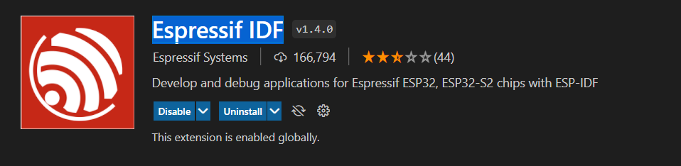
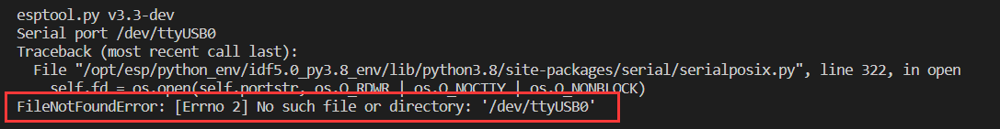

使用 Docker 容器
================

:link_to_translation:`en:[English]`

本文将展示如何借助 `IDF Docker 镜像 <https://docs.espressif.com/projects/esp-idf/zh_CN/latest/esp32/api-guides/tools/idf-docker-image.html>`_，在容器中使用 ``idf.py flash`` 和 ``idf.py monitor`` 工具。为了实现此功能，必须将 Windows 主机上的串口配置为可供 WSL 使用。

.. warning::

    macOS 目前尚不支持 USB 直通。若想通过 macOS 中的 Docker 容器连接到乐鑫设备串口，可以尝试 `使用远程串口 <https://docs.espressif.com/projects/esp-idf/zh_CN/latest/esp32/api-guides/tools/idf-docker-image.html#using-remote-serial-port>`_。RFC 端口可以在 ``idf.port`` 配置设置中手动定义，以便 ``ESP-IDF：烧录项目`` 命令正常工作。

本文将展示如何基于 ``VS Code`` + ``ESP-IDF 扩展`` + ``ESP-IDF Docker 镜像`` 来开发项目。

所需工具
--------

在开始项目之前，请安装以下工具：

1. Windows WSL（安装步骤如下）
2. `Visual Studio Code <https://code.visualstudio.com>`_
3. `usbipd-win <https://github.com/dorssel/usbipd-win/releases>`_
4. `Docker 桌面应用程序（适用于 Windows 系统） <https://hub.docker.com>`_

其他工具在项目的 Dockerfile 中定义，且会包含在容器中。

Docker 桌面应用程序
-------------------

在 macOS 和 Windows 主机上都可以使用 Docker 桌面应用程序构建和共享容器化应用程序。详情请参阅 `Docker 快速入门文档 <https://docs.docker.com/get-started/>`_。注意，此处 Docker 的作用是导入 ``ESP-IDF Docker 镜像`` 并对其进行启动、重启、关闭等管理操作。

.. note::

    Docker 的默认安装路径是 C 盘，如果 C 盘空间不足，请使用 ``mklink`` 命令将其移动到其他磁盘。

在 Windows 系统中为 Docker 安装 Ubuntu
--------------------------------------

如果未安装 WSL，请运行：

.. code-block::

    wsl --install

使用以下命令更新 WSL 内核：

.. code-block::

    wsl --update

使用 ``Powershell`` 命令提示符查看可用 WSL 发行版列表：

.. code-block::

    wsl -l -o

若想在 Windows 上的 WSL 中安装 Ubuntu 发行版，请输入以下命令：

.. code-block::

    wsl --install --distribution Ubuntu

Docker 中的 ``usbipd-win``
--------------------------

必须安装 ``usbipd-win``，才能访问来自本地 Windows 的 USB 设备、串口设备以及 JTAG 设备，否则无法在 IDF Docker 镜像中进行下载、监控和调试。安装方式与其他 Windows 应用程序相同，这里不再赘述。

安装好上述所有必要工具后，请继续进行下列配置。

检查 Windows 上的 WSL Ubuntu 以用于 Docker
~~~~~~~~~~~~~~~~~~~~~~~~~~~~~~~~~~~~~~~~~~

1.  检查当前 WSL 版本是否为 2。

    .. code-block::

        wsl -l -v

    .. image:: ../../../media/tutorials/using_docker_container/wsl-l-v.png

2.  如果 WSL 版本落后，请升级到版本 2。

    .. code-block::

        wsl --set-version Ubuntu 2

3.  将 Ubuntu 发行版设置为默认使用的操作系统。

    .. code-block::

        wsl -s Ubuntu

4.  最后，使用 ``wsl --status`` 命令检查上述所有指令是否生效。

    .. image:: ../../../media/tutorials/using_docker_container/wsl-status.png

适用于 Windows 系统的 Docker 桌面应用程序
~~~~~~~~~~~~~~~~~~~~~~~~~~~~~~~~~~~~~~~~~

将 Ubuntu 发行版更新到版本 2 之后，需要在 Docker 中进行一定调整，将 Ubuntu 设为默认的 WSL 集成。

.. image:: ../../../media/tutorials/using_docker_container/wsl-integration.png

1.  在 PowerShell 命令提示符中安装 ``usbipd``。

    .. code-block::

        winget install usbipd

2.  配置 USB 串口设备，通过 ``usbipd`` 连接到 WSL。

3.  以管理员权限打开 PowerShell 命令提示符，输入下列指令，获取 USB 串口设备列表。

    .. code-block::

        usbipd list

4.  要从 Windows 本地访问 WSL 上的指定设备，必须使用 ``usbipd`` 绑定设备。以管理员权限打开 PowerShell 命令提示符，然后输入下列指令：

    .. code-block::

        usbipd bind --busid <BUSID>

    .. note::

        除非重启计算机，否则此命令只需使用一次。**1-1** 是想要绑定的设备的 ``<BUSID>``。

5.  绑定后，请在 PowerShell 命令提示符中使用下列指令将指定设备附加到 WSL 中。``--auto-attach`` 参数能保证设备拔插后在容器中可见。

    .. code-block::

        usbipd attach --wsl --busid <BUSID> --auto-attach

6.  最后，通过在 WSL 环境中输入下列指令，验证连接是否成功。

    .. code-block::

        dmesg | tail

    .. image:: ../../../media/tutorials/using_docker_container/wsl_demsg_tail.png

    如图所示，**1-1** 设备已附加到 ``ttyACM0``，WSL 现在可以访问 **1-1** USB 设备。

在 Visual Studio Code 中安装远程容器扩展
~~~~~~~~~~~~~~~~~~~~~~~~~~~~~~~~~~~~~~~~~~~~~~~~~~~~~~~~~~~

安装下图中的 **Dev Containers**、**Remote Development** 和 **ESP-IDF** 扩展。

.. image:: ../../../media/tutorials/using_docker_container/dev_containers.png

.. image:: ../../../media/tutorials/using_docker_container/remote_development.png

实践
----

完成上述所有步骤后，就可以使用 WSL 或 Docker 容器。下文将展示如何利用这些工具。

使用 Docker 容器的示例项目
~~~~~~~~~~~~~~~~~~~~~~~~~~~~~~

以 ``Blink`` 和 ``Hello_world`` 项目为例，你可以将多个示例项目放在同一文件夹中并一起挂载到 IDF Docker 镜像中。若为每个示例项目都单独创建容器，则将占用过多磁盘空间。

.. image:: ../../../media/tutorials/using_docker_container/example_projects.png

如图所示，``Blink`` 和 ``Hello_world`` 示例项目已放在同一文件夹中，请用 VS Code 打开此文件夹。

.. image:: ../../../media/tutorials/using_docker_container/example_project_vscode.gif

注意，在 ``example_project`` 文件夹中有一个 ``.devcontainer`` 文件夹，这并非默认包含，而是使用 VS Code 中的 ESP-IDF 扩展创建和配置 ESP-IDF Docker 镜像进行容器开发时生成的。

参照下列步骤，可以生成 ``.devcontainer`` 文件夹：

1. 用 VS Code 打开示例项目，在菜单栏选择 ``查看`` > ``命令面板``。
2. 在弹出的对话框中，搜索 ``ESP-IDF：添加 Docker 容器配置``。
3. 当前项目的 ``.devcontainer`` 文件夹将自动生成。

.. image:: ../../../media/tutorials/using_docker_container/dev_container.gif

更多有关 ``devcontainer.json`` 的信息，请参阅注释。

.. code-block:: JSON

    {
        /* 在 UI 中显示的开发容器名称 */
        "name": "ESP-IDF",
        /* 创建容器时的容器名称 */
        "image": "espressif/idf:latest",
        /* 将本地文件夹挂载到 Docker 镜像的 /workspaces 文件夹 */
        "workspaceMount": "source=${localWorkspaceFolder},target=/workspaces/project-name,type=bind",
        /* 工作区文件夹的路径，容器运行后将打开此文件夹
        */
        "workspaceFolder": "/workspaces/project-name",
        /* 将 VS Code 扩展挂载到目标路径，重建容器时无需再次安装这些扩展
        */
        "mounts": [
            "source=extensionCache,target=/root/.vscode-server/extensions,type=volume"
        ],
        /* 按照 Dockerfile 中的命令创建容器
        */
        "build": {
            "dockerfile": "Dockerfile"
        },
        /* 应复制到容器中的特定主机环境设置
        */
        "settings": {
            "terminal.integrated.defaultProfile.linux": "bash",
            "idf.espIdfPath": "/opt/esp/idf",
            "idf.toolsPath": "/opt/esp",
            "idf.gitPath": "/usr/bin/git"
        },
        /* 应安装到容器中的一组扩展 */
        "extensions": ["espressif.esp-idf-extension"],
        /* 以特权模式启动容器，否则无法在 Docker 镜像中访问设备
        */
        "runArgs": ["--privileged"]
    }

至此，已完成所有相关配置。

创建容器
~~~~~~~~

1.  单击 VS Code 左下角的 ``><`` 按钮并选择 **在容器中打开文件夹**，创建容器并开始开发。

    .. note::

        首次在容器中打开文件夹耗时较长，因为需要下载 ESP-IDF 的 Docker 镜像。

2.  打开 ``Blink`` 示例项目。如果需要切换到其他项目，只需将路径从 ``"workspaceFolder": "/workspaces/blink"`` 更改为 ``"workspaceFolder": "/workspaces/<ProjectName>"`` （``<ProjectName>`` 即想要打开的文件的名称），然后重新选择 ``在容器中打开文件夹``。

    .. image:: ../../../media/tutorials/using_docker_container/create_container.gif

    此时，可以开始使用 ``Blink`` 示例项目进行构建、烧录、监视、调试等操作。

    .. warning::

        为了从 Docker 容器访问串口，请确保在 VS Code 中打开文件夹 **之前** 已使用 ``usbipd attach --wsl --busid <BUSID> --auto-attach`` 命令附加设备，否则设备将不可见。如果希望插拔设备后仍能在 Docker 容器中识别到设备，请务必加上 ``--auto-attach`` 参数。

3.  以 ESP32-C3 为例，若想将其作为目标设备，只需如图所示将 ``esp32`` 更改为 ``esp32c3``。

    .. image:: ../../../media/tutorials/using_docker_container/device_target_esp32_c3.png

4.  接下来，开始构建示例项目。

    .. image:: ../../../media/tutorials/using_docker_container/container_build.gif

5.  构建完成后，可以通过以下方式下载固件。

在 Docker 容器中使用外部 USB 转串口设备
~~~~~~~~~~~~~~~~~~~~~~~~~~~~~~~~~~~~~~~

按照前文 ``usbipd`` 指令描述部分的教程进行操作。此处以 ``Silicon Labs CP210x USB to UART Bridge`` 为例，此设备已附加到 Docker 镜像中。

.. image:: ../../../media/tutorials/using_docker_container/wsl_demsg_tail_usb_serial.png

如图所示，该设备已附加到 ``ttyUSB0``，因此 ``idf.port`` 也需要进行相应更改。

.. image:: ../../../media/tutorials/using_docker_container/ttyUSB0.png

但此时容器尚未识别到更改的配置。

选择 ``在本地重新打开文件夹``，重新打开容器，新的配置也将重新加载。

.. image:: ../../../media/tutorials/using_docker_container/container_reopen.gif

最后，点击 ``Flash`` 按钮下载固件。

在 Docker 容器中使用内部 USB 转串口设备
~~~~~~~~~~~~~~~~~~~~~~~~~~~~~~~~~~~~~~~

与 `在 Docker 容器中使用外部 USB 转串口设备`_ 类似，唯一的不同之处为附加的设备名称。外部 USB 转串口设备的名称通常显示为 ``ttyUSBx``，而内部 USB 转串口设备为 ``ttyACMx``。

在 Docker 容器中使用 USB 转 JTAG 设备
~~~~~~~~~~~~~~~~~~~~~~~~~~~~~~~~~~~~~~~~~

与 `在 Docker 容器中使用外部 USB 转串口设备`_ 和 `在 Docker 容器中使用内部 USB 转串口设备`_ 相同，但在 Docker 容器中使用 USB 转 JTAG 设备需要配置以下额外参数。

.. image:: ../../../media/tutorials/using_docker_container/extra_parameters.png

接口与 `在 Docker 容器中使用内部 USB 转串口设备`_ 相同，即 ``ttyACMx``。

.. image:: ../../../media/tutorials/using_docker_container/container_flash_jtag.gif

在 Docker 容器中调试
~~~~~~~~~~~~~~~~~~~~

在运行 OpenOCD 并开始调试会话之前，确保将 `OpenOCD udev 规则文件 <https://github.com/espressif/openocd-esp32/blob/master/contrib/60-openocd.rules>`_ 复制到 ``/etc/udev/rules.d`` 文件夹中。

完成 `在 Docker 容器中使用 USB 转 JTAG 设备`_ 章节中提到的配置后，按 ``F5`` 开始调试。

.. image:: ../../../media/tutorials/using_docker_container/container_debug.gif

.. note::

    1. 如果要在 Windows 系统中进行调试，则需要通过插拔 USB 线使 Windows 设备管理器识别到相应的 USB 端口。
    2. 在容器开发过程中，Docker 桌面应用程序需一直保持开启状态。
