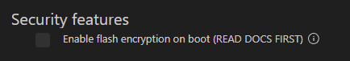

.. _flash_encryption:

闪存加密
========================

:link_to_translation:`en:[English]`

闪存加密可保护设备闪存中的内容。启用后，固件首次以明文烧录，在首次启动时被加密，从而防止未经授权的闪存读取。更多详情请参阅 `ESP-IDF 闪存加密文档 <https://docs.espressif.com/projects/esp-idf/en/latest/esp32/security/flash-encryption.html>`_。

本教程将打开一个 ESP-IDF 项目，使用 ``security/flash_encryption`` 示例。

1. 前往 **查看** > **命令面板**，搜索 **ESP-IDF: New Project** 命令，然后选择 ``Use Current ESP-IDF (/path/to/esp-idf)``。若未看到该选项，请参阅 :ref:`安装 ESP-IDF 和相关工具 <installation>` 中的设置说明。

2. 将弹出项目列表窗口。搜索 ``flash_encryption``。页面顶部会出现 **Create project using example flash_encryption** 按钮，下方会显示项目描述。点击该按钮，配置项目，点击 ``Create Project`` 按钮，等待项目创建完成后点击 ``Open Project``。

3. 通过以下步骤配置项目：

   - 选择要使用的串口
   - 设置乐鑫设备目标
   - 设置烧录方式为 UART

.. note::
   若该步骤不清楚，请参阅 :ref:`构建项目 <build the project>`。

4. 在命令面板中执行 ``ESP-IDF: SDK Configuration editor (Menuconfig)`` 打开 SDK 配置菜单。搜索 **flash encryption** 并启用相应选项：

.. important::
   启用闪存加密会限制 ESP32 的后续更新方式。使用此功能前，请阅读文档并充分理解其影响。`ESP-IDF 闪存加密文档 <https://docs.espressif.com/projects/esp-idf/en/latest/esp32/security/flash-encryption.html>`_

5. 构建项目。

6. 烧录项目。

.. note::
   首次烧录时固件将不会使用 ``--encrypt`` 参数。烧录完成后，需按开发板上的复位键重启设备。（按键可能标为 "RESET"、"RST" 或 "EN"）

7. 再次烧录固件；若前述步骤均正确完成，此次将自动添加 ``--encrypt`` 参数。
