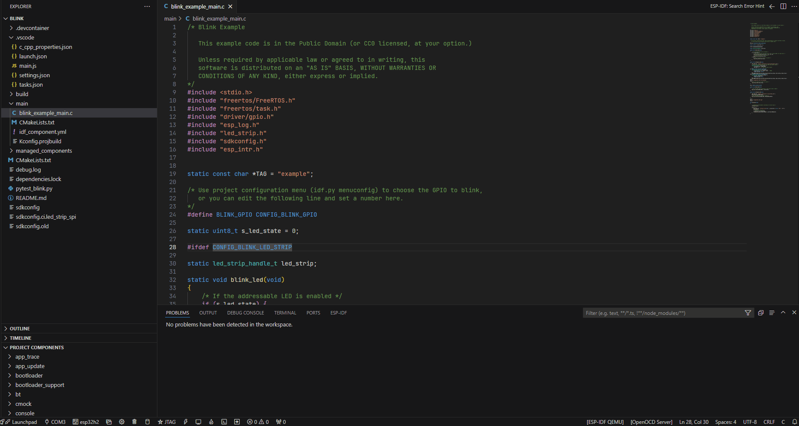

.. _hints_viewer:

提示查看器
==========

:link_to_translation:`en:[English]`

提示查看器可以检测代码中存在的错误并提供有用的提示，从而优化开发体验。

``idf.py`` 工具能针对错误提供解决方案。从 ESP-IDF v6.0 开始，在 CMake 配置期间会在项目构建目录 (``idf.buildPath``) 下生成聚合的 ``hints.yml`` 文件。扩展优先使用该文件，如果不存在则回退到旧版路径 ``$IDF_PATH/tools/idf_py_actions/hints.yml``。如果检测到的错误与数据库中的错误相匹配，则会显示相应的解决方案。

悬停鼠标查看提示
~~~~~~~~~~~~~~~~

在文本编辑器中，将鼠标悬停在错误上，如果该错误与 ``hints.yml`` 文件中的记录匹配，则会显示相应的提示。

在底部面板查看提示
~~~~~~~~~~~~~~~~~~

1.  **自动更新：** 基于当前打开文件中的错误，ESP-IDF 底部面板会自动更新并显示相应的提示。

    .. image:: ../../../media/tutorials/hints/bottom_panel.png

2.  **手动搜索：** 也可以通过复制粘贴错误信息来手动搜索提示。

    .. image:: ../../../media/tutorials/hints/manual_search.gif
