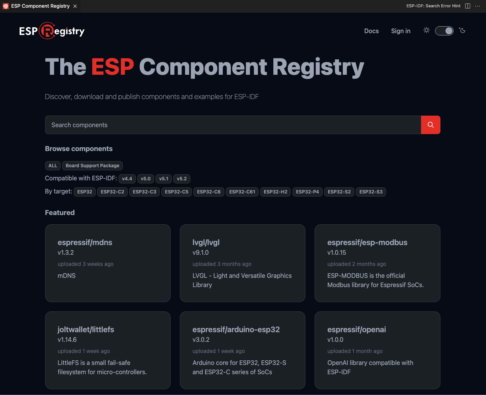
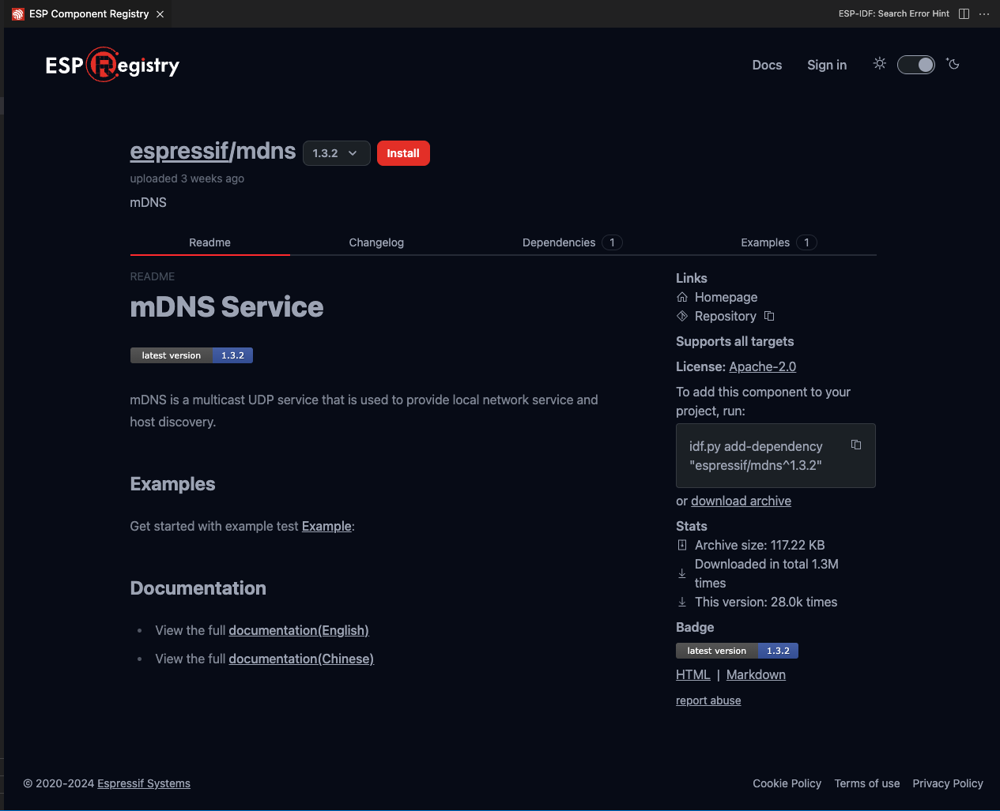
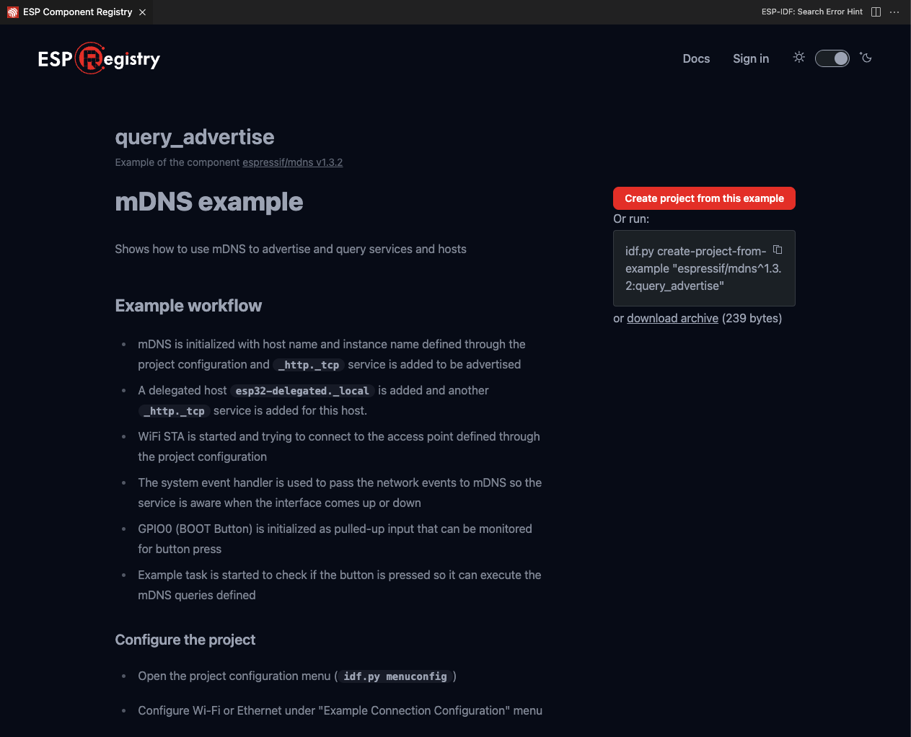

安装 ESP-IDF 组件
=================

:link_to_translation:`en:[English]`

使用 ``ESP-IDF：乐鑫组件注册表`` 命令开启用户界面，查看 `乐鑫组件注册表 <https://components.espressif.com>`_。

在此界面中，可以浏览各类乐鑫组件，并通过点击 ``Install`` 按钮将其安装到当前的 ESP-IDF 项目中。

也可以点击 ``Create project from this example`` 按钮，基于组件示例创建一个新项目。

更多信息请参考 `乐鑫组件注册表文档中心 <https://docs.espressif.com/projects/idf-component-manager/en/latest/>`_。

安装 Arduino-ESP32 组件
-----------------------

使用 ``ESP-IDF：添加 Arduino ESP32 为 ESP-IDF 组件`` 命令，可以将 `Arduino-ESP32 <https://github.com/espressif/arduino-esp32>`_ 添加为 ESP-IDF 组件，存放在当前目录下 (``${CURRENT_DIRECTORY}/components/arduino``)。也可以使用 ``ESP-IDF：基于模板创建新项目`` 命令，选择 ``arduino-as-component`` 为模板，创建一个包含 Arduino-ESP32 组件的新项目目录。

.. note::

    部分 ESP-IDF 版本不支持 Arduino ESP32。请查看 `Arduino-ESP32 <https://github.com/espressif/arduino-esp32>`_，确认 ESP-IDF 版本是否兼容。
