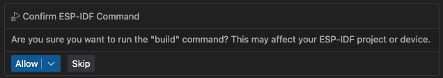

ESP-IDF 聊天命令
================

此功能允许您直接从 VS Code 聊天窗口运行 ESP-IDF 命令。
无需输入终端命令，您只需在聊天中询问 - 工具将为您执行常见的 ESP-IDF 操作，如构建、烧录或监控您的项目。

使用方法
--------

按菜单 ``视图`` > ``聊天`` 打开聊天窗口。

您可以在聊天窗口中使用自然语言输入，工具将解释您的请求以执行相应的 ESP-IDF 命令。

**自然语言模式**: 
- "构建项目"
- "烧录设备" 
- "监控输出"
- "清理项目"
- "配置项目"
- "分析大小"
- "擦除闪存"
- "选择端口"
- "设置目标为 esp32c6"
- "运行诊断"
- "创建新项目"
- "编辑分区表"
- "管理组件"
- "启动应用跟踪"
- "启动堆跟踪"

您也可以输入 ``#espIdfCommands <标签>`` 来直接调用命令。将 ``<标签>`` 替换为下面列出的支持的命令标签之一。

**#espIdfCommands 标签**: build, flash, monitor, buildFlashMonitor, fullClean, menuconfig, size, eraseFlash, selectPort, setTarget, doctor, newProject, partitionTable, componentManager, apptrace, heaptrace

.. note::

    * 虽然工具可以理解自然语言，但使用特定的 ``#espIdfCommands <标签>`` 格式可确保准确的命令执行。
    * 该工具设计为一次处理一个命令。对于多个操作，请分别输入。
    * 确保您的 ESP-IDF 环境在 VS Code 中正确设置，命令才能正常工作。请查看文档以了解 :ref:`安装 ESP-IDF 和工具 <installation>`。

例如，要构建项目，您可以输入：

.. code-block:: text

    构建项目

.. code-block:: text

    #espIdfCommands build    

将出现一个 ``确认 ESP-IDF 命令`` 对话框。点击 ``允许`` 继续。

命令将执行，输出将显示在终端中（如果命令使用终端）和聊天窗口中。某些命令可能不会产生输出并启动 UI（如 ``newProject``）。

可用命令
--------

该工具支持以下 ESP-IDF 命令：

构建和烧录命令
~~~~~~~~~~~~~~~

* **``build``** - 构建 ESP-IDF 项目 (``espIdf.buildDevice``)
* **``flash``** - 将构建的应用程序烧录到设备 (``espIdf.flashDevice``)
* **``monitor``** - 监控设备输出 (``espIdf.monitorDevice``)
* **``buildFlashMonitor``** - 在一个命令中构建、烧录和监控项目 (``espIdf.buildFlashMonitor``)

项目管理命令
~~~~~~~~~~~~~

* **``fullClean``** - 执行项目的完全清理 (``espIdf.fullClean``)
* **``menuconfig``** - 打开 ESP-IDF menuconfig 界面 (``espIdf.menuconfig.start``)
* **``size``** - 分析应用程序大小 (``espIdf.size``)
* **``eraseFlash``** - 擦除设备闪存 (``espIdf.eraseFlash``)

配置命令
~~~~~~~~~

* **``selectPort``** - 选择用于通信的串口 (``espIdf.selectPort``)
* **``setTarget``** - 设置 ESP32 目标设备 (``espIdf.setTarget``)
* **``doctor``** - 运行 ESP-IDF doctor 命令诊断问题 (``espIdf.doctorCommand``)

开发命令
~~~~~~~~~

* **``newProject``** - 创建新的 ESP-IDF 项目 (``espIdf.newProject.start``)
* **``partitionTable``** - 打开分区表编辑器 (``esp.webview.open.partition-table``)
* **``componentManager``** - 打开 ESP 组件管理器 (``esp.component-manager.ui.show``)
* **``apptrace``** - 启动应用程序跟踪 (``espIdf.apptrace``)
* **``heaptrace``** - 启动堆跟踪 (``espIdf.heaptrace``) 