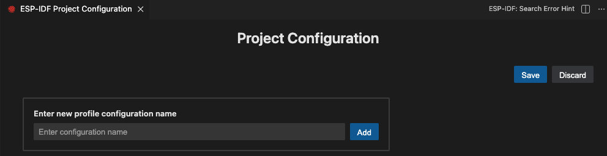
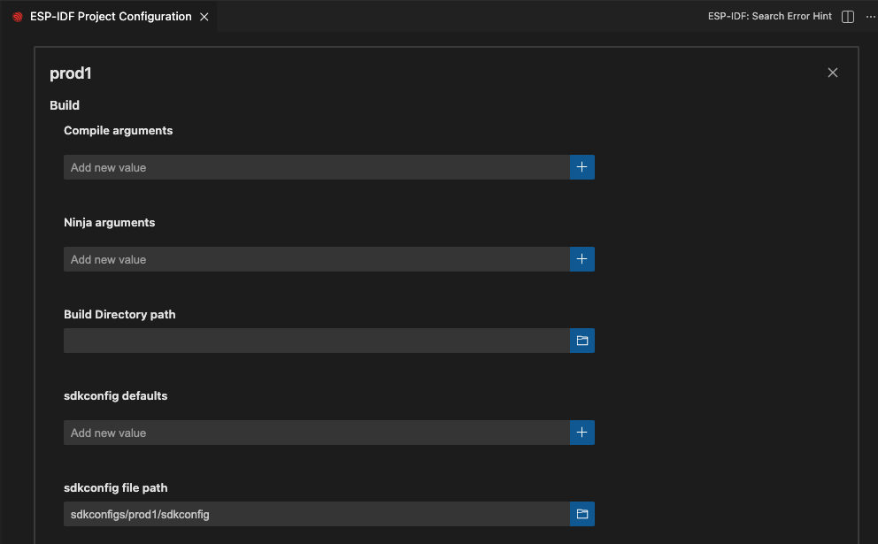
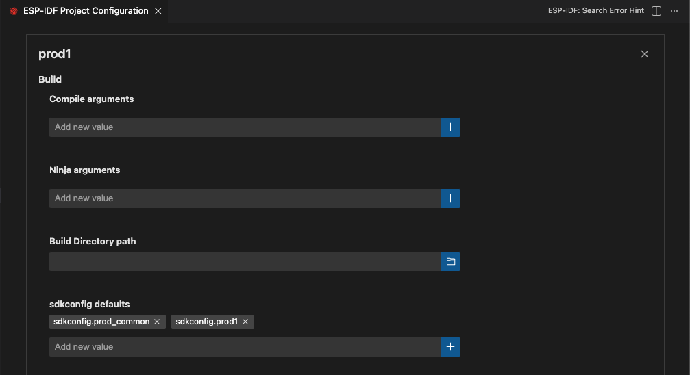

.. _multiple projects:

处理多个项目
============

:link_to_translation:`en:[English]`

对于大型项目，通常需要构建、烧录或监视多个项目。ESP-IDF 扩展遵循 `VS Code 工作区文件架构 <https://code.visualstudio.com/docs/editor/multi-root-workspaces#_workspace-file-schema>`_ 来识别当前工作区（即根目录）下的所有项目文件夹。详情请参阅 `用户和工作区设置 <https://code.visualstudio.com/docs/getstarted/settings#_creating-user-and-workspace-settings>`_。

配置将按照如下优先级进行覆盖：

1.  工作区文件夹中 ``${workspaceFolder}/.vscode/settings.json`` 文件里定义的设置
2.  工作区中 ``<name>.code-workspace`` 文件里定义的配置
3.  ``settings.json`` 文件中定义的用户设置

    - **Windows**：``%APPDATA%\Code\User\settings.json``
    - **MacOS**：``$HOME/Library/Application Support/Code/User/settings.json``
    - **Linux**：``$HOME/.config/Code/User/settings.json``

此扩展使用 ``idf.saveScope`` 配置选项来确定在某些功能（如设置向导）中，配置设置应该保存到哪里。若想改变位置，可以使用 ``ESP-IDF：选择配置存储位置`` 命令进行修改。

点击 VS Code 状态栏中的 ``ESP-IDF：当前项目`` 图标或按 F1 唤醒命令面板，输入 ``ESP-IDF：选择工作区文件夹`` 来选择当前项目，确定 ESP-IDF 设置（如当前设备的 USB 端口、ESP-IDF 路径等）将应用于哪个文件夹。

``<name>.code-workspace`` 文件定义了项目文件夹（即 VS Code 中的工作区文件夹）和工作区级别的设置，如下所示：

.. code-block:: JSON

    {
        "folders": [
            {
                "path": "./project1"
            },
            {
                "path": "./project2"
            }
        ],
        "settings": {
            "idf.port": "/dev/ttyUSB1"
        }
    }

若 ``ESP-IDF：当前项目`` 目录中不包含 ``.vscode/settings.json`` 文件，则使用根目录下 ``.code-workspace`` 中的设置。

若想在 VS Code 中打开一个包含多个子项目的项目，请前往菜单栏中的 ``文件`` > ``打开工作区``，选择描述你工作区的 ``.code-workspace`` 文件。

你可以手动创建 ``.code-workspace`` 文件并定义所有子文件夹（子项目），也可以点击菜单栏中的 ``文件`` > ``将工作区另存为`` 来保存当前的工作区，但要注意后者不会自动包含当前目录下的任何文件夹。

前往菜单栏中的 ``文件`` > ``将文件夹添加到工作区``，可以将文件夹添加到工作区。

.. note::

    必须在当前工作区文件夹的 ``调试`` 选项卡中手动选择相应的调试配置。每个调试配置都有一个项目目录后缀。

示例
----

请参考以下多项目目录树示例：

.. code-block::

    ---> /my-projects-root
    ------> /my-projects-root/project1
    ------> /my-projects-root/project2
    ------------> /my-projects-root/project2/.vscode/settings.json

以及 ``my-ws.code-workspace``：

.. code-block:: JSON

    {
        "folders": [
            {
                "path": "/my-projects-root/project1"
            },
            {
                "path": "/my-projects-root/project2"
            }
        ],
        "settings": {
            "idf.port": "/dev/ttyUSB1"
        }
    }

1.  打开 VS Code，前往菜单栏中的 ``文件`` > ``打开工作区`` 并打开 ``my-ws.code-workspace``，你只能看到在当前工作区中定义的文件夹（``/my-projects-root/project1`` 和 ``/my-projects-root/project2``）。

    - 对于 ``project1``，VS Code 优先使用 ``my-ws.code-workspace`` 中的设置，然后再从用户设置中获取其他所需的设置。
    - 对于 ``project2``，VS Code 优先使用 ``/my-projects-root/project2/.vscode/settings.json`` 中的设置，其次从 ``my-ws.code-workspace`` 中获取缺失的设置，最后从用户设置中获取其余设置。

2.  打开 ``/my-projects-root`` 或 ``/my-projects-root/project1`` 目录，VS Code 将使用用户设置。

    - 如果只打开 ``/my-projects-root/project2`` 目录，VS Code 将首先使用 ``/my-projects-root/project2/.vscode/settings.json`` 中定义的设置，然后使用用户设置中定义的其他必要设置。

    .. note::

        若打开 ``/my-projects-root``，任何子项目都不会被识别为工作区文件夹。你需要将这些项目添加到 ``my-ws.code-workspace`` （手动添加或点击菜单栏中的 ``文件`` > ``将文件夹添加到工作区``），并按照之前指定的方式打开此工作区。

在同一工作区文件夹中使用多种构建配置
------------------------------------

本章教程使用了 ESP-IDF CMake `多种构建配置示例 <https://github.com/espressif/esp-idf/tree/master/examples/build_system/cmake/multi_config>`_。

使用 ``ESP-IDF：打开项目配置`` 命令并创建两个配置文件：``prod1`` 和 ``prod2``。如下所示，在 sdkconfig defaults 字段中设置 ``sdkconfig.prod_common;sdkconfig.prod1`` 和 ``sdkconfig.prod_common;sdkconfig.prod2``：

创建好配置文件并为每个文件都设置好配置项后，点击 ``保存`` 按钮。使用 ``ESP-IDF：选择项目配置`` 命令来选择要覆盖的扩展配置。

选定配置文件后，所选文件将显示在 VS Code 状态栏中。

使用 ``ESP-IDF：构建项目`` 命令，为配置文件 ``prod1`` 和 ``prod2`` 构建项目。指定路径中将出现每个配置文件生成的二进制文件。使用 ``ESP-IDF：选择项目配置`` 命令，可以切换不同的构建配置。

使用 ``ESP-IDF：打开项目配置`` 命令，可以修改、添加或删除配置文件。如果不再需要这些配置文件，删除即可。

多个 ESP-IDF 版本
-----------------

在 VS Code 中可以使用多个 ESP-IDF 版本，每个项目配置一个不同的版本。只要在当前项目目录下的 ``.vscode/settings.json`` 文件中显式定义项目配置。

1. 使用 ``ESP-IDF：选择配置存储位置`` 命令或在 VS Code 中打开所需项目的 ``.vscode/settings.json`` 文件进行编辑，将 ``idf.saveScope`` 设置为工作区文件夹级别。

2. 参照 :ref:`安装 ESP-IDF 和工具 <installation>`，配置扩展。

3. 删除先前的构建目录。若存在先前构建的缓存，则不同的 ESP-IDF 版本将无法工作。

4. 如果你希望使用与全局用户设置版本不同的 ESP-IDF，请在所需项目中重复步骤 1。

手动使用多种构建配置
--------------------

如 ESP-IDF CMake `多种构建配置示例 <https://github.com/espressif/esp-idf/tree/master/examples/build_system/cmake/multi_config>`_ 所示，可以使用多个构建目录和多个 sdkconfig 默认文件来生成不同版本的最终产品。

在此扩展中，可以使用 ``idf.buildPath`` （Windows 系统中使用 ``idf.buildPathWin``）来定义构建目录，并使用 ``idf.sdkconfigDefaults`` 来定义 sdkconfig 默认文件列表。扩展构建命令会使用这些定义好的配置。

例如，如果要制作产品 1：

1.  创建 sdkconfig 文件 ``sdkconfig.prod_common`` 和 ``sdkconfig.prod1``，之后 ``<your-project>/build_prod1`` （``build_prod1`` 是自定义构建文件夹的名称）中将生成固件。
2.  在当前项目的 ``.vscode/settings.json`` 文件中添加下列设置：

    .. code-block:: JSON

        {
            // ...
            "idf.buildPath": "${workspaceFolder}/build_prod1",
            "idf.sdkconfigDefaults": ["sdkconfig.prod_common", "sdkconfig.prod1"]
            // ...
        }

3.  使用 ``ESP-IDF：构建项目`` 命令构建你的项目。

4.  ``<your-project>/build_prod1`` 中将生成固件文件，而 SDK 配置编辑器使用的 sdkconfig 文件位于 ``<your-project>/build_prod1/sdkconfig``。

5.  对于不同的产品和配置，请在步骤 2 中更改相应的值。
