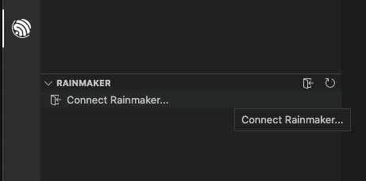
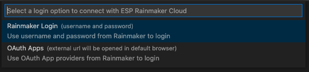
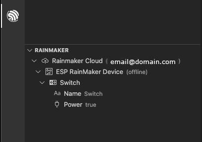

ESP Rainmaker
=============

:link_to_translation:`en:[English]`

本文将展示如何在 ESP-IDF 扩展中使用 `ESP Rainmaker <https://rainmaker.espressif.com/zh-hans/>`_ 集成功能。

首先需要准备好乐鑫设备和 ESP Rainmaker 账户。更多信息请参考 `RainMaker 文档 <https://rainmaker.espressif.com/zh-hans/docs/get-started/>`_。

点击 Visual Studio Code 左侧活动栏中的 ``ESP-IDF：资源管理器`` 图标，然后点击 ``RainMaker`` 选项卡中的 ``连接 RainMaker`` 选项。

系统会提示你选择一种身份验证方式来连接 RainMaker。可以使用 RainMaker 账户的用户名和密码，也可以使用 Google、GitHub、Apple 等 OAuth 应用进行身份验证。

.. note::

    若选择使用 OAuth 应用进行身份验证，则必须授予 Visual Studio Code 和浏览器权限，以便在 OAuth 认证流程完成后重新打开 Visual Studio Code。

完成身份验证后，你将看到与账户关联的节点列表。在账户名称旁边，有用于 ``添加新节点`` 和 ``取消与 Rainmaker 帐户的绑定`` 的图标。每个设备旁都有一个 ``移除此节点`` 图标。在每个 Rainmaker 设备（如 ``Switch``）下方，会显示一组可以修改的参数（例如 ``Name`` 和 ``Power``），你可以点击 ``为设备更新参数`` 图标来修改参数。

