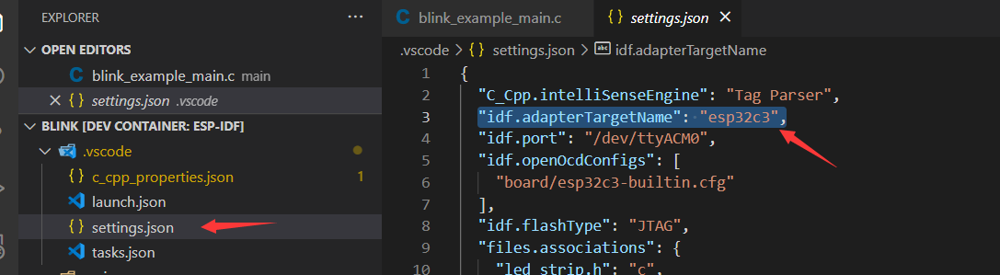

在 Windows 系统中使用 WSL
=========================

:link_to_translation:`en:[English]`

本文将展示如何基于 Visual Studio Code 中的 **ESP-IDF** 和 **Remote - WSL** 扩展，在 WSL 中开发项目。

在开始项目之前，请安装以下工具：

1. Windows WSL（安装步骤见下文）
2. `Visual Studio Code <https://code.visualstudio.com>`_
3. `usbipd-win <https://github.com/dorssel/usbipd-win/releases>`_

在 Windows 系统中安装 Ubuntu (WSL)
----------------------------------

安装 WSL，请运行：

.. code-block::

    wsl --install

使用以下命令更新 WSL 内核：

.. code-block::

    wsl --update

使用 ``Powershell`` 命令提示符查看可用 WSL 发行版列表：

.. code-block::

    wsl -l -o

.. image:: ../../../media/tutorials/using_docker_container/wsl-l-o.png

若想在 Windows 上的 WSL 中安装 Ubuntu 发行版，请输入以下命令：

.. code-block::

    wsl --install --distribution Ubuntu

在 WSL 中使用 ``usbipd-win``
------------------------------

必须安装 ``usbipd-win``，才能访问来自本地 Windows 的 USB 设备、串口设备以及 JTAG 设备，否则无法在 IDF Docker 镜像中进行下载、监控和调试。安装方式与其他 Windows 应用程序相同，这里不再赘述。

安装好上述所有必要工具后，请继续进行下列配置。

检查 Windows 上的 Ubuntu (WSL)
~~~~~~~~~~~~~~~~~~~~~~~~~~~~~~~~~

1.  检查当前 WSL 版本是否为 2。

    .. code-block::

        wsl -l -v

    .. image:: ../../../media/tutorials/using_docker_container/wsl-l-v.png

2.  如果 WSL 版本落后，请升级到版本 2。

    .. code-block::

        wsl --set-version Ubuntu 2

3.  将 Ubuntu 发行版设置为默认使用的操作系统。

    .. code-block::

        wsl -s Ubuntu

4.  最后，使用 ``wsl --status`` 命令检查上述所有指令是否生效。

    .. image:: ../../../media/tutorials/using_docker_container/wsl-status.png

在 WSL 中添加所需的 Linux 软件包
~~~~~~~~~~~~~~~~~~~~~~~~~~~~~~~~~

安装 `在 Linux 系统中使用 ESP-IDF 所需的工具链 <https://docs.espressif.com/projects/esp-idf/zh_CN/latest/esp32/get-started/linux-macos-setup.html>`_。

.. code-block::

    sudo apt-get install git wget flex bison gperf python3-pip python3-venv python3-setuptools cmake ninja-build ccache libffi-dev libssl-dev dfu-util

1.  在 PowerShell 命令提示符中安装 ``usbipd``。

    .. code-block::

        winget install usbipd

2.  配置 USB 串口设备，通过 ``usbipd`` 连接到 WSL。

3.  以管理员权限打开 PowerShell 命令提示符，输入下列指令，获取 USB 串口设备列表。

    .. code-block::

        usbipd list

4.  要从 Windows 本地访问 WSL 上的指定设备，必须使用 ``usbipd`` 绑定设备。以管理员权限打开 PowerShell 命令提示符，然后输入下列指令：

    .. code-block::

        usbipd bind --busid <BUSID>

    .. note::

        除非重启计算机，否则此命令只需使用一次。**1-1** 是想要绑定的设备的 ``<BUSID>``。

5.  绑定后，请在 PowerShell 命令提示符中使用下列指令将指定设备附加到 WSL 中。

    .. code-block::

        usbipd attach --wsl --busid <BUSID>

6.  最后，通过在 WSL 环境中输入下列指令，验证连接是否成功。

    .. code-block::

        dmesg | tail

    .. image:: ../../../media/tutorials/using_docker_container/wsl_demsg_tail.png

如上所示，**1-1** 设备已附加到 ``ttyACM0``，WSL 现在可以访问 **1-1** USB 设备。

在 Visual Studio Code 中安装 Remote WSL 扩展
~~~~~~~~~~~~~~~~~~~~~~~~~~~~~~~~~~~~~~~~~~~~

安装下图中的 **Remote - WSL**、**Remote Development** 和 **ESP-IDF** 扩展。

.. image:: ../../../media/tutorials/using_docker_container/remote_wsl.png

.. image:: ../../../media/tutorials/using_docker_container/remote_development.png

.. image:: ../../../media/tutorials/using_docker_container/esp-idf.png

在 WSL 中打开项目
~~~~~~~~~~~~~~~~~

单击 Visual Studio Code 左下角的 ``><`` 按钮。选择 **在 WSL 中打开文件夹**，配置 WSL 并打开 ``Blink`` 例程项目。

在 WSL 中按照 :ref:`安装 ESP-IDF 和相关工具 <installation>` 中的指导来配置 ESP-IDF 扩展。

.. note::

    在 WSL 中运行设置程序时，默认使用 **用户设置** (User Settings)，这可能会覆盖 Windows 主机的配置，因此建议将设置保存到 **工作区** (workspace) 或 **工作区文件夹** (workspace folder)，避免影响 Windows 系统的全局配置。

此时，可以开始使用 ``Blink`` 示例项目进行构建、烧录、监视、调试等操作。

构建你的项目
~~~~~~~~~~~~

以 ESP32-C3 为例，若想将其作为目标设备，只需如图所示将 ``esp32`` 更改为 ``esp32c3``。

接下来，开始构建示例项目：

.. image:: ../../../media/tutorials/using_docker_container/container_build.gif

烧录固件
~~~~~~~~

构建完成后，可以通过以下三种方式烧录固件。

外部 USB 转串口设备
~~~~~~~~~~~~~~~~~~~

按照前文 ``usbipd`` 指令描述部份的教程进行操作。此处以 ``Silicon Labs CP210x USB to UART Bridge`` 为例，此设备已附加到 Docker 镜像中。

.. image:: ../../../media/tutorials/using_docker_container/wsl_demsg_tail_usb_serial.png

如图所示，该设备已附加到 ``ttyUSB0``，因此 ``idf.port`` 也需要进行相应更改。

.. image:: ../../../media/tutorials/using_docker_container/ttyUSB0.png

但此时容器尚未识别到更改的配置。

.. image:: ../../../media/tutorials/using_docker_container/unkown_ttyUSB0.png

选择 ``在本地重新打开文件夹``，重新打开容器，新的配置也将重新加载。

.. image:: ../../../media/tutorials/using_docker_container/container_reopen.gif

最后，点击 ``Flash`` 按钮下载固件。

.. image:: ../../../media/tutorials/using_docker_container/container_flash_uart.gif

内部 USB 转串口设备
~~~~~~~~~~~~~~~~~~~

与 `外部 USB 转串口设备`_ 类似，唯一的不同之处为附加的设备名称。外部 USB 转串口设备的名称通常显示为 ``ttyUSBx``，而内部 USB 转串口设备为 ``ttyACMx``。

.. image:: ../../../media/tutorials/using_docker_container/container_flash_uart_internal.gif

USB 转 JTAG 设备
~~~~~~~~~~~~~~~~

与 `外部 USB 转串口设备`_ 和 `内部 USB 转串口设备`_ 相同，但使用 USB 转 JTAG 设备时需要配置以下额外参数：

.. image:: ../../../media/tutorials/using_docker_container/extra_parameters.png

接口与 `USB 转 JTAG 设备`_ 相同，即 ``ttyACMx``：

.. image:: ../../../media/tutorials/using_docker_container/container_flash_jtag.gif

调试的额外步骤
~~~~~~~~~~~~~~

在运行 OpenOCD 并开始调试会话之前，复确保将 `OpenOCD udev 规则文件 <https://github.com/espressif/openocd-esp32/blob/master/contrib/60-openocd.rules>`_ 复制到 ``/etc/udev/rules.d`` 目录中。

调试
~~~~

配置好 `USB 转 JTAG 设备`_ 后，按 ``F5`` 开始调试：

.. image:: ../../../media/tutorials/using_docker_container/container_debug.gif

注意事项
~~~~~~~~~

1. 如果要在 Windows 系统中进行调试，则需要通过插拔 USB 线使 Windows 设备管理器识别到相应的 USB 端口。
2. 在容器开发过程中，Docker 桌面应用程序需一直保持开启状态。
