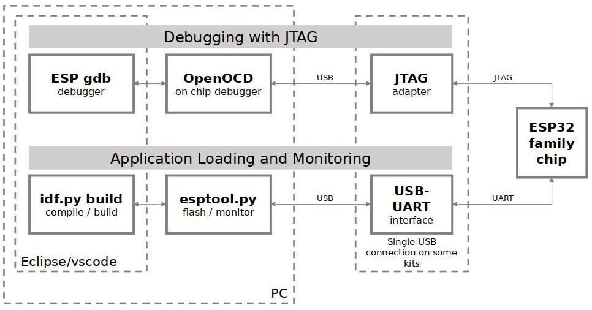

调试项目
========

:link_to_translation:`en:[English]`

目录
====

.. contents::
   :depth: 2
   :local:

启动调试会话
------------

在调试项目之前，请先指定设备的串口：

1. 选择串口：

- 点击 ``查看`` > ``命令面板``。

- 输入 **ESP-IDF：选择要使用的端口**，指定设备的串口。

2. 确保 OpenOCD 配置文件正确

- 点击 ``查看`` > ``命令面板``。

- 输入 **ESP-IDF：选择 OpenOCD 开发板配置**，选择扩展中 OpenOCD 服务器的配置文件。

.. note::

    * 请查看 `根据目标芯片配置 OpenOCD <https://docs.espressif.com/projects/esp-idf/zh_CN/latest/esp32/api-guides/jtag-debugging/tips-and-quirks.html#jtag-debugging-tip-openocd-configure-target>`_，为目标硬件选择开发板或配置。
    * 请确保按照 `配置 JTAG 接口 <https://docs.espressif.com/projects/esp-idf/zh_CN/latest/esp32/api-guides/jtag-debugging/configure-ft2232h-jtag.html>`_ 中的说明来配置驱动程序。

- （适用于 Linux 用户）在运行 OpenOCD 并启动调试会话前，请确保将 `OpenOCD udev 规则文件 <https://github.com/espressif/openocd-esp32/blob/master/contrib/60-openocd.rules>`_ 复制到 ``/etc/udev/rules.d`` 目录中。

在顶部菜单栏中点击 ``运行`` > ``启动调试``，或者直接按 F5 启动调试。

.. image:: ../../media/tutorials/debug/init_halted.png

可以在调试控制台中查看 GDB 输出。点击 ``查看`` > ``输出``，在下拉菜单中选择 ``ESP-IDF``，可以查看 OpenOCD 输出。

以上内容为 ESP-IDF 扩展的基本功能，详情请参阅 :ref:`其他 IDE 功能 <additional features>`。

调试过程概览
------------

    JTAG 调试 – 概览图

1.  首先，OpenOCD 服务器在后台启动。可以点击菜单栏中的 ``查看`` > ``输出``，并在下拉菜单中选择 ``ESP-IDF`` 来查看输出。

    默认情况下，OpenOCD 服务器在当前计算机上启动，并通过端口 ``4444`` 与 Telnet 通信；端口 ``6666`` 用于 TCL 通信；端口 ``3333`` 用于 GDB。通过修改 ``openocd.tcl.host`` 和 ``openocd.tcl.port`` 配置，可以变更以上设置。通过设置 ``idf.openOcdDebugLevel`` 参数（范围是 0～4），可以调整 OpenOCD 在 ESP-IDF 输出窗口中显示消息的详细程度。

2.  接下来，`Eclipse CDT GDB 适配器 <https://github.com/eclipse-cdt-cloud/cdt-gdb-adapter>`_ 在后台启动，输出显示在 ``调试控制台`` 中。该调试适配器将通过启动 GDB 调试会话来连接目标设备。

    此适配器是 VS Code、配置的工具链 GDB 以及 OpenOCD 服务器之间的中间桥梁。可参考以下链接，查看 `乐鑫芯片调试工作原理 <https://docs.espressif.com/projects/esp-idf/zh_CN/latest/esp32/api-guides/jtag-debugging/index.html#jtag-debugging-how-it-works>`_，以及 VS Code 如何使用 `调试适配器 <https://microsoft.github.io/debug-adapter-protocol/overview>`_ 与不同调试工具进行通信。

自定义应用程序镜像偏移量
------------------------

如果修改了应用程序镜像偏移量，则应更新相应的 OpenOCD 启动参数。点击菜单栏 ``查看`` > ``输出``，并在下拉菜单栏中选择 ``ESP-IDF``，如果 OpenOCD 输出显示如下错误，则应立即进行参数更改：

.. code-block::

    Failed to get flash maps (-6)!
    ❌ Error: Failed to get flash maps (-6)!
    Warn : Application image is invalid! Check configured binary flash offset 'appimage_offset'.

要更新 openOCD 启动参数，请打开项目的 ``.vscode/settings.json`` 文件并添加或修改以下代码：

.. code-block:: JSON

    {
        "idf.openOcdLaunchArgs": [
            "-c",
            "init",
            "-c",
            "reset halt",
            "-c",
            "esp appimage_offset 0x20000"
        ]
    }

其中 ``0x20000`` 是分区表中使用的应用程序镜像偏移量。

浏览代码、调用栈和线程
----------------------

目标程序暂停时，编辑器将显示程序在哪一行代码处暂停，同时 VS Code 左侧活动栏 ``运行`` 图标下的 ``调用堆栈`` 子窗口中会出现线程列表（见 ``(a)``）。``调用堆栈`` 子窗口的第一行包含了最后调用的函数 ``app_main()`` （见 ``(b)``）。如前图所示，该函数由 ``main_task()`` 调用。栈的每一行还列出了函数调用自哪一文件的第几行（见 ``(c)``），点击每个栈条目，可以打开相应文件。

展开线程就可以浏览整个应用程序。一些线程包含较长的调用栈，除了函数调用外，还可以看到类似 ``0x4000bff0`` 的数字，代表未在源代码中出现的二进制代码地址。

.. image:: ../../media/tutorials/debug/thread5.png

回到线程 #1 中的 ``app_main()`` 函数，熟悉 ``blink.c`` 文件里的代码，后续例程中将展开分析。使用调试器可以快速浏览整个应用程序的代码，尤其是在执行代码和处理断点时非常方便。下文将详细讨论这一功能。

设置和清除断点
--------------

调试时，常常需要在关键代码行暂停应用程序，检查特定变量、存储、寄存器以及外设的状态，断点在此起到了重要作用。断点能帮助快速锁定关键代码行，并在该行暂停应用程序。

例如可以在 LED 状态变化处设置两个断点，根据下图中的代码，断点应分别位于第 57 和 80 行。要设置断点，请先转到这两行并按 F9，也可以点击行号左侧的圆点。点击 VS Code 侧边栏的 ``运行``(Run) 图标，在 ``断点`` (Breakpoints) 子窗口中可以查看断点列表。

.. image:: ../../media/tutorials/debug/breakpoint.png

.. note::

    请注意，ESP32 最多支持两个硬件断点。详情请参阅 `可用的断点和观察点 <https://docs.espressif.com/projects/esp-idf/zh_CN/latest/esp32/api-guides/jtag-debugging/tips-and-quirks.html#jtag-debugging-tip-breakpoints>`_。

启动调试会话后，VS Code 编辑器顶部将出现一个 **调试工具栏**，包含部分快捷操作按钮。详情请参阅 `VS Code 调试操作 <https://code.visualstudio.com/docs/editor/debugging#_debug-actions>`_。

按 F5（继续/暂停），处理器将开始运行并在下一个断点处停止；再次按 F5，程序将在下一个断点处停止。依此类推，每次执行“继续”命令时，LED 都会改变状态。

更多有关断点的信息，请参阅 `关于断点的补充知识 <https://docs.espressif.com/projects/esp-idf/zh_CN/latest/esp32/api-guides/jtag-debugging/tips-and-quirks.html#jtag-debugging-tip-where-breakpoints>`_。

手动暂停目标
------------

在进行调试时，你可能会恢复应用程序，进入等待某些事件或处于无限循环状态的代码，且没有定义任何断点。此时，若想回到调试模式，可以点击“继续”或“暂停”按钮手动中断程序。若想验证这一点，请删除所有断点并点击“继续”，然后点击“暂停”。如果起作用，那么应用程序将随机暂停，且 LED 停止闪烁。

也可以使用“单步调试 (F11)”和“单步跳过 (F10)”命令逐步执行代码。二者的区别在于，“单步调试”能进入子程序调用内部，而“单步跳过”则将整个函数作为一个单元执行完毕。

演示此功能前，请先阅读前一章节的内容，确保在 ``blink.c`` 文件的第 57 行只定义了一个断点。

按 F5 恢复程序并将其暂停。多次按 F10 单步跳过，观察调试器如何逐行执行程序。

.. image:: ../../media/tutorials/debug/step_over.png

逐行执行代码
------------

如果按 F11 单步调试，则调试器进入子程序调用内部。

.. image:: ../../media/tutorials/debug/step_into.png

此时，调试器进入了 ``vTaskDelay(CONFIG_BLINK_PERIOD / portTICK_PERIOD_MS)`` 函数内部并跳转到 ``tasks.c`` 文件中的相关代码处。

.. note::

    * 请参阅 `"next" 命令无法跳过子程序的原因 <https://docs.espressif.com/projects/esp-idf/zh_CN/latest/esp32/api-guides/jtag-debugging/tips-and-quirks.html#next>`_，了解 ``next`` 命令存在的限制。

如果按 Shift + F11 单步跳出，则调试器将退出子程序调用。

.. image:: ../../media/tutorials/debug/step_out.png

监视和设置程序变量
------------------

常见的调试任务之一是检查程序运行时程序变量的值。若想演示此功能，请先在 ``blink.c`` 文件中函数 ``blink_task`` 定义的上方声明全局变量 ``int i``。然后在此函数的 ``while(1)`` 中添加 ``i++``，以便在每次闪烁时递增 ``i``。

按 Shift + F5 停止调试。为目标芯片构建并烧录项目，按 F5 重启调试器。一旦应用程序暂停，请在 ``i++`` 所在行设置一个断点。

在 VS Code 侧边栏 ``运行`` 图标下的 ``监视`` 子窗口中，点击 ``+`` 并输入 ``i``，开始监视变量的值。

按 F5 继续执行程序。每次程序暂停，都将看到 ``i`` 值递增。

.. image:: ../../media/tutorials/debug/watch_set_program_vars.png

设置条件断点
------------

你也可以设置条件断点，在满足特定条件时停止执行程序。请参阅 `VS Code 条件断点 <https://code.visualstudio.com/docs/editor/debugging#_conditional-breakpoints>`_。

要设置新的条件断点，请转到所需行并右键单击行号左侧的圆点，选择 ``添加条件断点`` 操作。也可以点击 VS Code 侧边栏的 ``运行`` 图标，找到 ``断点`` 子窗口中的断点列表，点击断点上的铅笔图标并设置条件，从而修改断点。

如例图所示，找到第 79 行，右键单击行号边的圆点，选择 ``添加条件断点`` (Add Conditional Breakpoint) 操作，并设置 ``i=2``。开始调试后，当 ``i`` 值为 2 时，调试器将在第 79 行暂停。

.. image:: ../../media/tutorials/debug/conditional_breakpoint.png

反汇编视图
----------

在调试过程中，右键单击源代码文件的任意行并选择 ``打开反汇编视图``，可以查看程序的汇编代码。**反汇编视图** (Disassembly) 展示了与 C 代码对应的汇编代码，你也可以在其中设置断点。

.. image:: ../../media/tutorials/debug/disassembly_view.png

观察点（数据断点）
------------------

详情请参阅 `可用的断点和观察点 <https://docs.espressif.com/projects/esp-idf/zh_CN/latest/esp32/api-guides/jtag-debugging/tips-and-quirks.html#jtag-debugging-tip-breakpoints>`_。

给 GDB 发送命令
---------------

在调试控制台中使用 ``> COMMAND`` 可以发送任何 GDB 命令。例如 ``> i threads``。

点击变量名称旁边的 ``查看二进制数据`` (View Binary Data) 可以查看二进制数据变量。

.. image:: ../../media/tutorials/debug/gdb_commands.png

详情请参阅 `使用命令行的调试示例 <https://docs.espressif.com/projects/esp-idf/zh_CN/latest/esp32/api-guides/jtag-debugging/debugging-examples.html#jtag-debugging-examples-command-line>`_。

ESP-IDF：外设视图
-----------------

ESP-IDF 扩展在 ``运行和调试`` 视图中提供了 ``ESP-IDF：外设视图`` 树视图。该树视图使用 ``IDF SVD 文件路径 (idf.svdFilePath)`` 配置中定义的 SVD 文件，为当前调试会话的目标填充一组外设寄存器值。你可以从 `乐鑫 SVD <https://github.com/espressif/svd>`_ 仓库下载所需的 SVD 文件。

.. image:: ../../media/tutorials/debug/peripheral_viewer.png

事后调试用例
------------

启动监视会话，通过 **ESP-IDF：启动 IDF 监视器以支持核心转储模式/GDB 存根模式** 命令找到致命错误事件。若提前在项目的 sdkconfig 文件中启用了特定选项，那么上述命令发现错误时就会触发 GDB 远程协议服务器 (GDBStub) 或 `ESP-IDF 核心转储 <https://docs.espressif.com/projects/esp-idf/zh_CN/latest/esp32/api-guides/core_dump.html#id1>`_。详情请参阅 `紧急处理程序 <https://docs.espressif.com/projects/esp-idf/zh_CN/latest/esp32/api-guides/fatal-errors.html#id3>`_。

- 配置 **核心转储**：在扩展中使用命令 **ESP-IDF：SDK 配置编辑器** 或在终端中使用 ``idf.py menuconfig``，将 **核心转储的数据目标** 设置为 ``UART`` 或 ``FLASH``。
- 配置 **GDB Stub**：在扩展中使用命令 **ESP-IDF：SDK 配置编辑器** 或在终端中使用 ``idf.py menuconfig``，将 **紧急处理程序行为** 设置为 ``Invoke GDBStub``。
